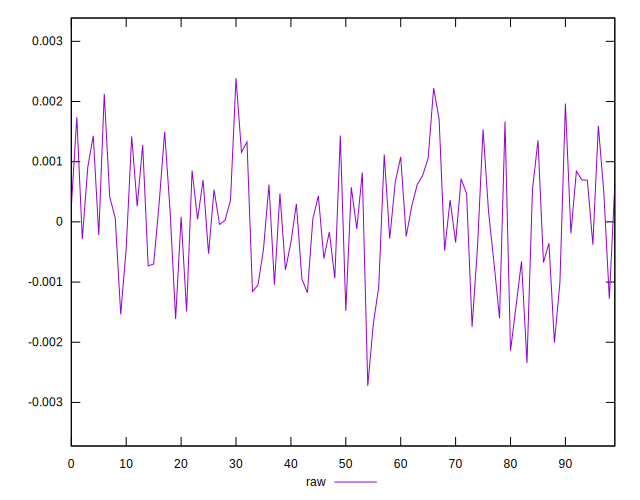
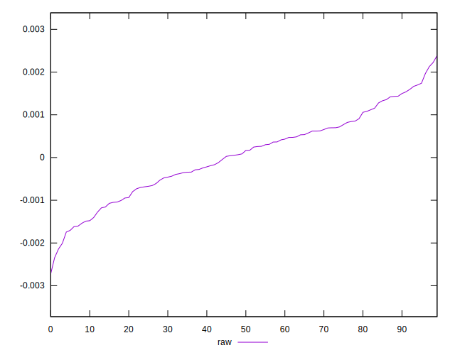
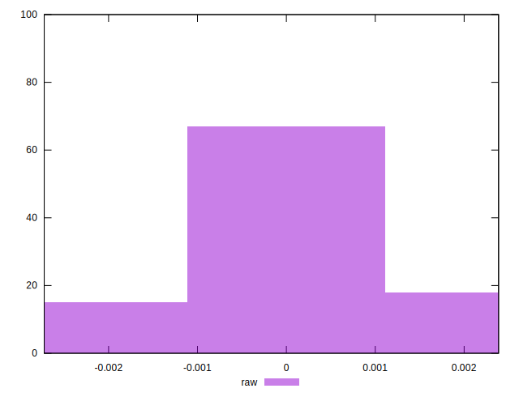

# //meta/pScore-difference/samples/pages+cached+noexternal+nomedia+nocss+nojs

[→ Parent](../..)


## Raw


```yaml
p90min: -0.001704249976277089
p90max: 0.0017393211959901467
p90range: 0.0034435711722672355
p90mean: 0.00008713392060179096
p90median: 0.0001663077631797645
p90stdev: 0.0009000028922972332
p90skewness: -0.10163628616117375
p90eccentricity: 0.9999999999999996
p90discretization: 1
outlandishness: 0.4247801229951198
confidence: 0.0004252509410636896
p90confidence: 0.00036982928309567723

```

