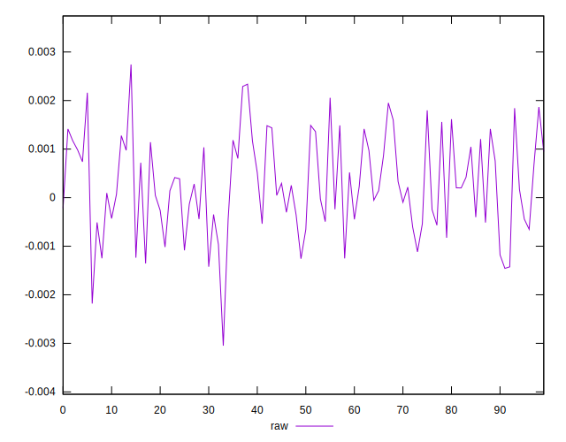
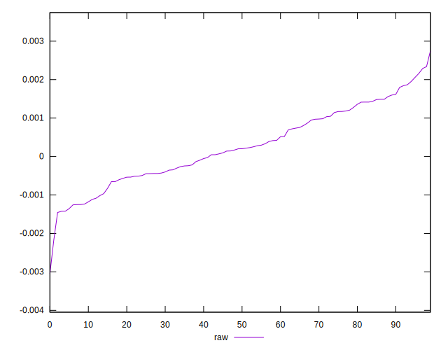
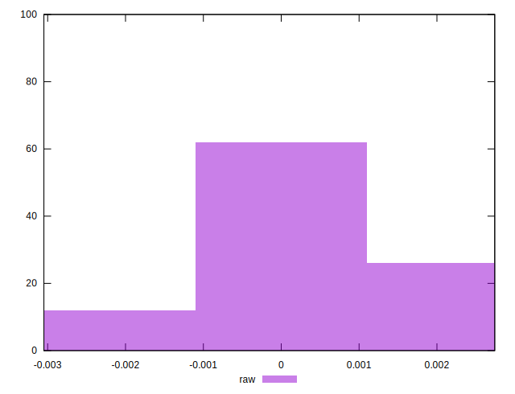

# //meta/pScore-difference/samples/pages+cached+noexternal+nomedia+nocss

[→ Parent](../..)


## Raw


```yaml
p90min: -0.0014240877100125152
p90max: 0.0018662966596284453
p90range: 0.0032903843696409606
p90mean: 0.00021018176504004164
p90median: 0.0001688414460186663
p90stdev: 0.0008959694929826487
p90skewness: 0.02849308937138631
p90eccentricity: 0.9999999999999996
p90discretization: 1
outlandishness: 1.5277569854482098
confidence: 0.00042477119256602416
p90confidence: 0.0003681718782254061

```

