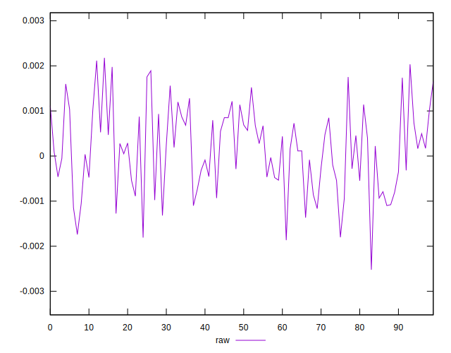
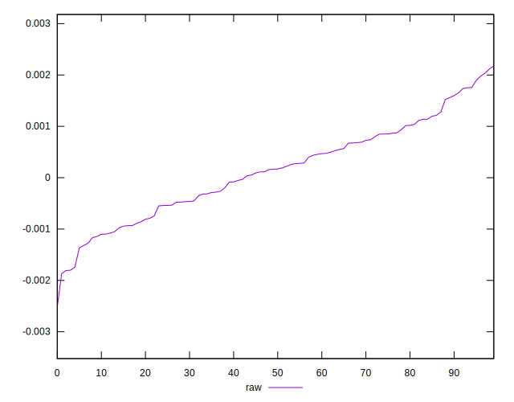
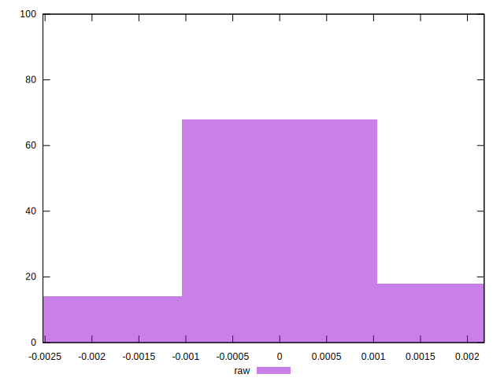

# //meta/pScore-difference/samples/pages+cached+noexternal+nomedia

[→ Parent](../..)


## Raw


```yaml
p90min: -0.0013669829409666562
p90max: 0.0018915872897577346
p90range: 0.0032585702307243907
p90mean: 0.00016875907234811365
p90median: 0.0001706877025342797
p90stdev: 0.000844534125674646
p90skewness: 0.06785418080179226
p90eccentricity: 1.0000000000000004
p90discretization: 1
outlandishness: 0.6807120499517256
confidence: 0.00039629839807330637
p90confidence: 0.0003470360516851964

```

