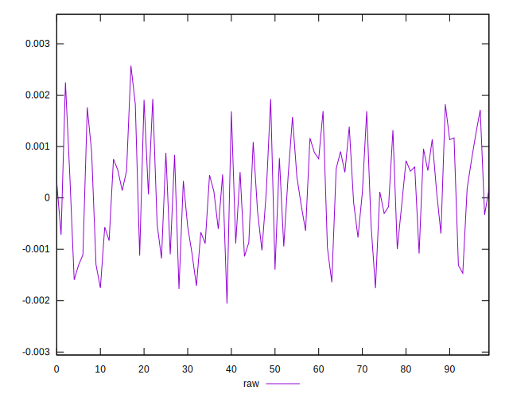
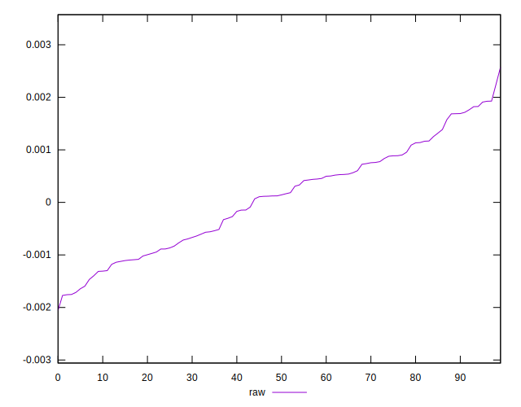
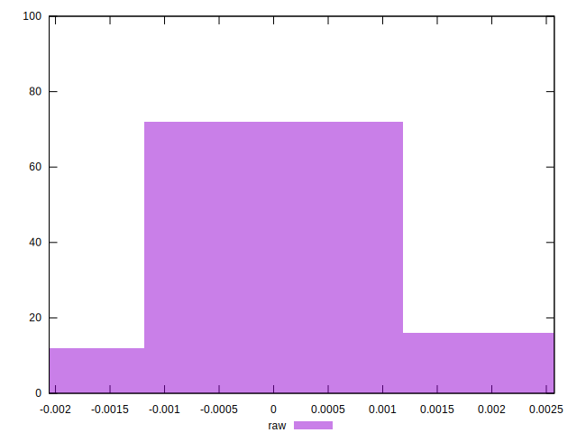

# //meta/pScore-difference/samples/pages+cached+noexternal

[→ Parent](../..)


## Raw


```yaml
p90min: -0.0017128806260524746
p90max: 0.0018246628830349684
p90range: 0.003537543509087443
p90mean: 0.00006681644998932119
p90median: 0.00012341600091541797
p90stdev: 0.0009586726225730212
p90skewness: 0.020451637414768156
p90eccentricity: 1.0000000000000002
p90discretization: 1
outlandishness: 1.9473752237487003
confidence: 0.00042841110163478085
p90confidence: 0.00039393785482696173

```

