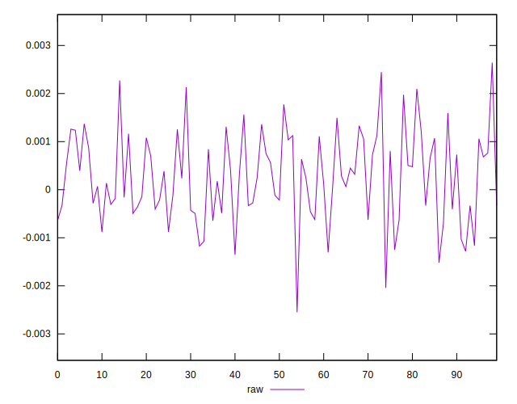
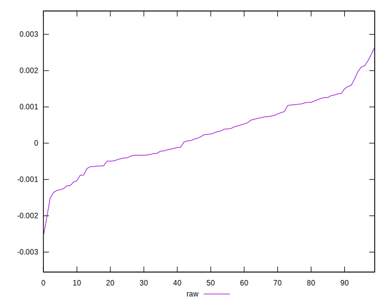
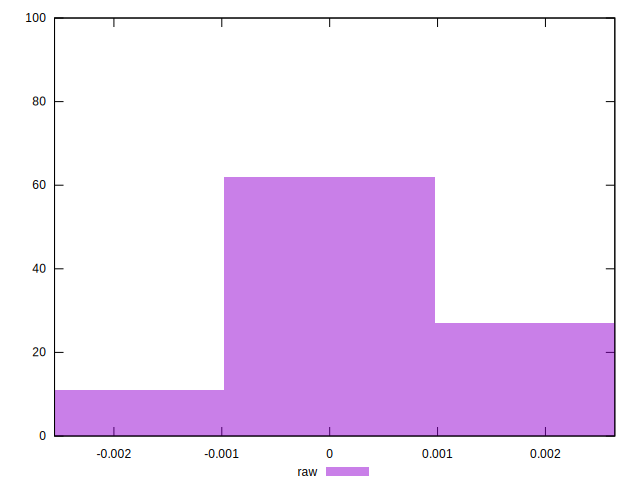

# //meta/pScore-difference/samples/pages+cached

[→ Parent](../..)


## Raw


```yaml
p90min: -0.0013561597269246281
p90max: 0.0017731033520303446
p90range: 0.003129263078954973
p90mean: 0.00020057380128459117
p90median: 0.00023510776982077873
p90stdev: 0.0007951588680120343
p90skewness: -0.04719186180604998
p90eccentricity: 1.0000000000000002
p90discretization: 1
outlandishness: 1.6423096973234232
confidence: 0.00038915030121391156
p90confidence: 0.00032674676561699406

```

