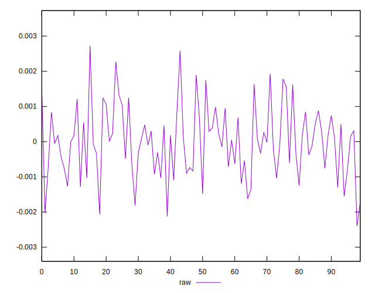
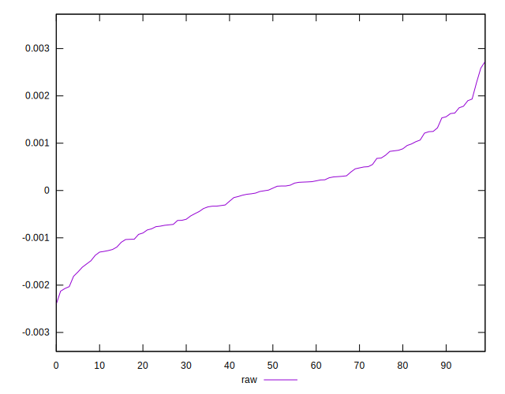
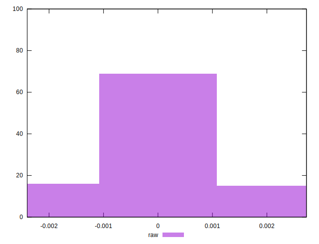

# //meta/pScore-difference/samples/pages

[→ Parent](../..)


## Raw


```yaml
p90min: -0.001812367864349252
p90max: 0.0017808805547106018
p90range: 0.003593248419059854
p90mean: -0.000028877269452873325
p90median: 0.000008479407953095909
p90stdev: 0.000872919132914025
p90skewness: 0.06658882977578308
p90eccentricity: 0.9999999999999996
p90discretization: 1
outlandishness: 0.00315098394064247
confidence: 0.00041994276471152135
p90confidence: 0.00035870002184334814

```

