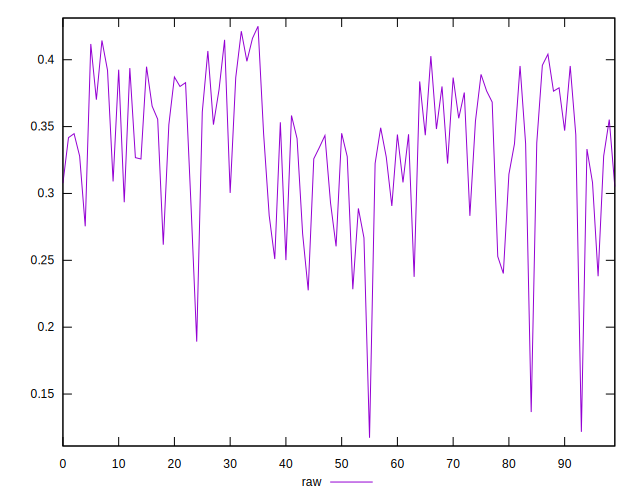
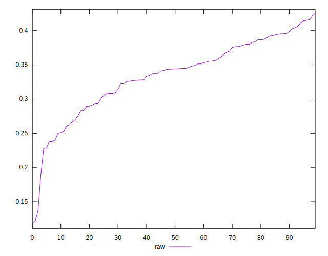
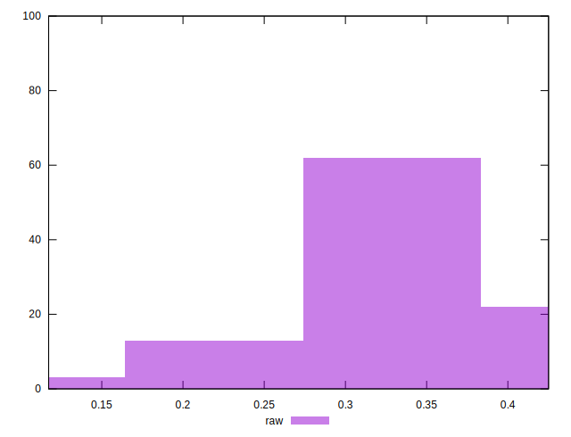

# //meta/pScore/samples/pages+cached+noexternal+nomedia+nocss+nojs

[→ Parent](../..)


## Raw


```yaml
p90min: 0.24016565626866312
p90max: 0.42132852716645486
p90range: 0.18116287089779173
p90mean: 0.34405238058080495
p90median: 0.34471247520057136
p90stdev: 0.044431239822215224
p90skewness: -0.3907898792394095
p90eccentricity: 0.9999999999999989
p90discretization: 1
outlandishness: 0.9328594731834868
confidence: 0.024473978325598167
p90confidence: 0.018257689737596006

```

