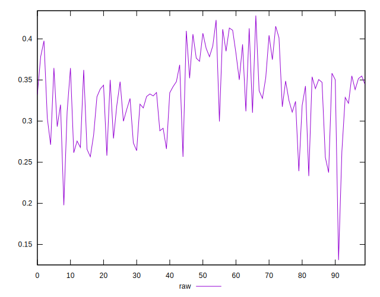
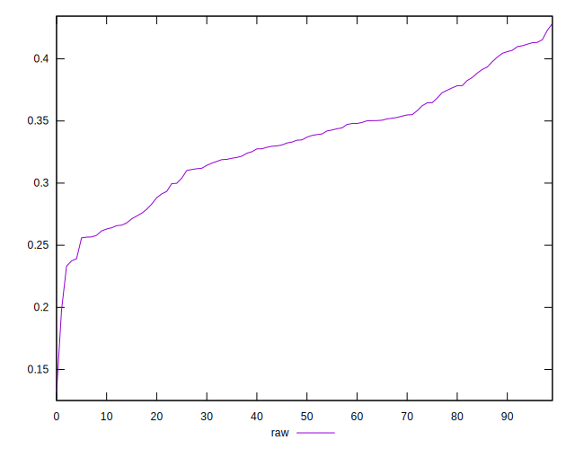
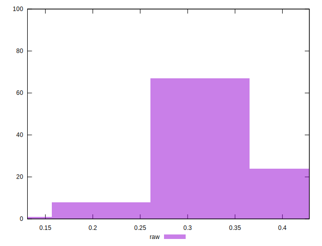

# //meta/pScore/samples/pages+cached+noexternal+nomedia+nocss

[→ Parent](../..)


## Raw


```yaml
p90min: 0.25598661113684085
p90max: 0.4129467208140551
p90range: 0.15696010967721424
p90mean: 0.33480628459531053
p90median: 0.3369504082846213
p90stdev: 0.04231303210233419
p90skewness: -0.10331142992825602
p90eccentricity: 0.9999999999999999
p90discretization: 1
outlandishness: 0.9824762590850098
confidence: 0.020760682400266184
p90confidence: 0.01738727559871278

```

