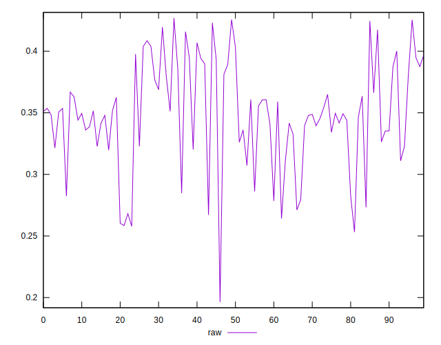
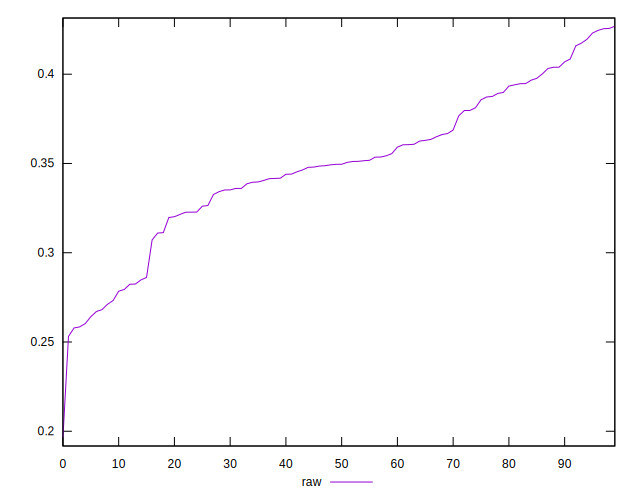
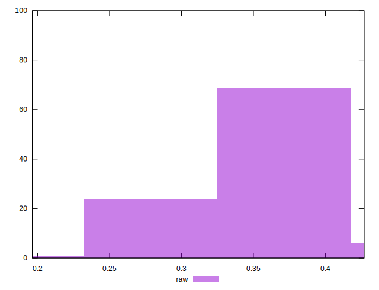

# //meta/pScore/samples/pages+cached+noexternal+nomedia

[→ Parent](../..)


## Raw


```yaml
p90min: 0.27113301705903337
p90max: 0.4256378200985735
p90range: 0.15450480303954012
p90mean: 0.3553693146768947
p90median: 0.35119823504223435
p90stdev: 0.0376435851468778
p90skewness: -0.15757689616467027
p90eccentricity: 1.0000000000000002
p90discretization: 1
outlandishness: 0.9584557445575923
confidence: 0.018214084090492966
p90confidence: 0.015468505965004375

```

