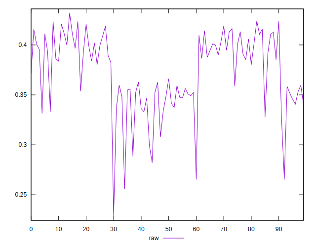
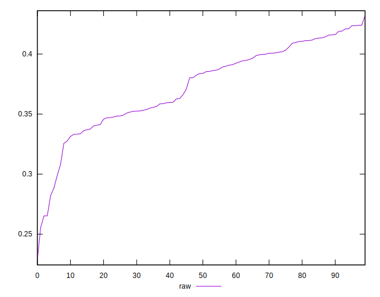
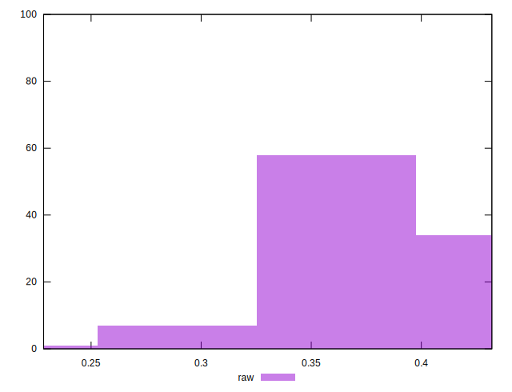

# //meta/pScore/samples/pages+cached+noexternal

[→ Parent](../..)


## Raw


```yaml
p90min: 0.3256683193742271
p90max: 0.42410288735007007
p90range: 0.09843456797584299
p90mean: 0.37995512694850025
p90median: 0.38620107590582914
p90stdev: 0.02930426656534354
p90skewness: -0.1799576266321101
p90eccentricity: 0.9999999999999997
p90discretization: 1
outlandishness: 0.958555261021454
confidence: 0.016113742077421
p90confidence: 0.0120417122969938

```

