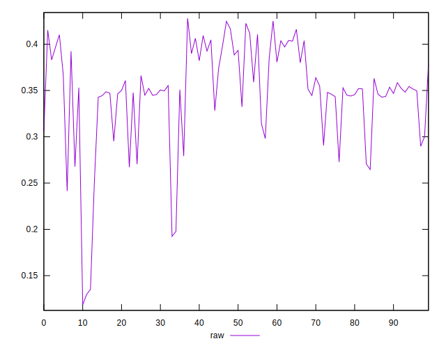
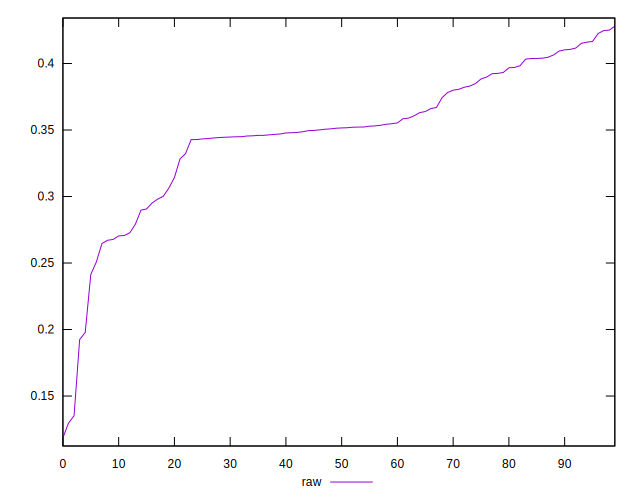
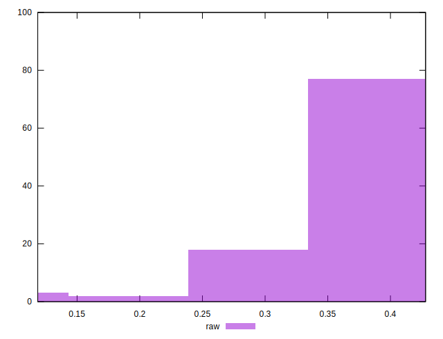

# //meta/pScore/samples/pages+cached

[→ Parent](../..)


## Raw


```yaml
p90min: 0.26709624687853584
p90max: 0.4251102818493301
p90range: 0.15801403497079425
p90mean: 0.3578200790161002
p90median: 0.3522178315790779
p90stdev: 0.03872871756441695
p90skewness: -0.4489981540065922
p90eccentricity: 0.9999999999999999
p90discretization: 1
outlandishness: 0.9307162445198086
confidence: 0.023875628377662328
p90confidence: 0.01591440869207006

```

