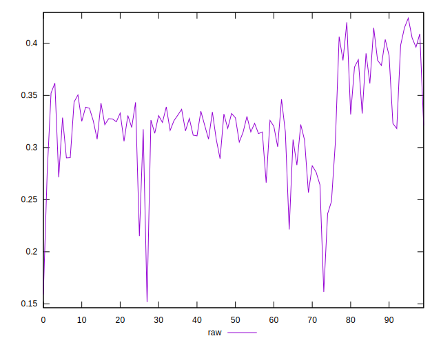
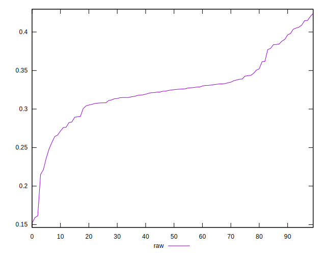
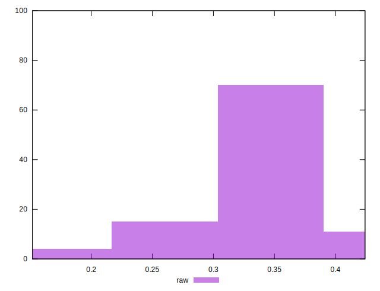

# //meta/pScore/samples/pages

[→ Parent](../..)


## Raw


```yaml
p90min: 0.23643055292829543
p90max: 0.4090985415304088
p90range: 0.17266798860211338
p90mean: 0.32731684793279386
p90median: 0.32517320003469985
p90stdev: 0.03516404427672562
p90skewness: 0.27545012470020375
p90eccentricity: 1.000000000000001
p90discretization: 1
outlandishness: 0.9779412774416839
confidence: 0.019796057084214058
p90confidence: 0.014449612770034537

```

