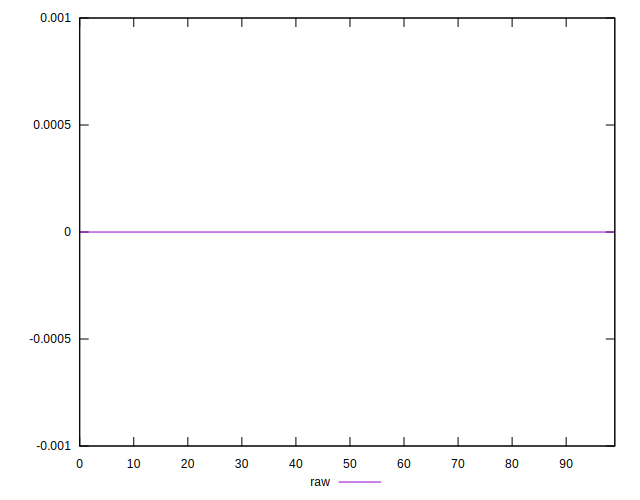

# //meta/score-difference/samples/pages+cached+noexternal+nomedia+nocss+nojs

[→ Parent](../..)


## Raw


```yaml
p90min: 0
p90max: 2.7755575615628914e-17
p90range: 2.7755575615628914e-17
p90mean: 2.0435423804913596e-18
p90median: 0
p90stdev: 6.52984280312103e-18
p90skewness: 3.158097668263453
p90eccentricity: 1.0000000000000022
p90discretization: 22.75
outlandishness: 4.901267297839161
confidence: 3.987644639611594e-18
p90confidence: 2.6832436909637933e-18

```

