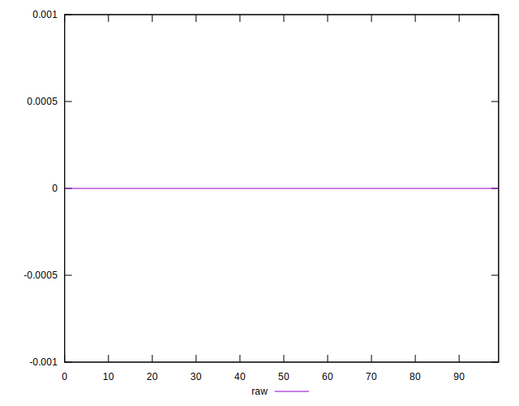
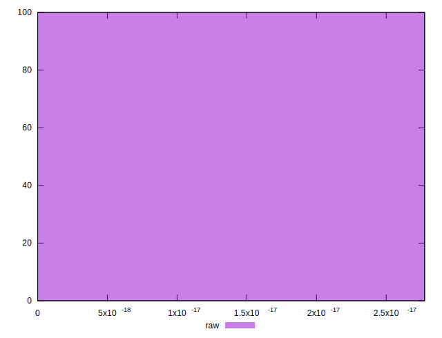

# //meta/score-difference/samples/pages+cached+noexternal+nomedia+nocss

[→ Parent](../..)


## Raw


```yaml
p90min: 0
p90max: 2.7755575615628914e-17
p90range: 2.7755575615628914e-17
p90mean: 2.2265461757592423e-18
p90median: 0
p90stdev: 6.701121550013158e-18
p90skewness: 2.954317720471312
p90eccentricity: 0.999999999999998
p90discretization: 22.75
outlandishness: 4.128689979358227
confidence: 3.805367354385809e-18
p90confidence: 2.7536255716385966e-18

```

