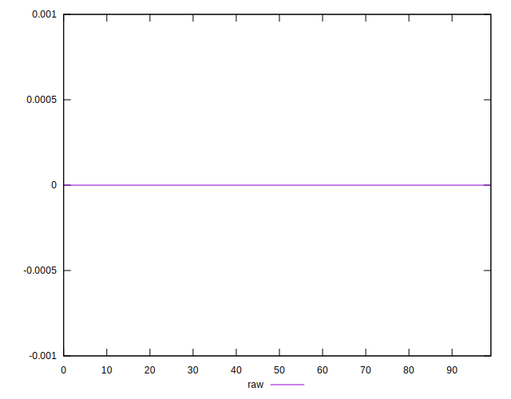
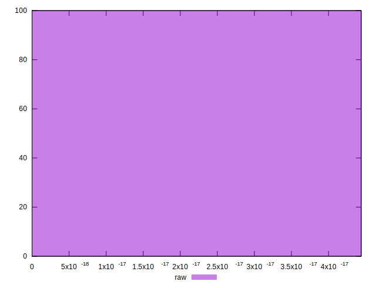

# //meta/score-difference/samples/pages+cached+noexternal+nomedia

[→ Parent](../..)


## Raw


```yaml
p90min: 0
p90max: 1.6653345369377347e-17
p90range: 1.6653345369377347e-17
p90mean: 7.320151810715318e-19
p90median: 0
p90stdev: 3.18289847425909e-18
p90skewness: 4.4132661494133805
p90eccentricity: 1.000000000000004
p90discretization: 30.333333333333332
outlandishness: 13.249599999999994
confidence: 2.8905564705999413e-18
p90confidence: 1.307916975574349e-18

```

