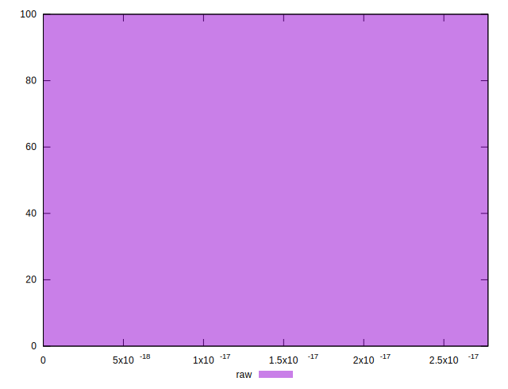

# //meta/score-difference/samples/pages+cached+noexternal

[→ Parent](../..)


## Raw


```yaml
p90min: 0
p90max: 1.6653345369377347e-17
p90range: 1.6653345369377347e-17
p90mean: 1.2810265668751807e-18
p90median: 0
p90stdev: 4.437606199346683e-18
p90skewness: 3.1754264805429506
p90eccentricity: 1.0000000000000013
p90discretization: 45.5
outlandishness: 6.316844444444442
confidence: 3.0022452673778677e-18
p90confidence: 1.8235016058407416e-18

```

