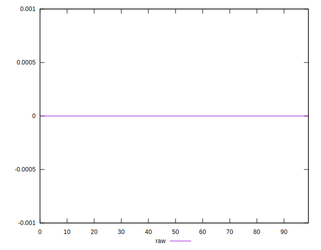

# //meta/score-difference/samples/pages+cached

[→ Parent](../..)


## Raw


```yaml
p90min: 0
p90max: 1.6653345369377347e-17
p90range: 1.6653345369377347e-17
p90mean: 5.490113858036488e-19
p90median: 0
p90stdev: 2.7051155270182357e-18
p90skewness: 5.151616606319533
p90eccentricity: 1.0000000000000024
p90discretization: 30.333333333333332
outlandishness: 19.792612345678997
confidence: 2.648466542671292e-18
p90confidence: 1.1115863566777724e-18

```

