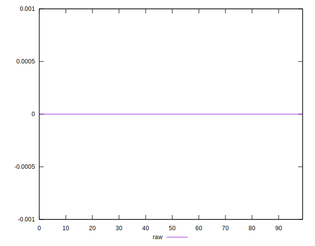

# //meta/score-difference/samples/pages

[→ Parent](../..)


## Raw


```yaml
p90min: 0
p90max: 2.7755575615628914e-17
p90range: 2.7755575615628914e-17
p90mean: 3.11106451955401e-18
p90median: 0
p90stdev: 6.771689963558428e-18
p90skewness: 2.052453662716923
p90eccentricity: 1.000000000000001
p90discretization: 15.166666666666666
outlandishness: 2.9341674740484445
confidence: 3.7490353227559395e-18
p90confidence: 2.782623551549563e-18

```

