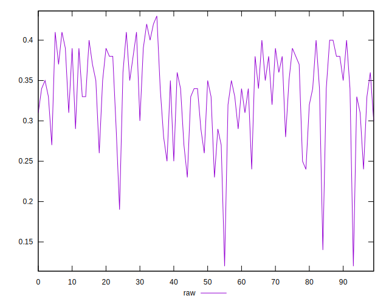
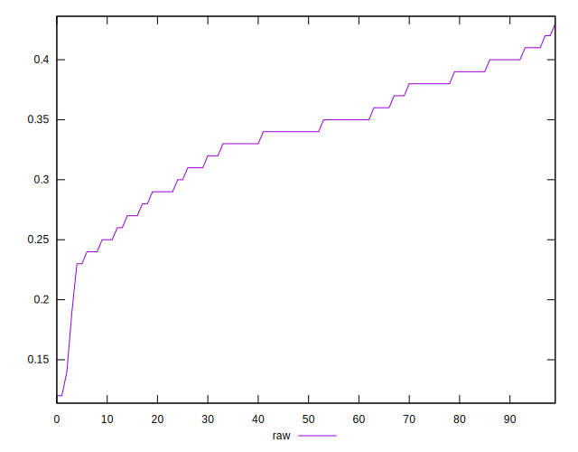
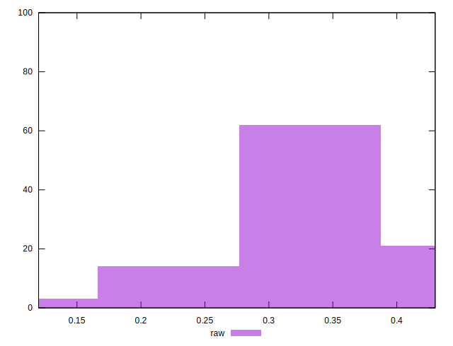

# //meta/score/samples/pages+cached+noexternal+nomedia+nocss+nojs

[→ Parent](../..)


## Raw


```yaml
p90min: 0.24
p90max: 0.42
p90range: 0.18
p90mean: 0.3442857142857141
p90median: 0.35
p90stdev: 0.04489653201670658
p90skewness: -0.41874950446171205
p90eccentricity: 1.0000000000000002
p90discretization: 4.7894736842105265
outlandishness: 0.9338295156763832
confidence: 0.024522932778229256
p90confidence: 0.01844888765506003

```

