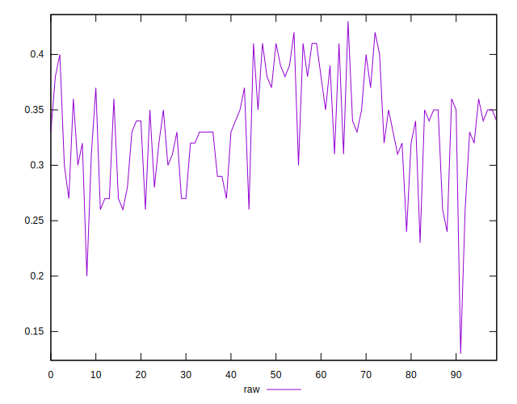
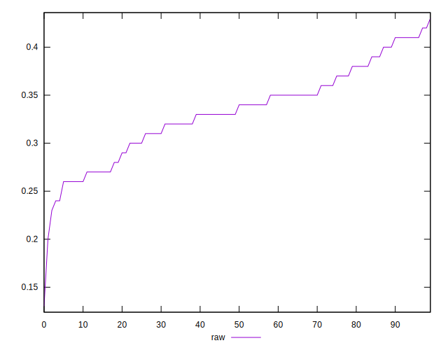
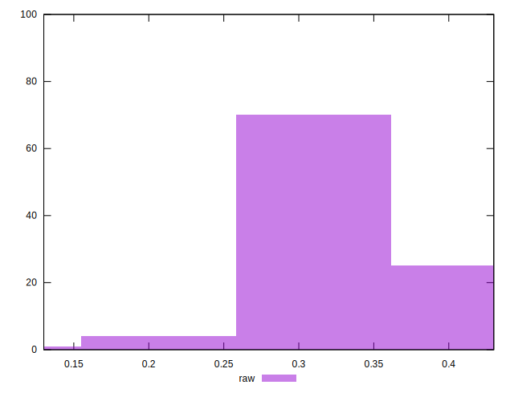

# //meta/score/samples/pages+cached+noexternal+nomedia+nocss

[→ Parent](../..)


## Raw


```yaml
p90min: 0.26
p90max: 0.41
p90range: 0.14999999999999997
p90mean: 0.3346153846153846
p90median: 0.34
p90stdev: 0.04188701947711541
p90skewness: -0.07082281122038524
p90eccentricity: 1.0000000000000002
p90discretization: 5.6875
outlandishness: 0.9826506228035417
confidence: 0.020631300001495823
p90confidence: 0.017212218445982752

```

