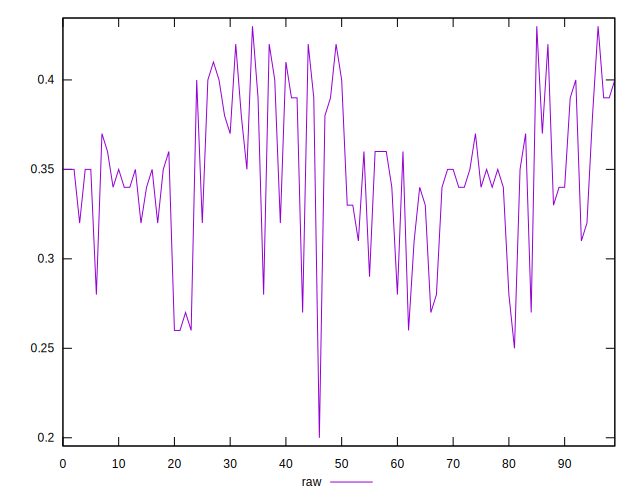
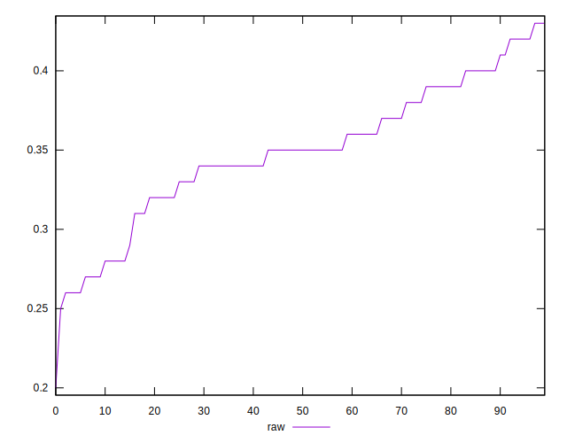
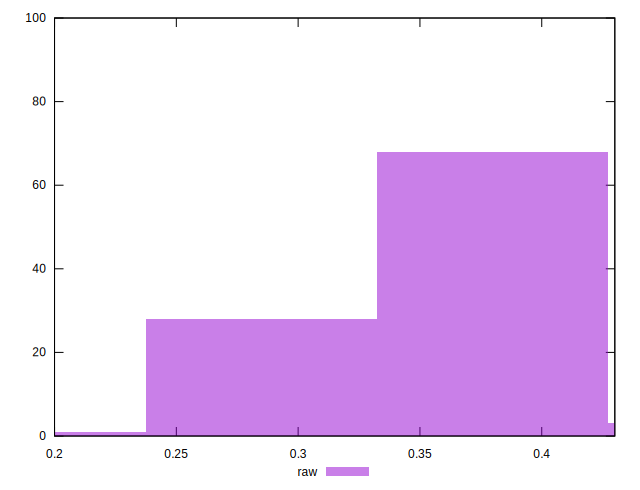

# //meta/score/samples/pages+cached+noexternal+nomedia

[→ Parent](../..)


## Raw


```yaml
p90min: 0.27
p90max: 0.42
p90range: 0.14999999999999997
p90mean: 0.35197802197802197
p90median: 0.35
p90stdev: 0.038494177673626784
p90skewness: -0.2872204365759396
p90eccentricity: 1.0000000000000004
p90discretization: 6.066666666666666
outlandishness: 0.9780858001918087
confidence: 0.018341702786207725
p90confidence: 0.01581803153549577

```

