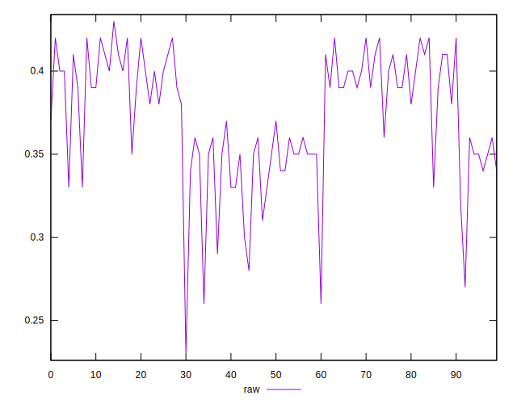
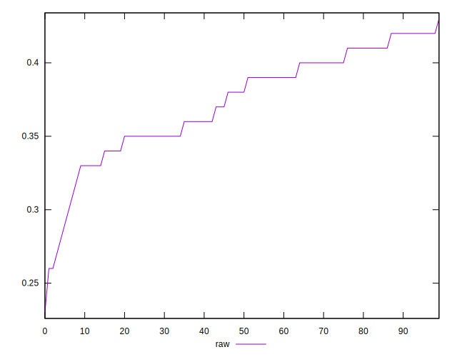
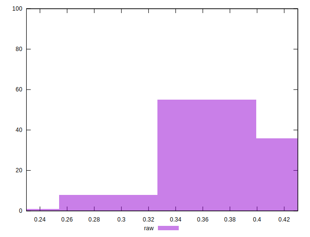

# //meta/score/samples/pages+cached+noexternal

[→ Parent](../..)


## Raw


```yaml
p90min: 0.32
p90max: 0.42
p90range: 0.09999999999999998
p90mean: 0.37978021978022
p90median: 0.39
p90stdev: 0.029425936902485517
p90skewness: -0.2294651839463896
p90eccentricity: 1.0000000000000002
p90discretization: 8.272727272727273
outlandishness: 0.958931695891539
confidence: 0.016044864217066745
p90confidence: 0.012091709084720126

```

