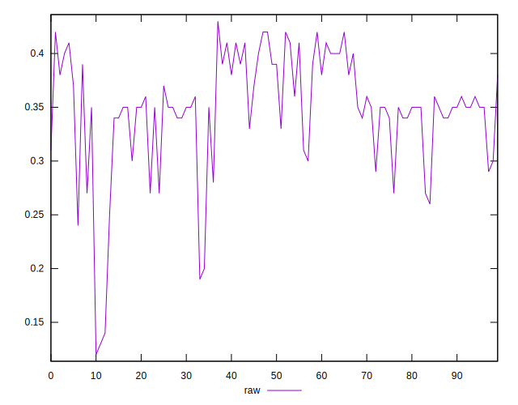
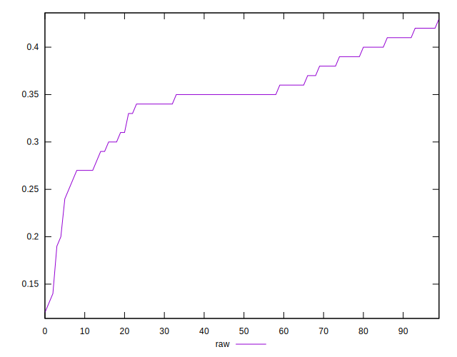
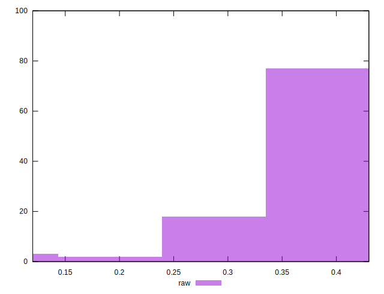

# //meta/score/samples/pages+cached

[→ Parent](../..)


## Raw


```yaml
p90min: 0.27
p90max: 0.42
p90range: 0.14999999999999997
p90mean: 0.3576923076923078
p90median: 0.35
p90stdev: 0.03877455048100785
p90skewness: -0.41333021852498614
p90eccentricity: 0.9999999999999996
p90discretization: 6.066666666666666
outlandishness: 0.9308307406636602
confidence: 0.023840736367117032
p90confidence: 0.015933242358972755

```

