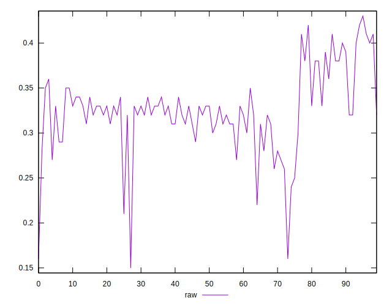
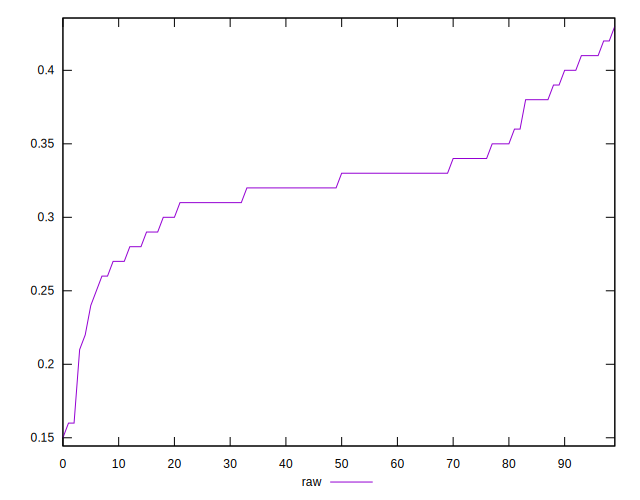
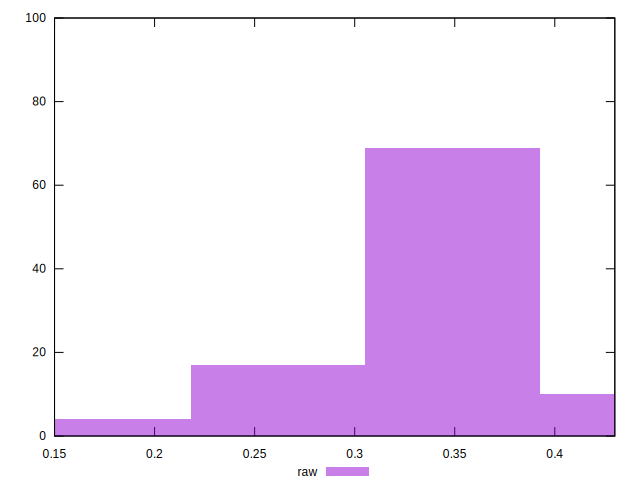

# //meta/score/samples/pages

[→ Parent](../..)


## Raw


```yaml
p90min: 0.24
p90max: 0.41
p90range: 0.16999999999999998
p90mean: 0.32747252747252736
p90median: 0.33
p90stdev: 0.03535047154801233
p90skewness: 0.30913656986086696
p90eccentricity: 0.9999999999999988
p90discretization: 5.352941176470588
outlandishness: 0.9776962407549208
confidence: 0.019978408119049162
p90confidence: 0.014526219483945724

```

