# //meta/scoreEstimate

[→ Parent](../..)

[0=pages](samples/pages)  
[1=pages+cached](samples/pages+cached)  
[2=pages+cached+noexternal](samples/pages+cached+noexternal)  
[3=pages+cached+noexternal+nomedia](samples/pages+cached+noexternal+nomedia)  
[4=pages+cached+noexternal+nomedia+nocss](samples/pages+cached+noexternal+nomedia+nocss)  
[5=pages+cached+noexternal+nomedia+nocss+nojs](samples/pages+cached+noexternal+nomedia+nocss+nojs)  

## Comparison

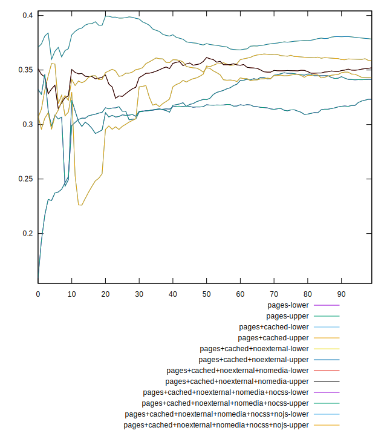
## Score Differentials

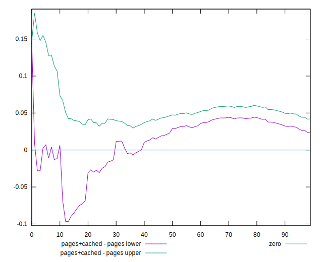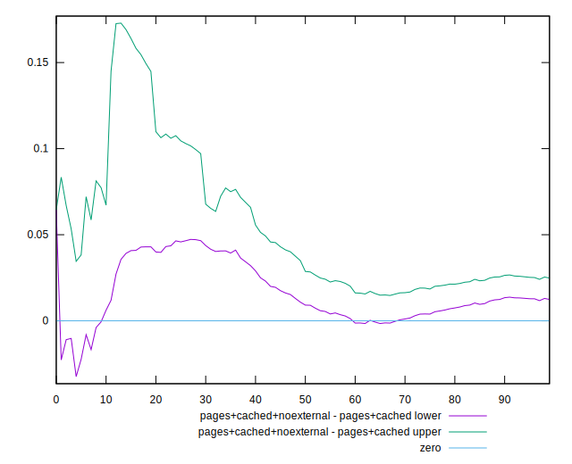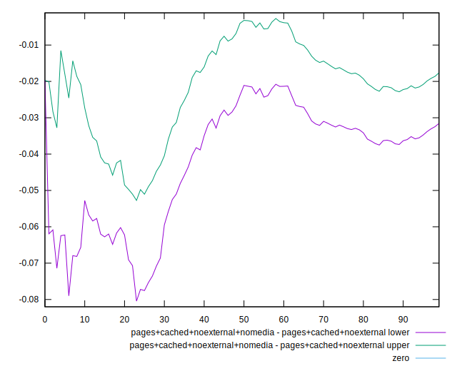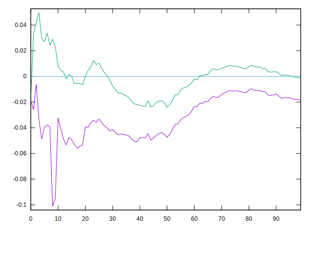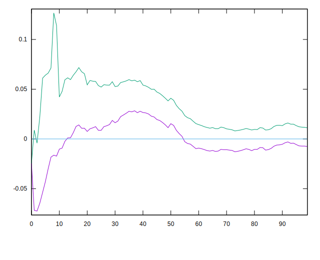
## Absolute value comparisons

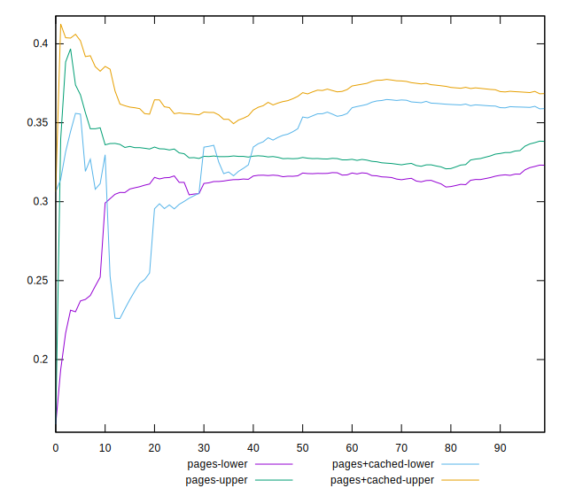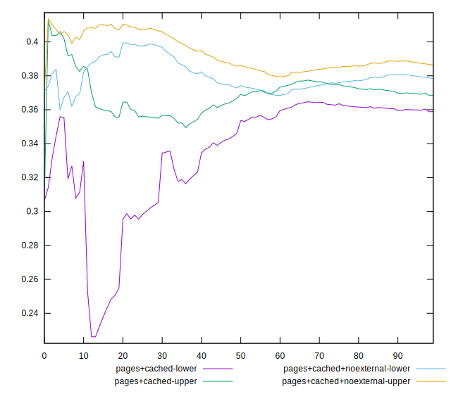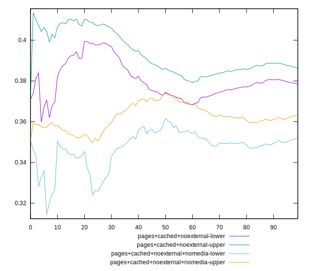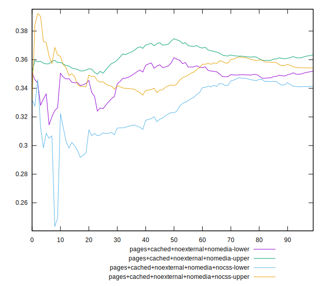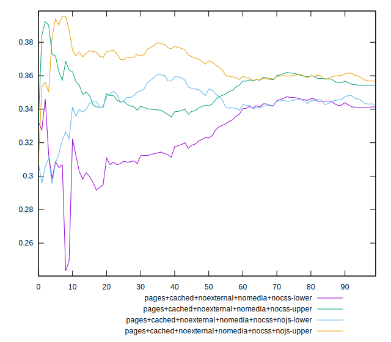