# //offscreen-images/samples/pages+cached+noexternal+nomedia+nocss+nojs

[→ Parent](../..)


## Raw


```yaml
p90min: 0
p90max: 1210
p90range: 1210
p90mean: 629.2307692307693
p90median: 750
p90stdev: 508.65310351220216
p90skewness: -0.13862928689920687
p90eccentricity: 1.0000000000000002
p90discretization: 7
outlandishness: 1.0888845959792204
confidence: 216.96949677801763
p90confidence: 209.01578675614132

```

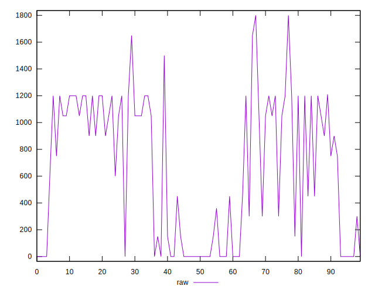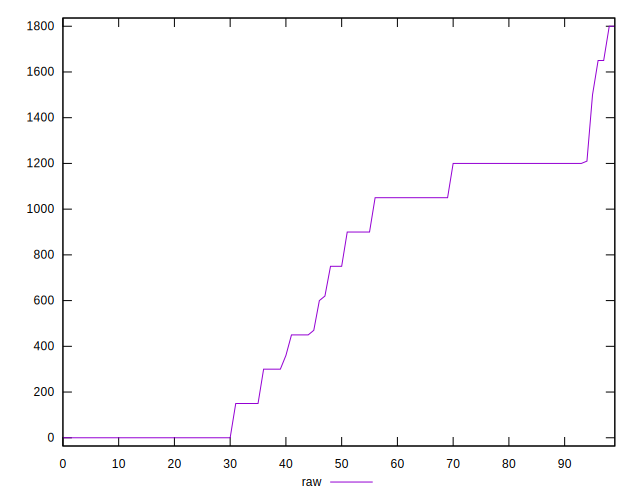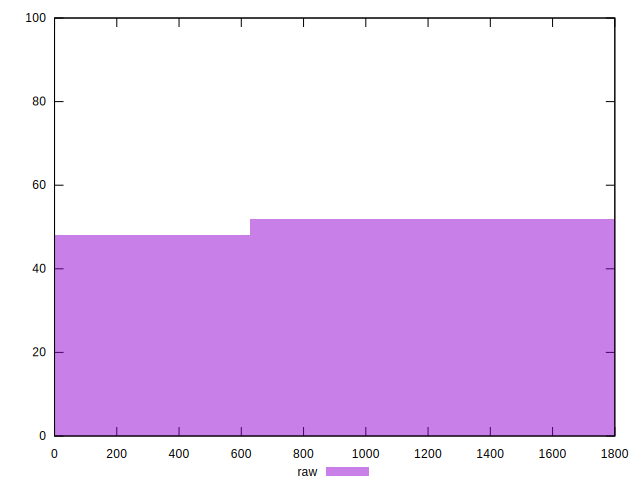
## Score


```yaml
p90min: 0.38
p90max: 1
p90range: 0.62
p90mean: 0.6390109890109894
p90median: 0.48
p90stdev: 0.23586201472287077
p90skewness: 0.6327823758805081
p90eccentricity: 1.0000000000000016
p90discretization: 6.066666666666666
outlandishness: 1.1042702715351305
confidence: 0.09705028407323346
p90confidence: 0.09692044387969956

```

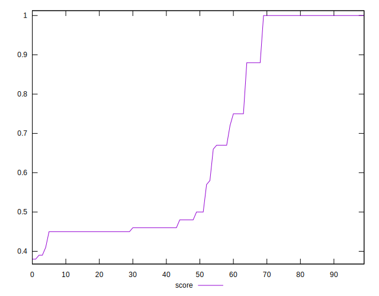
## Raw Estimate

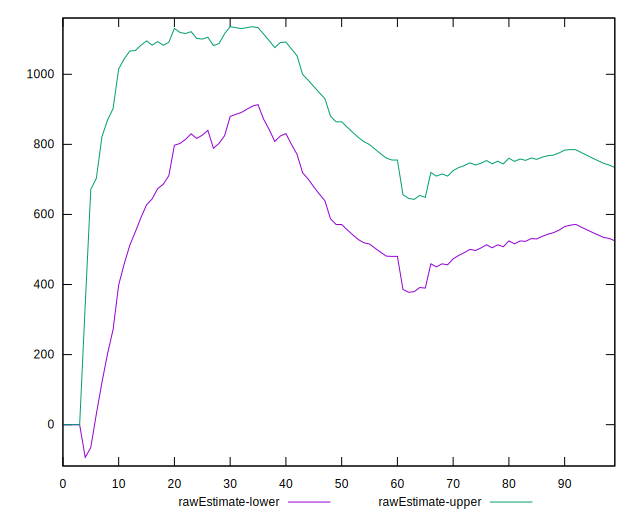
## Score Estimate

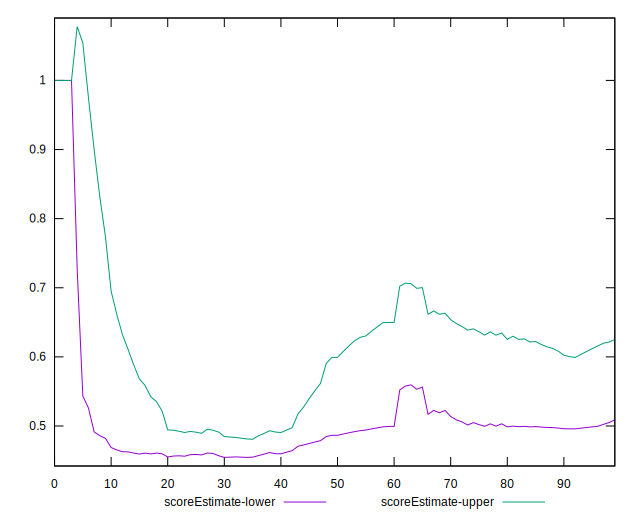
## P Score


```yaml
p90min: 0.3764705882352941
p90max: 1
p90range: 0.6235294117647059
p90mean: 0.638629964806435
p90median: 0.4823529411764706
p90stdev: 0.23553993640527782
p90skewness: 0.6359887527860111
p90eccentricity: 1.0000000000000002
p90discretization: 5.6875
outlandishness: 1.1044468844692195
confidence: 0.09695870956818897
p90confidence: 0.09678809542358291

```

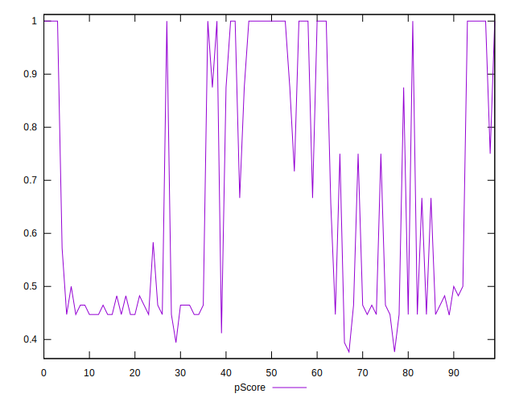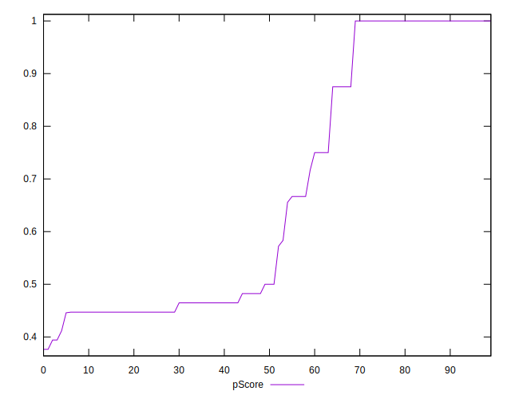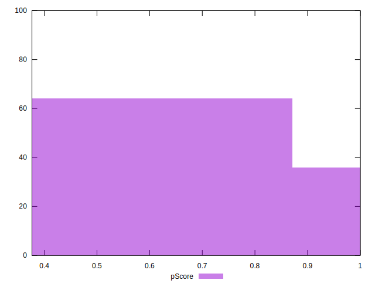
## Score Difference


```yaml
p90min: 0
p90max: 0
p90range: 0
p90mean: 0
p90median: 0
p90stdev: 0
p90skewness: .nan
p90eccentricity: .nan
p90discretization: 91
outlandishness: .inf
confidence: 4.8216875792918796e-18
p90confidence: 0

```

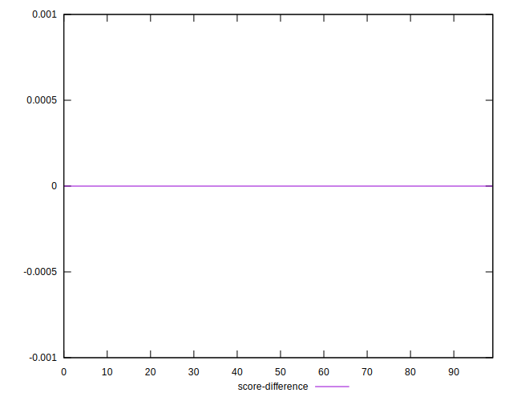
## P Score Difference


```yaml
p90min: -0.0050000000000000044
p90max: 0.004705882352941171
p90range: 0.009705882352941175
p90mean: -0.0008464411405587875
p90median: 0
p90stdev: 0.0025160439523796746
p90skewness: 0.4353535687670936
p90eccentricity: 1
p90discretization: 6.5
outlandishness: 0.167800939240015
confidence: 0.0011283382900826543
p90confidence: 0.0010338930453553275

```

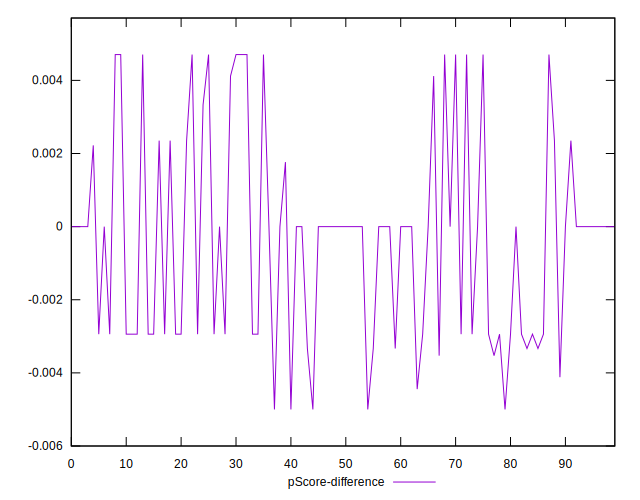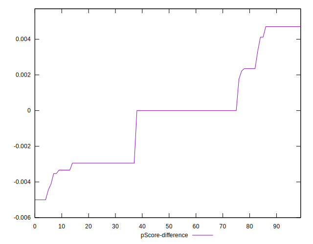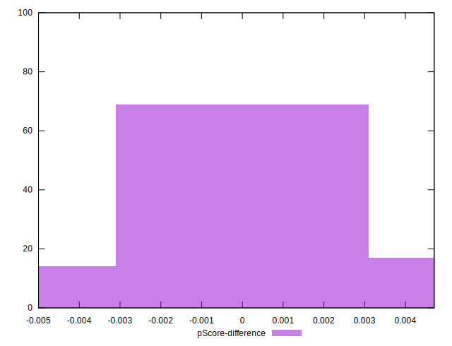