# //offscreen-images/samples/pages+cached+noexternal+nomedia+nocss

[→ Parent](../..)


## Raw


```yaml
p90min: 0
p90max: 1200
p90range: 1200
p90mean: 449.7802197802198
p90median: 150
p90stdev: 502.57354832588925
p90skewness: 0.4782659188778695
p90eccentricity: 1.0000000000000009
p90discretization: 8.272727272727273
outlandishness: 1.3691973041935037
confidence: 211.89424718173746
p90confidence: 206.51757530000293

```

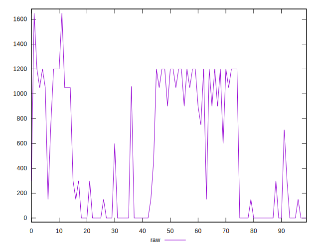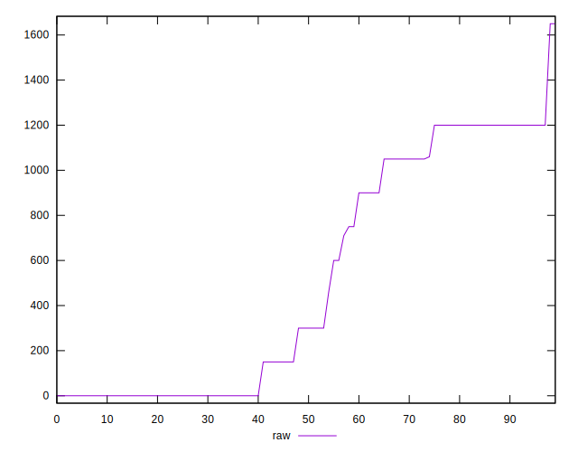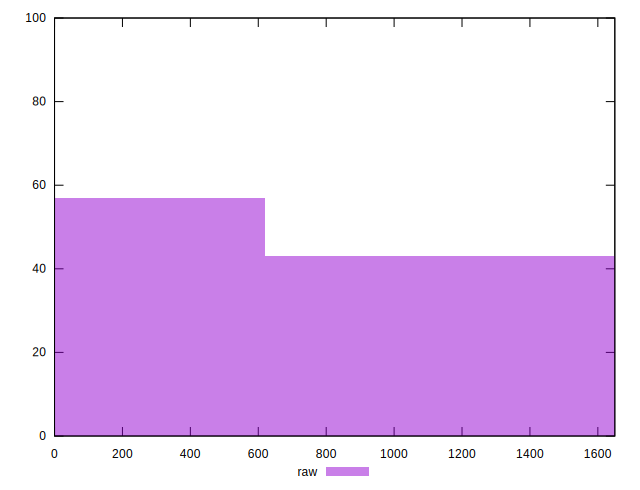
## Score


```yaml
p90min: 0.45
p90max: 1
p90range: 0.55
p90mean: 0.7604395604395607
p90median: 0.88
p90stdev: 0.2471859738895372
p90skewness: -0.25212044661929794
p90eccentricity: 0.9999999999999983
p90discretization: 9.1
outlandishness: 0.9248296453460694
confidence: 0.0993555292613526
p90confidence: 0.1015736863706469

```

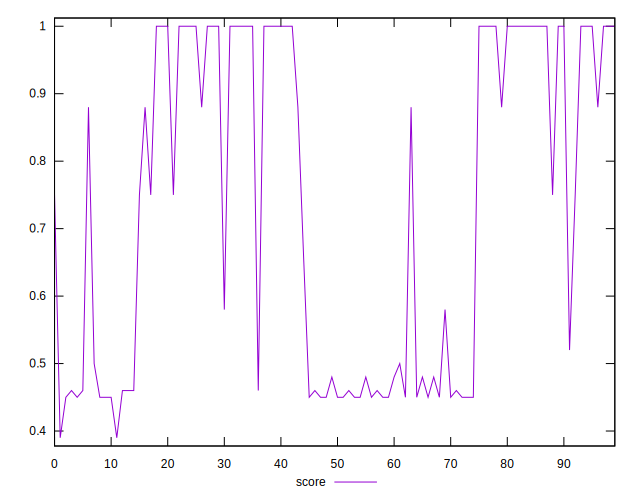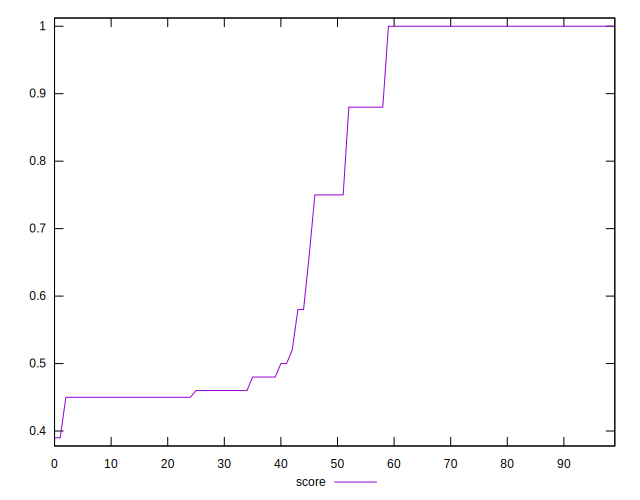
## Raw Estimate


## Score Estimate

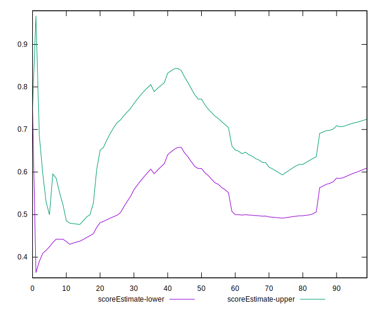
## P Score


```yaml
p90min: 0.4470588235294118
p90max: 1
p90range: 0.5529411764705883
p90mean: 0.7602811893988362
p90median: 0.875
p90stdev: 0.24682030633224922
p90skewness: -0.2506836522361606
p90eccentricity: 1.0000000000000018
p90discretization: 8.272727272727273
outlandishness: 0.9245378690607323
confidence: 0.09926867396832972
p90confidence: 0.10142342621957345

```

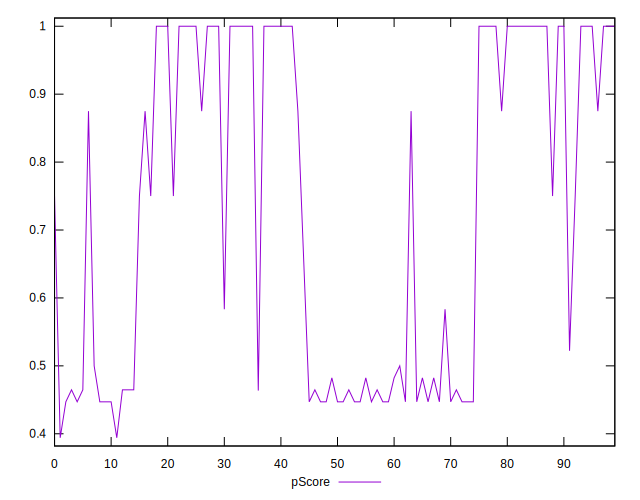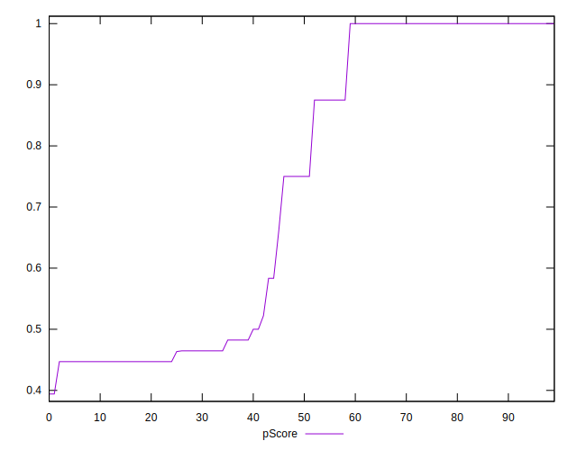
## Score Difference


```yaml
p90min: 0
p90max: 0
p90range: 0
p90mean: 0
p90median: 0
p90stdev: 0
p90skewness: .nan
p90eccentricity: .nan
p90discretization: 91
outlandishness: .nan
confidence: 0
p90confidence: 0

```


## P Score Difference


```yaml
p90min: -0.0050000000000000044
p90max: 0.004117647058823504
p90range: 0.009117647058823508
p90mean: -0.0007595345830639909
p90median: 0
p90stdev: 0.002158316904060229
p90skewness: -0.1303296412742297
p90eccentricity: 1.0000000000000007
p90discretization: 10.11111111111111
outlandishness: 0.1241737636939776
confidence: 0.001013549591002062
p90confidence: 0.000886895809061757

```

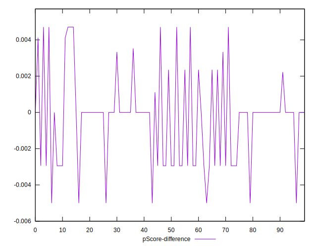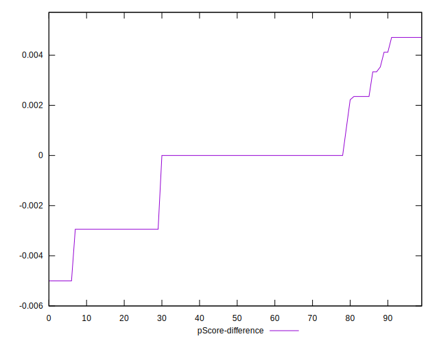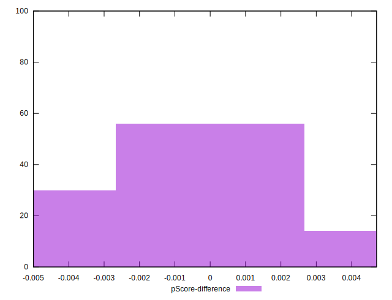