# //offscreen-images/samples/pages+cached+noexternal+nomedia

[→ Parent](../..)


## Raw


```yaml
p90min: 0
p90max: 1200
p90range: 1200
p90mean: 473.2967032967033
p90median: 150
p90stdev: 511.90240945156575
p90skewness: 0.40473299584674
p90eccentricity: 0.9999999999999999
p90discretization: 10.11111111111111
outlandishness: 1.3317920948877833
confidence: 212.56333418378904
p90confidence: 210.35099189425614

```

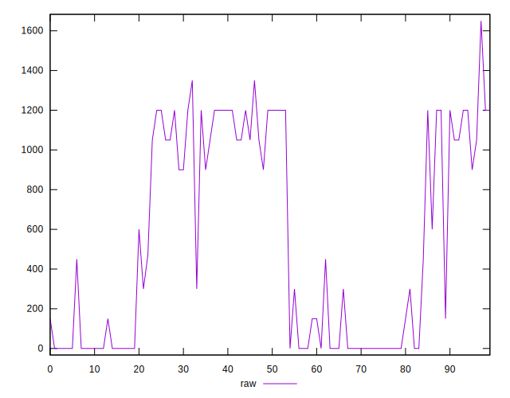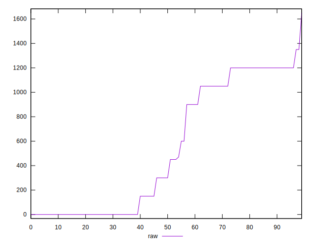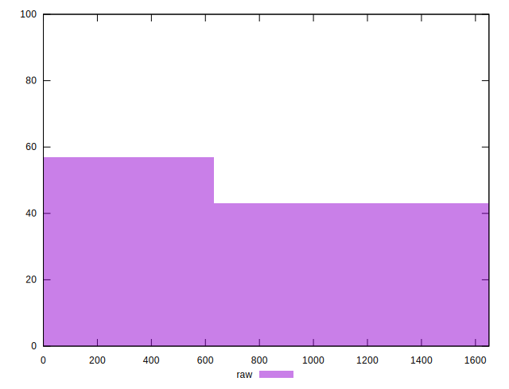
## Score


```yaml
p90min: 0.45
p90max: 1
p90range: 0.55
p90mean: 0.7156043956043959
p90median: 0.67
p90stdev: 0.24925034324359963
p90skewness: 0.07430909932841515
p90eccentricity: 1.0000000000000009
p90discretization: 10.11111111111111
outlandishness: 1.0227539044554483
confidence: 0.0991775164725004
p90confidence: 0.10242197724258939

```

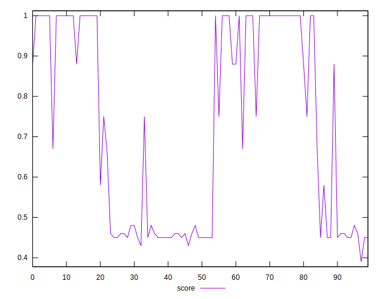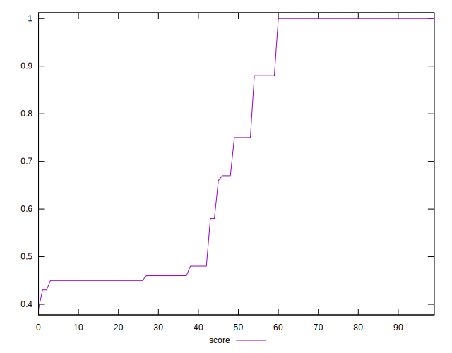
## Raw Estimate

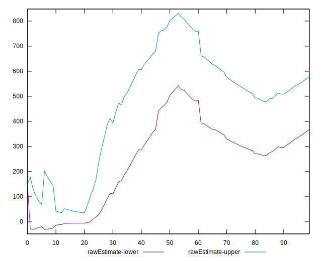
## Score Estimate

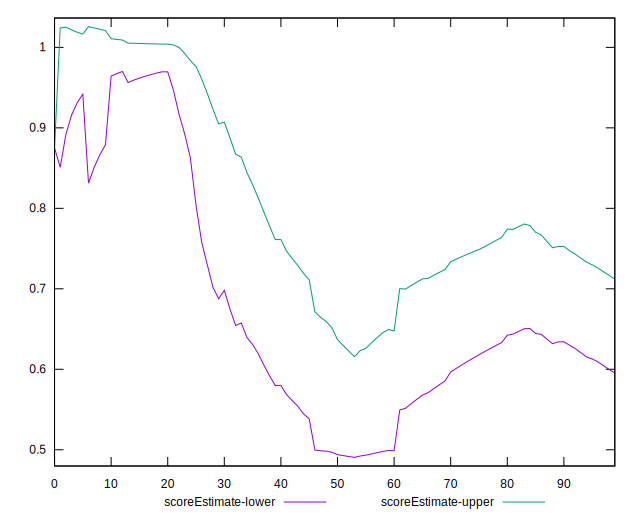
## P Score


```yaml
p90min: 0.4470588235294118
p90max: 1
p90range: 0.5529411764705883
p90mean: 0.7151116856999205
p90median: 0.6666666666666666
p90stdev: 0.24916011243267827
p90skewness: 0.07654482657561357
p90eccentricity: 1.0000000000000018
p90discretization: 10.11111111111111
outlandishness: 1.0229782932299896
confidence: 0.0991356652610853
p90confidence: 0.10238489958828212

```

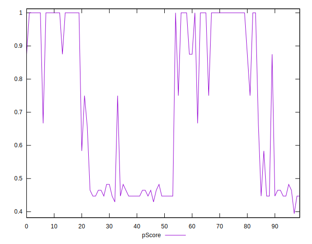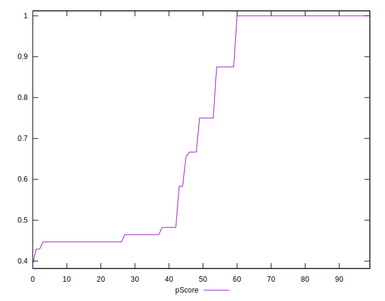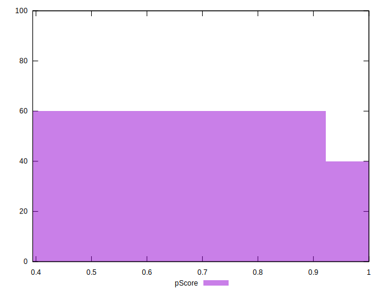
## Score Difference


```yaml
p90min: 0
p90max: 0
p90range: 0
p90mean: 0
p90median: 0
p90stdev: 0
p90skewness: .nan
p90eccentricity: .nan
p90discretization: 91
outlandishness: .nan
confidence: 0
p90confidence: 0

```


## P Score Difference


```yaml
p90min: -0.0050000000000000044
p90max: 0.004705882352941171
p90range: 0.009705882352941175
p90mean: -0.0009258062199238639
p90median: 0
p90stdev: 0.002210223037355589
p90skewness: 0.16732821666208583
p90eccentricity: 1.000000000000001
p90discretization: 9.1
outlandishness: 0.20478257939562522
confidence: 0.0010402931755008758
p90confidence: 0.0009082250828109705

```

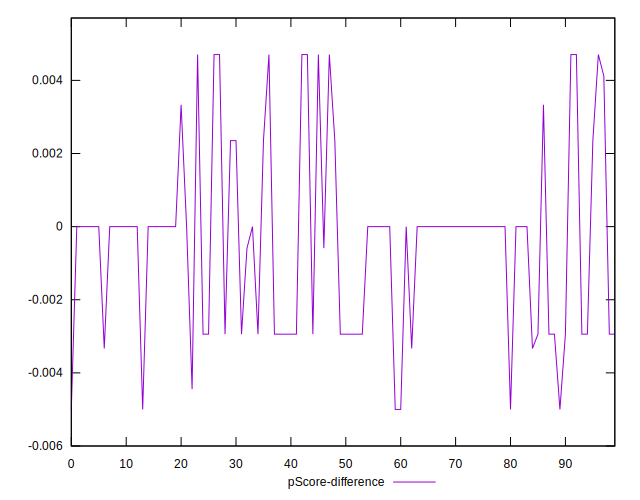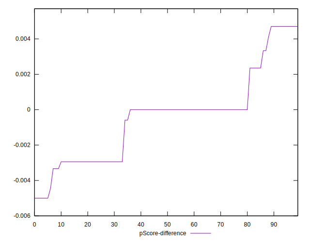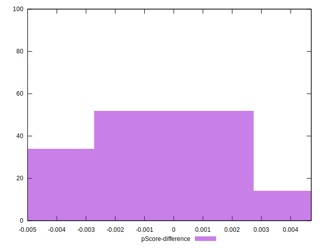