# //offscreen-images/samples/pages+cached+noexternal

[→ Parent](../..)


## Raw


```yaml
p90min: 0
p90max: 1350
p90range: 1350
p90mean: 711.7582417582418
p90median: 900
p90stdev: 526.780796429614
p90skewness: -0.44370995625693255
p90eccentricity: 1.0000000000000009
p90discretization: 10.11111111111111
outlandishness: 1.0063091326182654
confidence: 219.6727074282419
p90confidence: 216.464820235037

```

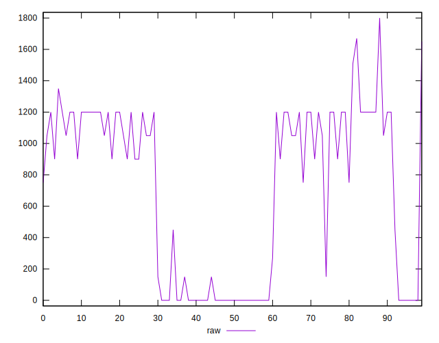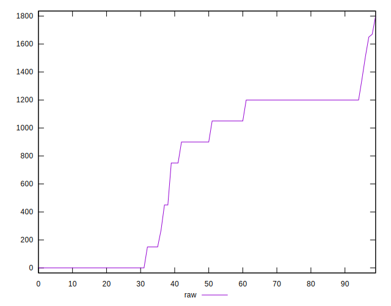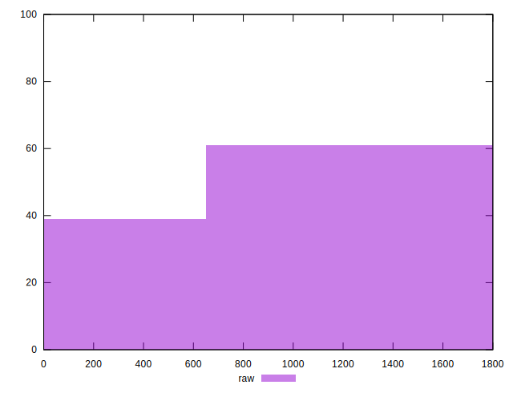
## Score


```yaml
p90min: 0.38
p90max: 1
p90range: 0.62
p90mean: 0.6193406593406598
p90median: 0.46
p90stdev: 0.24187819202108626
p90skewness: 0.8193181889902502
p90eccentricity: 0.9999999999999991
p90discretization: 7.583333333333333
outlandishness: 1.1136914943526888
confidence: 0.1000212003721781
p90confidence: 0.09939261208740002

```

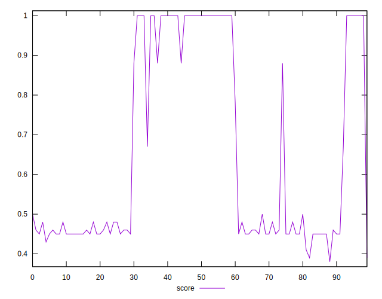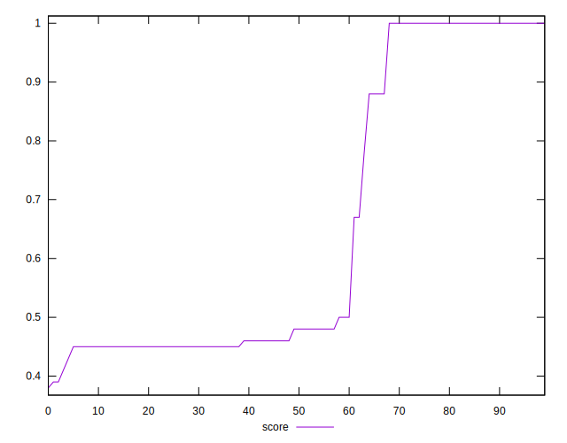
## Raw Estimate

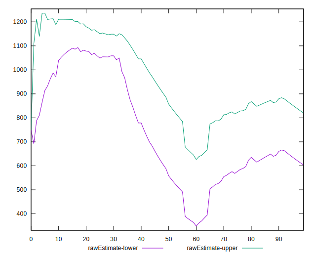
## Score Estimate

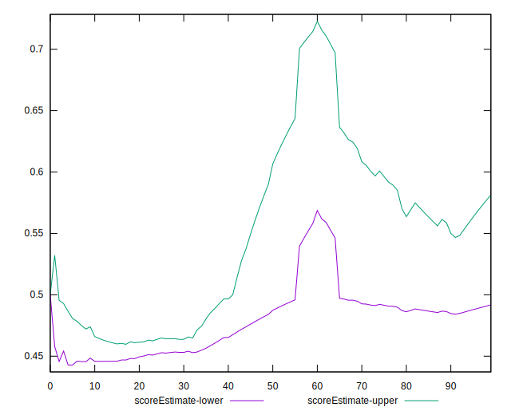
## P Score


```yaml
p90min: 0.3764705882352941
p90max: 1
p90range: 0.6235294117647059
p90mean: 0.6186694677871144
p90median: 0.4647058823529412
p90stdev: 0.24187669511704069
p90skewness: 0.8213133863219022
p90eccentricity: 1.0000000000000018
p90discretization: 7
outlandishness: 1.114024265452178
confidence: 0.1000528638324063
p90confidence: 0.09939199697943213

```

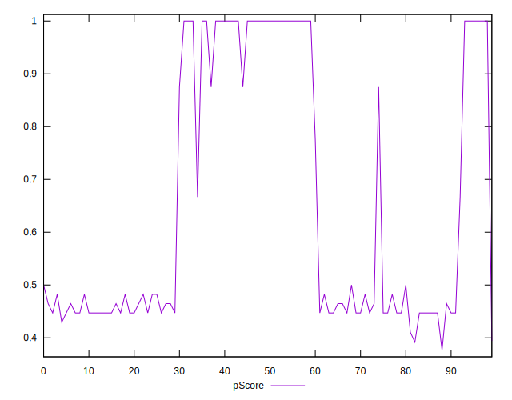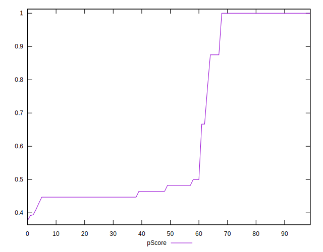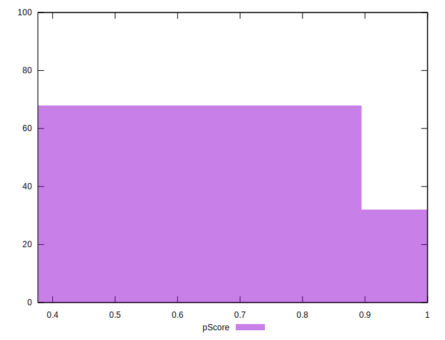
## Score Difference


```yaml
p90min: 0
p90max: 0
p90range: 0
p90mean: 0
p90median: 0
p90stdev: 0
p90skewness: .nan
p90eccentricity: .nan
p90discretization: 91
outlandishness: .inf
confidence: 2.1650898205369656e-18
p90confidence: 0

```

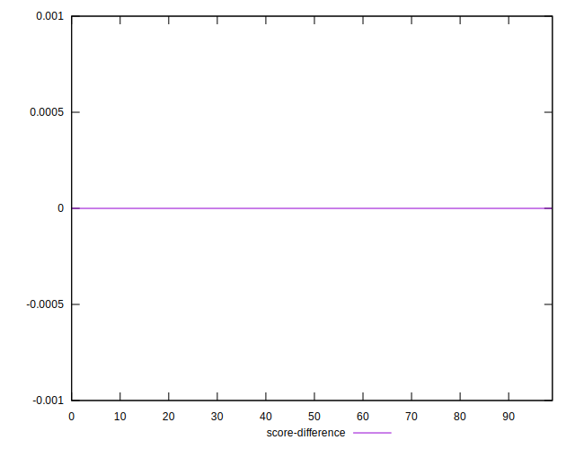
## P Score Difference


```yaml
p90min: -0.0050000000000000044
p90max: 0.004705882352941171
p90range: 0.009705882352941175
p90mean: -0.001136608489549662
p90median: 0
p90stdev: 0.0021711626615753916
p90skewness: 0.3060074033225064
p90eccentricity: 0.9999999999999999
p90discretization: 8.272727272727273
outlandishness: 0.28877125392511305
confidence: 0.001043417079531414
p90confidence: 0.0008921743890900136

```

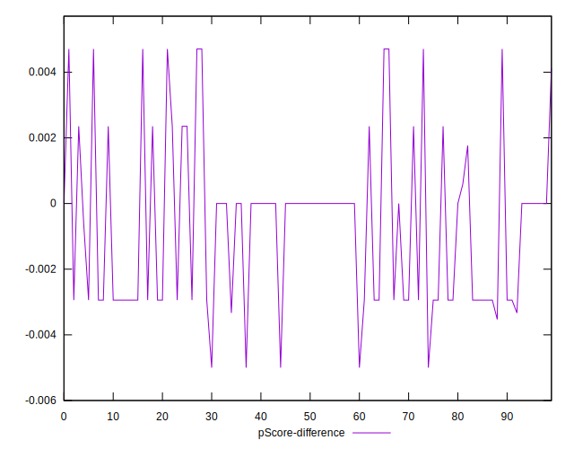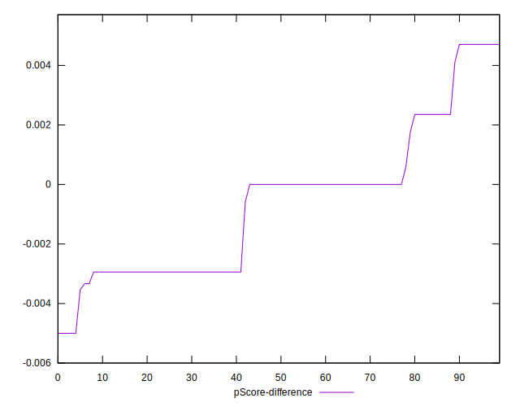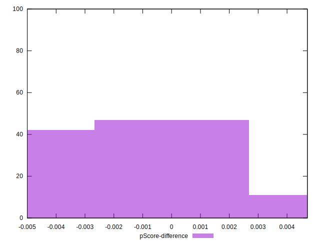