# //offscreen-images/samples/pages+cached

[→ Parent](../..)


## Raw


```yaml
p90min: 0
p90max: 1200
p90range: 1200
p90mean: 391.86813186813185
p90median: 0
p90stdev: 506.38757707431137
p90skewness: 0.705866375268679
p90eccentricity: 1.0000000000000007
p90discretization: 9.1
outlandishness: 1.4056542754543835
confidence: 209.94017329877863
p90confidence: 208.08483639417

```

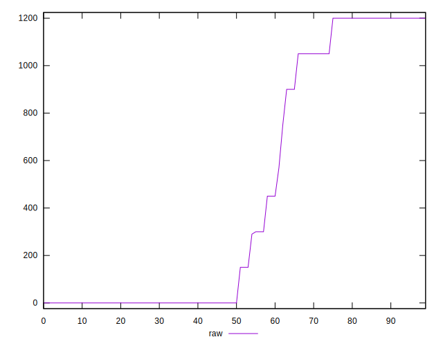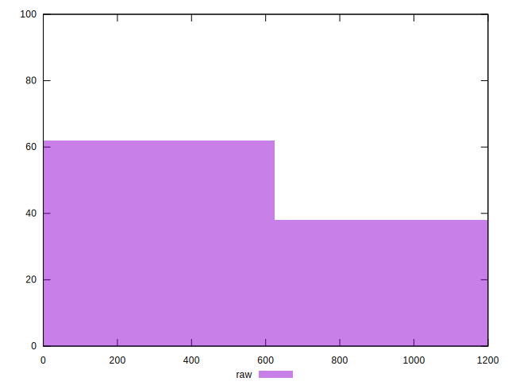
## Score


```yaml
p90min: 0.45
p90max: 1
p90range: 0.55
p90mean: 0.7971428571428575
p90median: 1
p90stdev: 0.2470898120041221
p90skewness: -0.5265971087350547
p90eccentricity: 1
p90discretization: 9.1
outlandishness: 0.9231490374609785
confidence: 0.10026758152016058
p90confidence: 0.10153417151858535

```

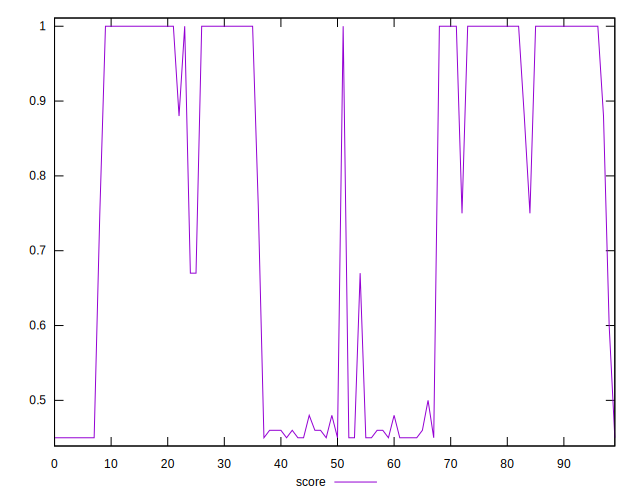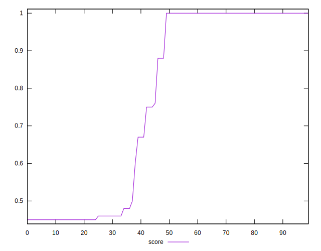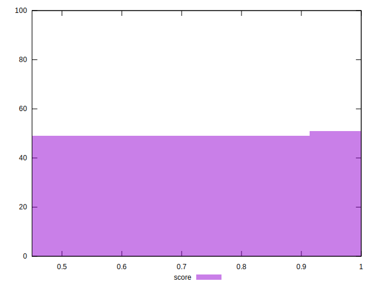
## Raw Estimate

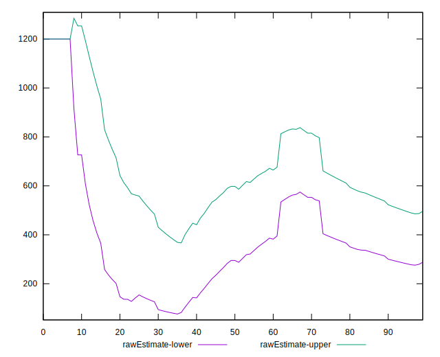
## Score Estimate

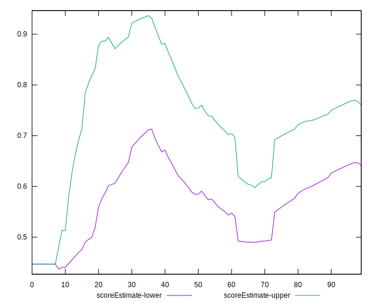
## P Score


```yaml
p90min: 0.4470588235294118
p90max: 1
p90range: 0.5529411764705883
p90mean: 0.7968756733462613
p90median: 1
p90stdev: 0.24709596859140073
p90skewness: -0.5244774160255605
p90eccentricity: 0.9999999999999999
p90discretization: 9.1
outlandishness: 0.9225435504703471
confidence: 0.10038658700090064
p90confidence: 0.10153670138407689

```

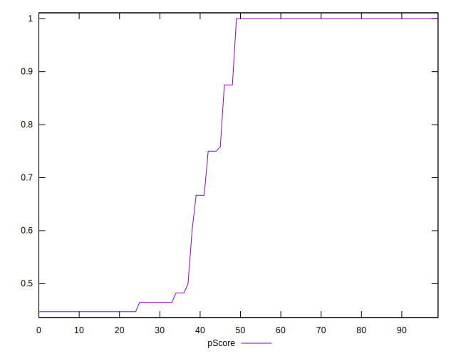
## Score Difference


```yaml
p90min: 0
p90max: 0
p90range: 0
p90mean: 0
p90median: 0
p90stdev: 0
p90skewness: .nan
p90eccentricity: .nan
p90discretization: 91
outlandishness: .nan
confidence: 0
p90confidence: 0

```


## P Score Difference


```yaml
p90min: -0.0050000000000000044
p90max: 0.002352941176470613
p90range: 0.007352941176470618
p90mean: -0.001023486317603964
p90median: 0
p90stdev: 0.0016530304418000275
p90skewness: -0.5514536892539025
p90eccentricity: 1.0000000000000009
p90discretization: 15.166666666666666
outlandishness: 0.24620399379501406
confidence: 0.0008917302630467106
p90confidence: 0.0006792634428827316

```

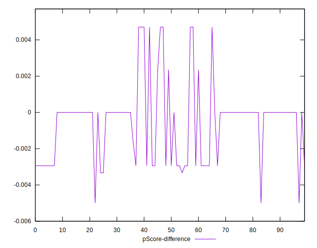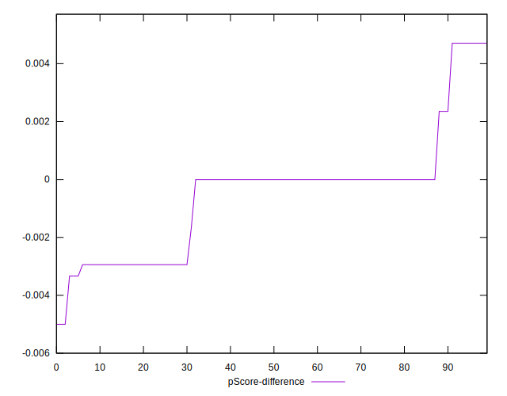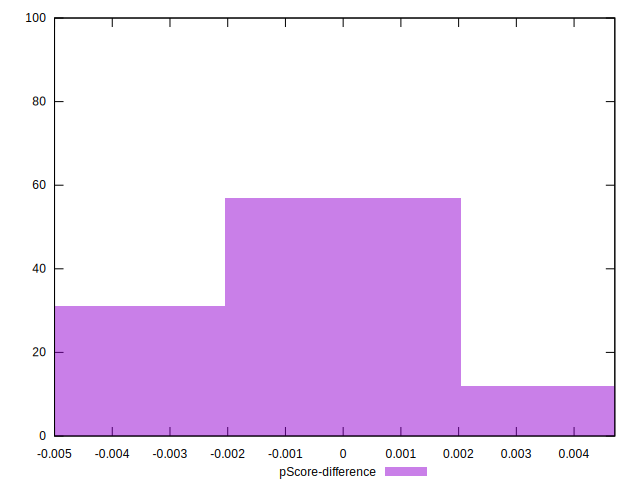