# //offscreen-images/samples/pages

[→ Parent](../..)


## Raw


```yaml
p90min: 0
p90max: 1200
p90range: 1200
p90mean: 240.65934065934067
p90median: 0
p90stdev: 457.2920825756538
p90skewness: 1.4107216858010407
p90eccentricity: 0.9999999999999992
p90discretization: 22.75
outlandishness: 1.8814193382331479
confidence: 204.27112489424542
p90confidence: 187.91051063470366

```

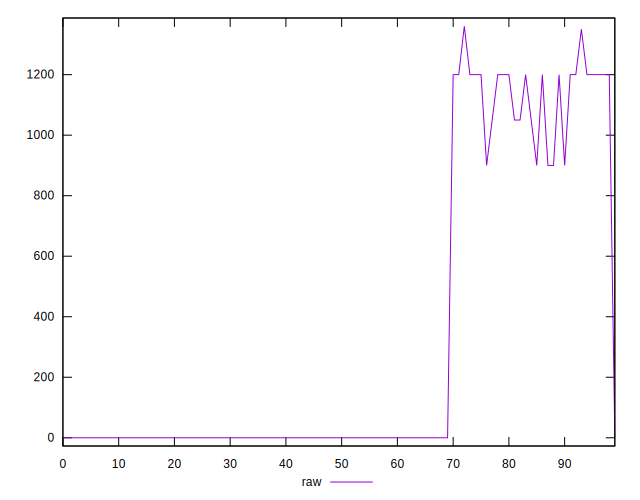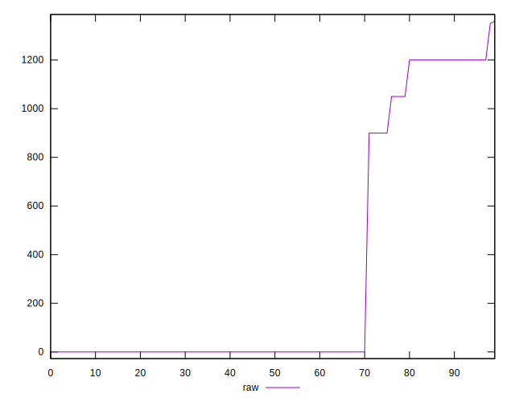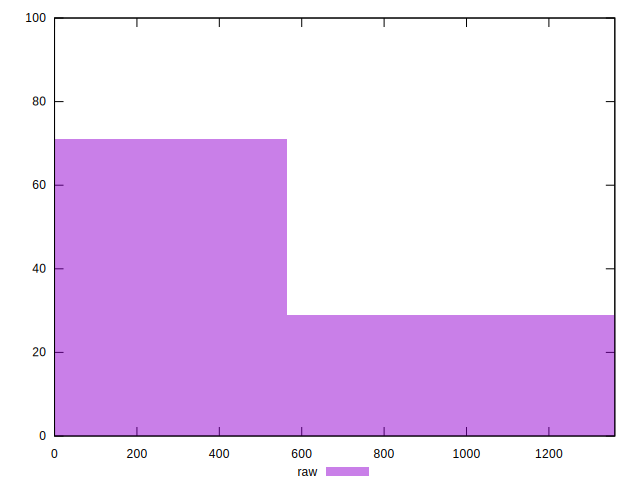
## Score


```yaml
p90min: 0.45
p90max: 1
p90range: 0.55
p90mean: 0.8812087912087915
p90median: 1
p90stdev: 0.2238957526497157
p90skewness: -1.3558230941636782
p90eccentricity: 1.0000000000000024
p90discretization: 22.75
outlandishness: 0.9129910930924273
confidence: 0.09694830646158148
p90confidence: 0.09200326621091004

```

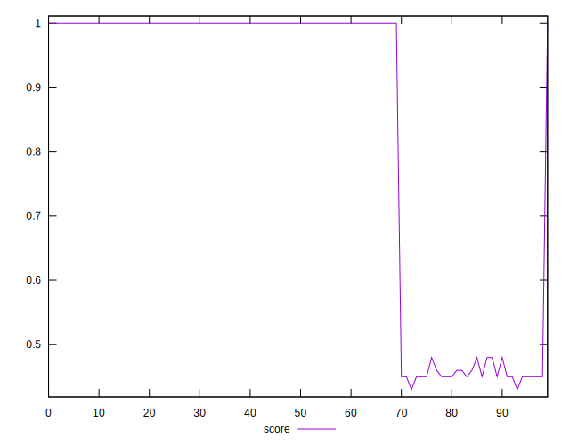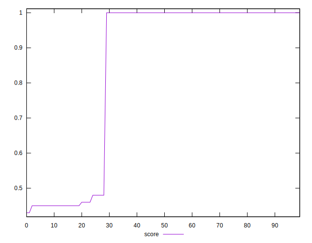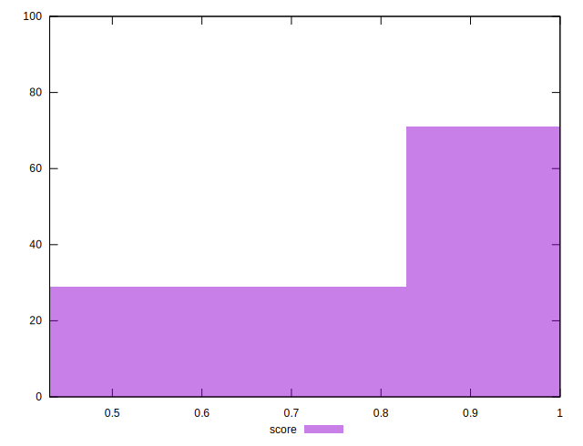
## Raw Estimate

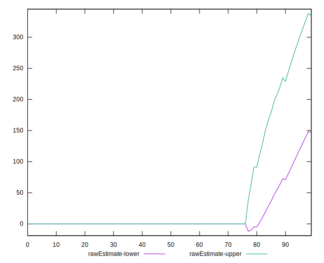
## Score Estimate

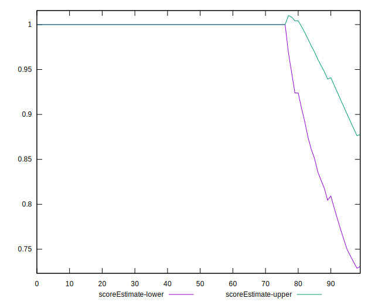
## P Score


```yaml
p90min: 0.4470588235294118
p90max: 1
p90range: 0.5529411764705883
p90mean: 0.8811893988364586
p90median: 1
p90stdev: 0.22396483936547412
p90skewness: -1.3568672479985842
p90eccentricity: 0.9999999999999986
p90discretization: 22.75
outlandishness: 0.9124955551044159
confidence: 0.0971131218540553
p90confidence: 0.09203165533141089

```

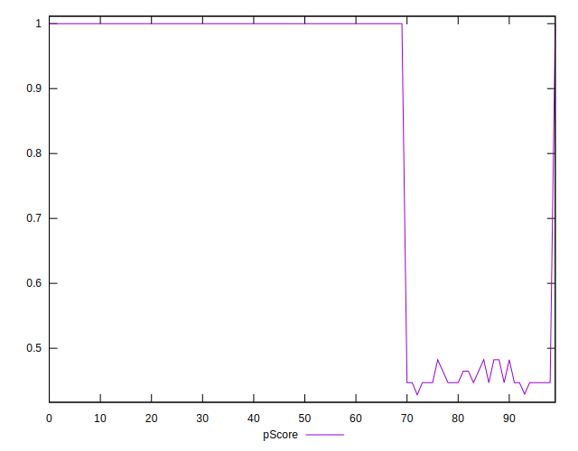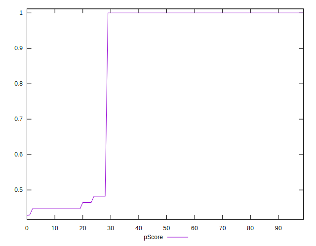
## Score Difference


```yaml
p90min: 0
p90max: 0
p90range: 0
p90mean: 0
p90median: 0
p90stdev: 0
p90skewness: .nan
p90eccentricity: .nan
p90discretization: 91
outlandishness: .nan
confidence: 0
p90confidence: 0

```


## P Score Difference


```yaml
p90min: -0.002941176470588225
p90max: 0.002352941176470613
p90range: 0.005294117647058838
p90mean: -0.0003167420814479606
p90median: 0
p90stdev: 0.0012155991206636348
p90skewness: -0.8604732099060574
p90eccentricity: 0.999999999999997
p90discretization: 18.2
outlandishness: 0.6083999999999966
confidence: 0.0006433086929451128
p90confidence: 0.0004995141184260722

```

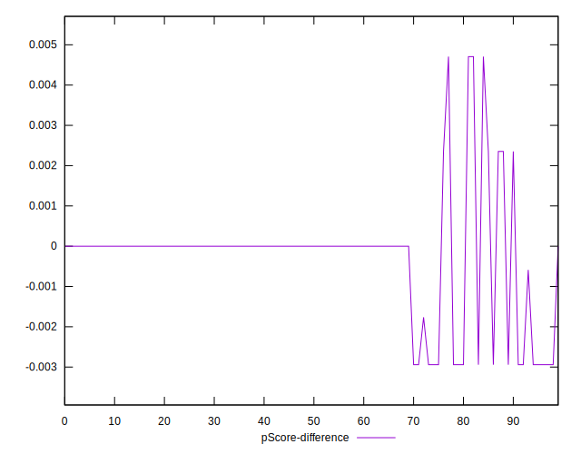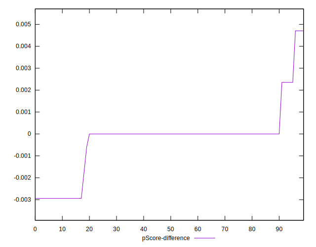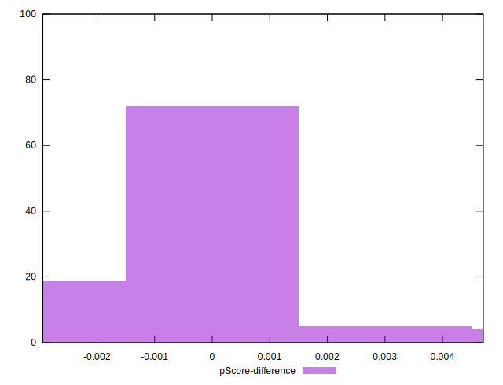