# //render-blocking-resources/samples/pages+cached+noexternal+nomedia+nocss+nojs

[→ Parent](../..)


## Raw


```yaml
p90min: 1144
p90max: 1730
p90range: 586
p90mean: 1439.3626373626373
p90median: 1431
p90stdev: 142.47116665946152
p90skewness: -0.24231148332518784
p90eccentricity: 0.9999999999999997
p90discretization: 1.058139534883721
outlandishness: 1.1200908295883987
confidence: 242.96657921685028
p90confidence: 58.54426677783613

```

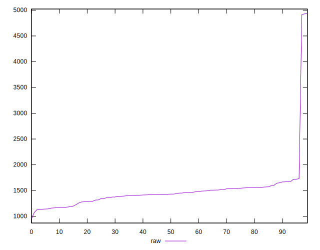
## Score


```yaml
p90min: 0.38
p90max: 0.45
p90range: 0.07
p90mean: 0.4186813186813187
p90median: 0.42
p90stdev: 0.016916653554762205
p90skewness: 0.20708933254513717
p90eccentricity: 1.0000000000000009
p90discretization: 11.375
outlandishness: 0.9533549098173754
confidence: 0.02846893397180894
p90confidence: 0.006951393056711885

```

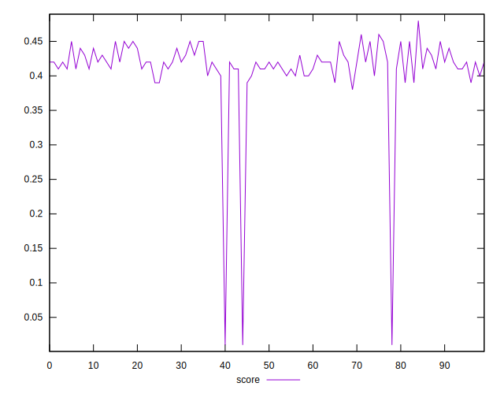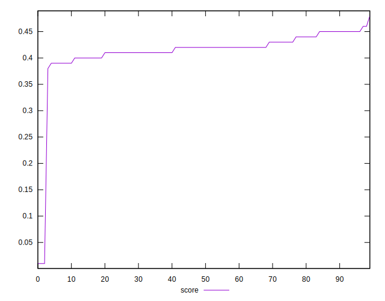
## Raw Estimate

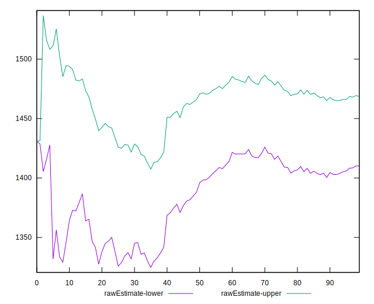
## Score Estimate

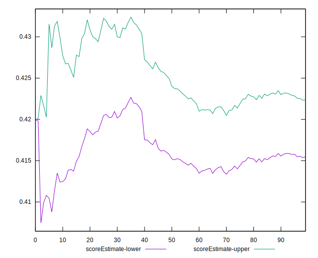
## P Score


```yaml
p90min: 0.3847058823529412
p90max: 0.4536470588235294
p90range: 0.06894117647058823
p90mean: 0.4188985132514543
p90median: 0.4198823529411765
p90stdev: 0.016761313724642526
p90skewness: 0.24231148332518554
p90eccentricity: 0.9999999999999997
p90discretization: 1.058139534883721
outlandishness: 0.9533864000653097
confidence: 0.02858430343727647
p90confidence: 0.0068875607973925

```

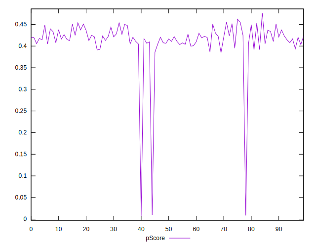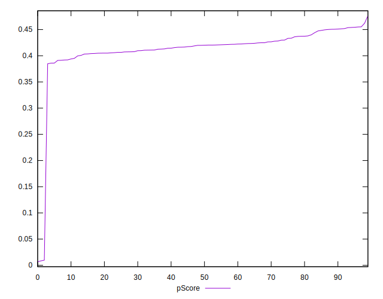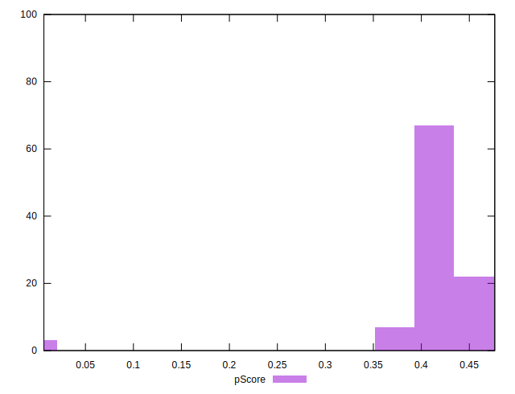
## Score Difference


```yaml
p90min: 0
p90max: 5.551115123125783e-17
p90range: 5.551115123125783e-17
p90mean: 7.320151810715318e-18
p90median: 0
p90stdev: 1.878205078441823e-17
p90skewness: 2.1760588382464627
p90eccentricity: 0.9999999999999986
p90discretization: 45.5
outlandishness: 2.5360562499999992
confidence: 8.863015602540674e-18
p90confidence: 7.717922282380813e-18

```

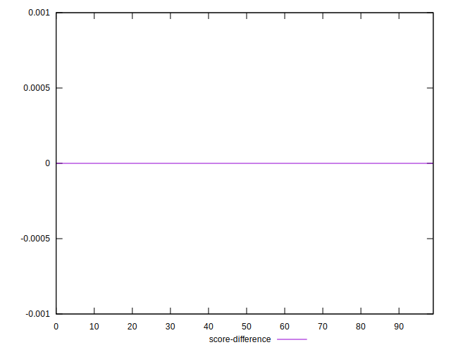
## P Score Difference


```yaml
p90min: -0.004117647058823559
p90max: 0.0048235294117647265
p90range: 0.008941176470588286
p90mean: 0.0003930187459599249
p90median: 0.0005882352941176117
p90stdev: 0.0026841951385185047
p90skewness: -0.08181823225375627
p90eccentricity: 1
p90discretization: 1.2816901408450705
outlandishness: 0.3099998658241027
confidence: 0.0011585329461466247
p90confidence: 0.0011029897484366698

```

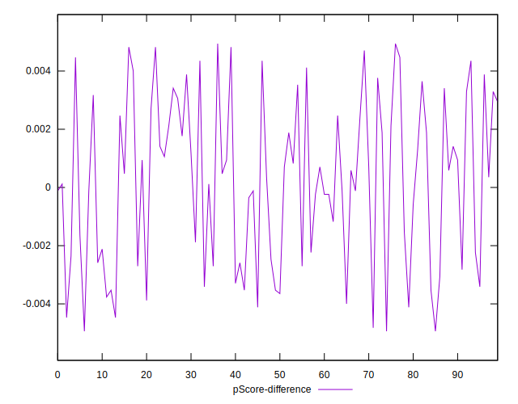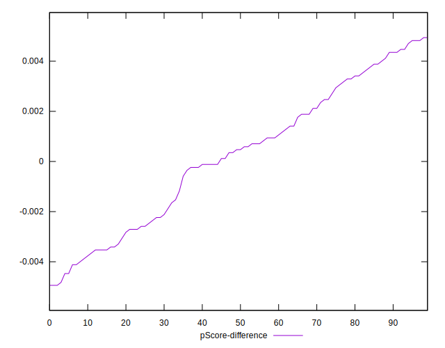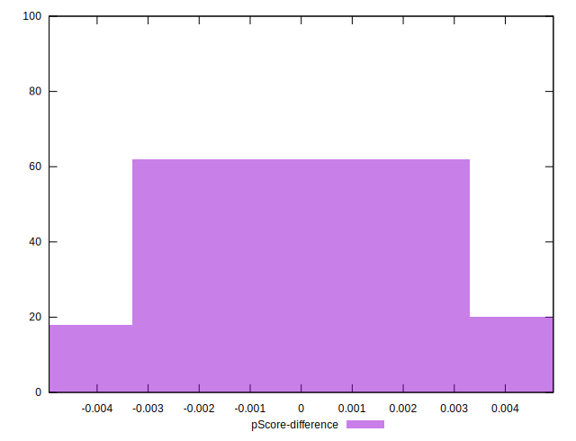