# //render-blocking-resources/samples/pages+cached+noexternal+nomedia+nocss

[→ Parent](../..)


## Raw


```yaml
p90min: 1134
p90max: 1795
p90range: 661
p90mean: 1419.5604395604396
p90median: 1433
p90stdev: 137.70490895917666
p90skewness: -0.31672811078809776
p90eccentricity: 1.0000000000000002
p90discretization: 1.058139534883721
outlandishness: 1.2265044677628292
confidence: 294.7187704433327
p90confidence: 56.58571566268756

```

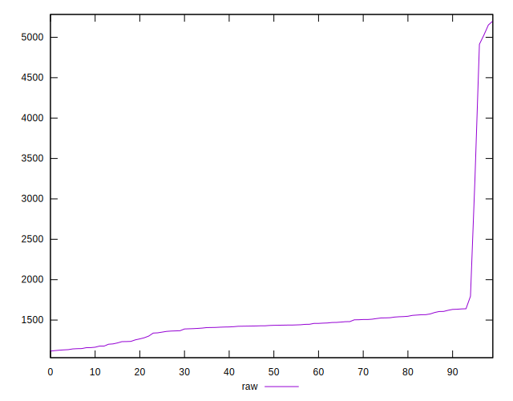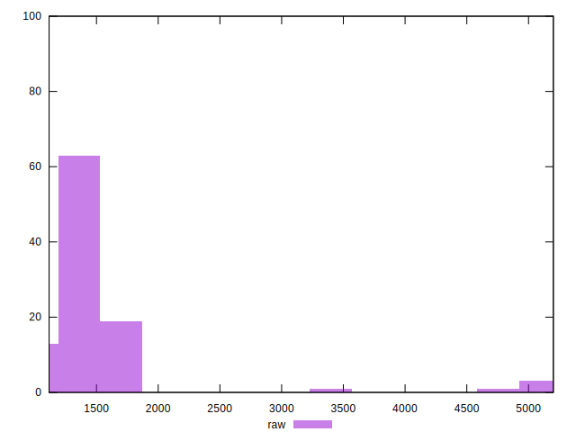
## Score


```yaml
p90min: 0.38
p90max: 0.45
p90range: 0.07
p90mean: 0.4212087912087914
p90median: 0.42
p90stdev: 0.015747678345206916
p90skewness: 0.34048998331899666
p90eccentricity: 0.9999999999999992
p90discretization: 13
outlandishness: 0.9195023689669857
confidence: 0.03382466299760345
p90confidence: 0.006471037640738864

```

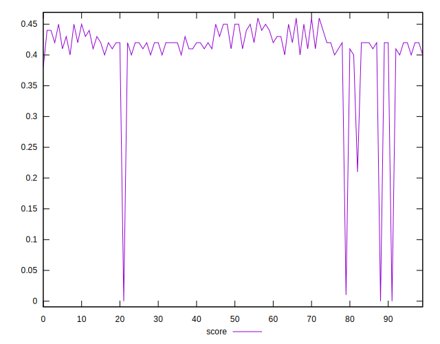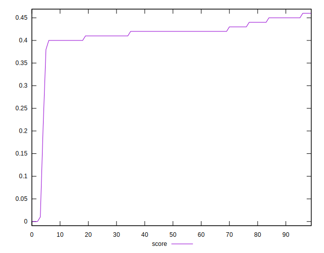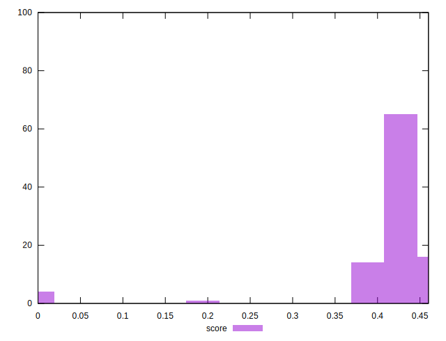
## Raw Estimate

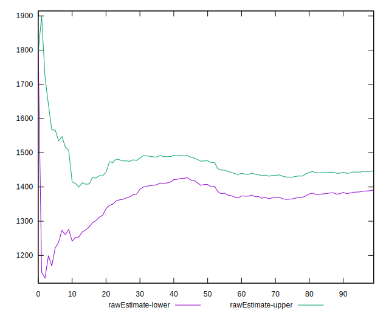
## Score Estimate

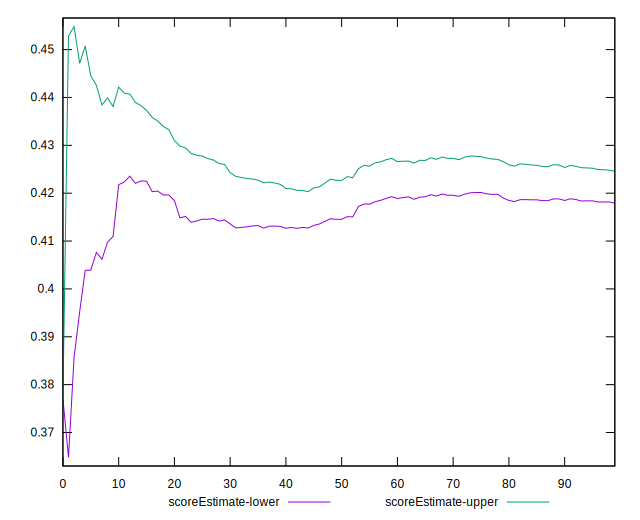
## P Score


```yaml
p90min: 0.3770588235294118
p90max: 0.4548235294117647
p90range: 0.0777647058823529
p90mean: 0.4212281835811249
p90median: 0.41964705882352943
p90stdev: 0.01620057752460902
p90skewness: 0.3167281107880912
p90eccentricity: 1
p90discretization: 1.058139534883721
outlandishness: 0.9186251728886627
confidence: 0.03384375976041332
p90confidence: 0.006657143019139777

```

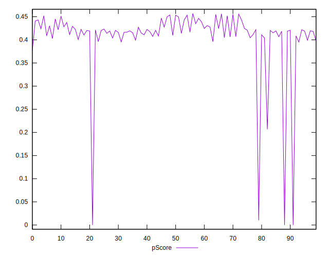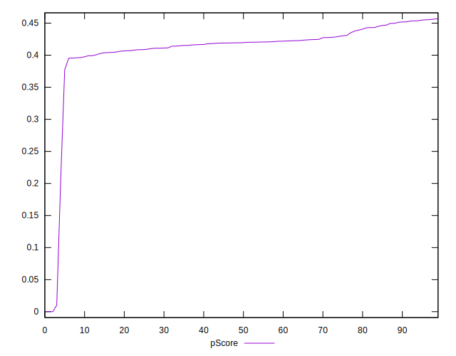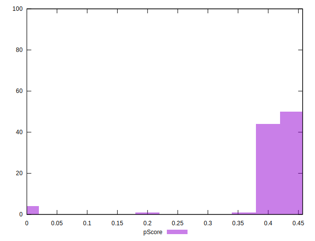
## Score Difference


```yaml
p90min: 0
p90max: 5.551115123125783e-17
p90range: 5.551115123125783e-17
p90mean: 4.270088556250602e-18
p90median: 0
p90stdev: 1.479202066448897e-17
p90skewness: 3.1754264805429315
p90eccentricity: 0.999999999999997
p90discretization: 45.5
outlandishness: 4.3264000000000005
confidence: 7.977337296109668e-18
p90confidence: 6.078338686135816e-18

```

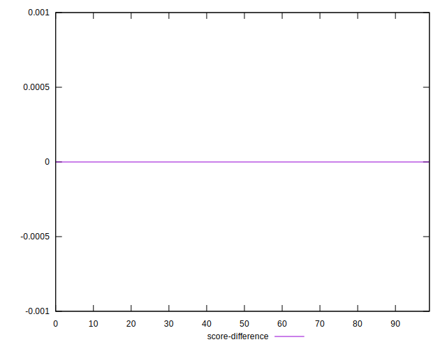
## P Score Difference


```yaml
p90min: -0.004705882352941226
p90max: 0.004470588235294115
p90range: 0.009176470588235341
p90mean: -0.0002365869424692898
p90median: -0.0003529411764705559
p90stdev: 0.0025205641628711635
p90skewness: 0.07226231341501986
p90eccentricity: 1
p90discretization: 1.378787878787879
outlandishness: 0.5416316521842984
confidence: 0.0011000472132813909
p90confidence: 0.0010357504907255771

```

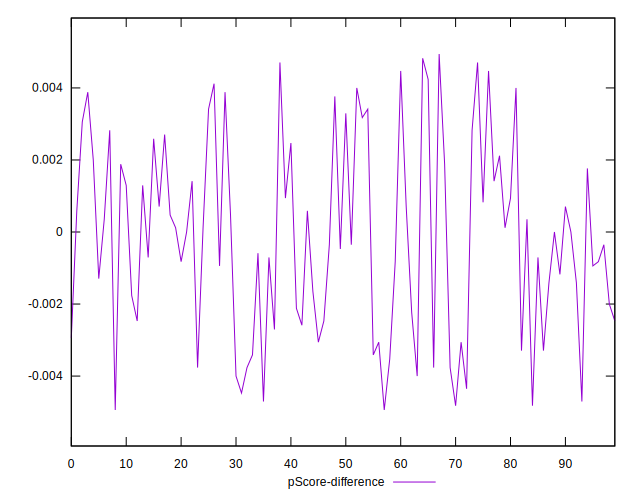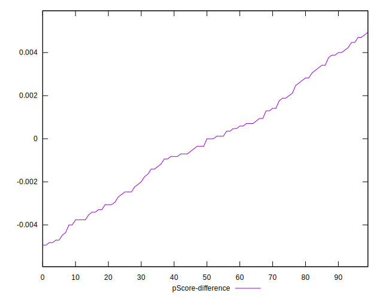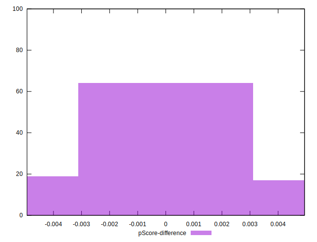