# //render-blocking-resources/samples/pages+cached+noexternal+nomedia

[→ Parent](../..)


## Raw


```yaml
p90min: 1133
p90max: 1752
p90range: 619
p90mean: 1408.1648351648353
p90median: 1415
p90stdev: 138.58573446210616
p90skewness: -0.06881233386982492
p90eccentricity: 0.9999999999999999
p90discretization: 1.123456790123457
outlandishness: 1.3147049137546742
confidence: 339.3808705598658
p90confidence: 56.94766457092874

```

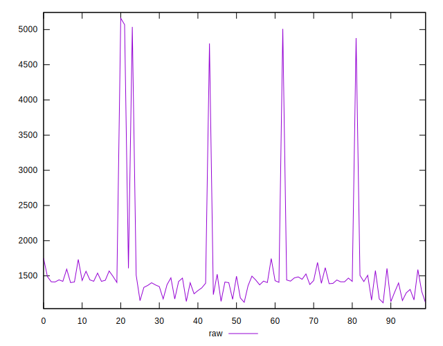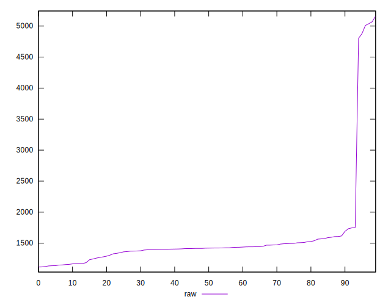
## Score


```yaml
p90min: 0.38
p90max: 0.45
p90range: 0.07
p90mean: 0.4217582417582421
p90median: 0.42
p90stdev: 0.016212422763228235
p90skewness: -0.09969343887115968
p90eccentricity: 0.9999999999999988
p90discretization: 11.375
outlandishness: 0.8900629475044673
confidence: 0.03946997643014305
p90confidence: 0.006662010465838142

```

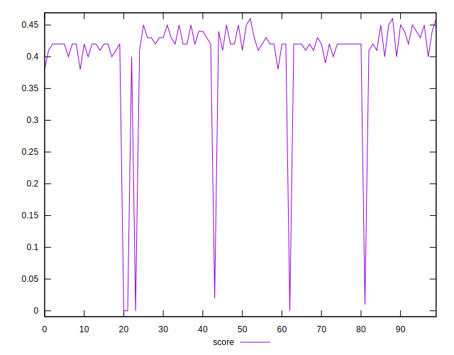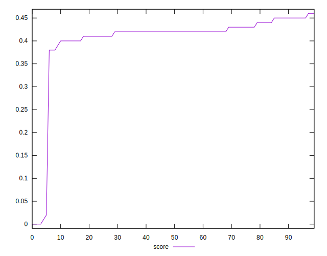
## Raw Estimate

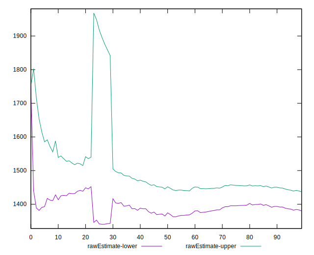
## Score Estimate

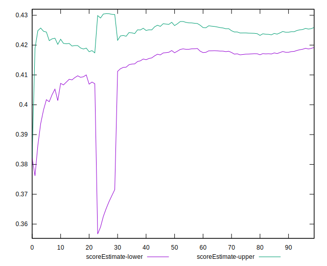
## P Score


```yaml
p90min: 0.3821176470588235
p90max: 0.45494117647058824
p90range: 0.07282352941176473
p90mean: 0.42256884292178415
p90median: 0.42176470588235293
p90stdev: 0.01630420405436543
p90skewness: 0.06881233386983196
p90eccentricity: 0.9999999999999997
p90discretization: 1.123456790123457
outlandishness: 0.8898211346761762
confidence: 0.03940998406022567
p90confidence: 0.00669972524363871

```

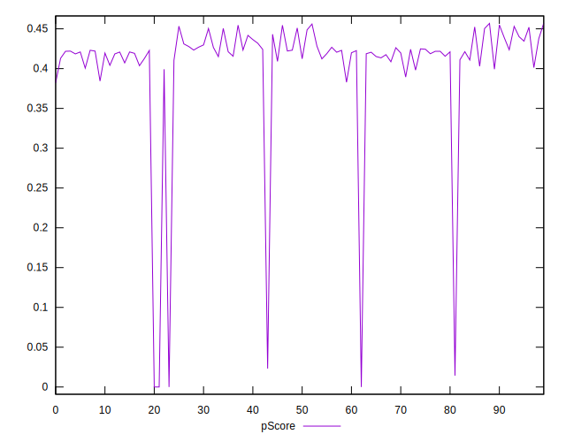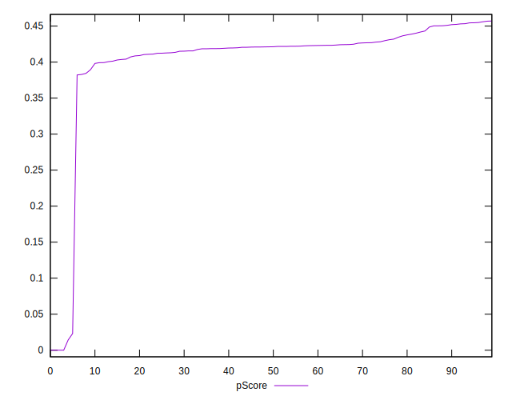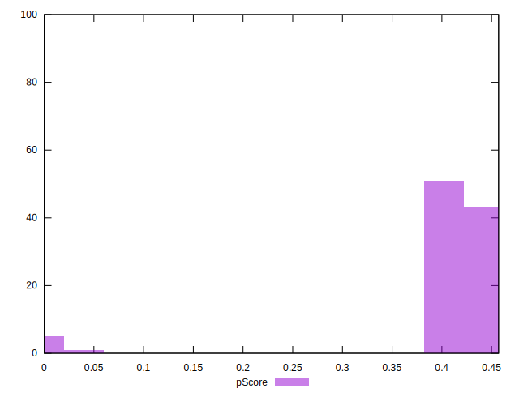
## Score Difference


```yaml
p90min: 0
p90max: 5.551115123125783e-17
p90range: 5.551115123125783e-17
p90mean: 1.2200253017858864e-18
p90median: 0
p90stdev: 8.138583863080836e-18
p90skewness: 6.520925694263966
p90eccentricity: 0.9999999999999964
p90discretization: 45.5
outlandishness: 25.050024999999998
confidence: 6.808472172051191e-18
p90confidence: 3.3443077364057997e-18

```

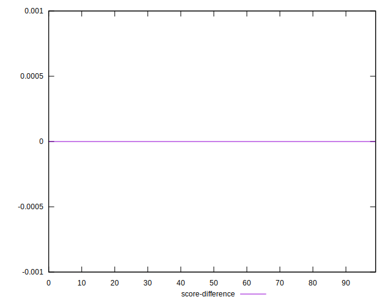
## P Score Difference


```yaml
p90min: -0.003176470588235336
p90max: 0.0048235294117647265
p90range: 0.008000000000000063
p90mean: 0.001093729799612154
p90median: 0.0010588235294117787
p90stdev: 0.0021319986647626945
p90skewness: -0.1831255543927947
p90eccentricity: 0.9999999999999999
p90discretization: 1.4
outlandishness: 0.42210056726411044
confidence: 0.0009903827261380006
p90confidence: 0.0008760811154034914

```

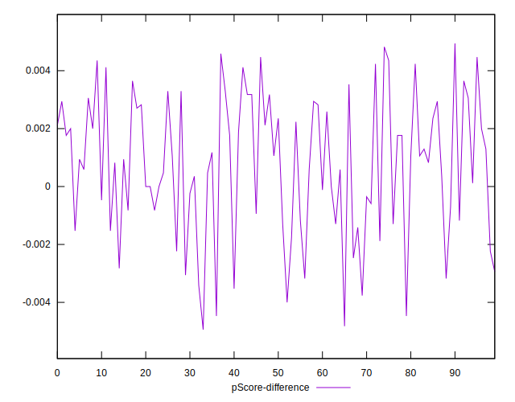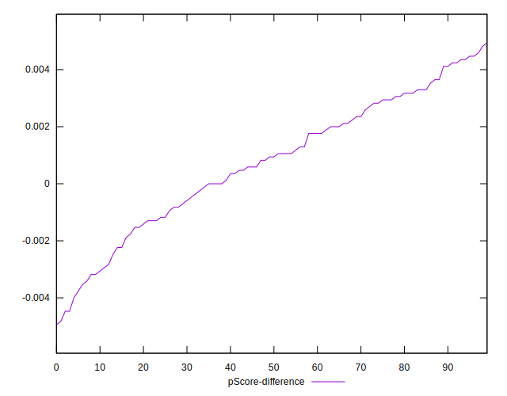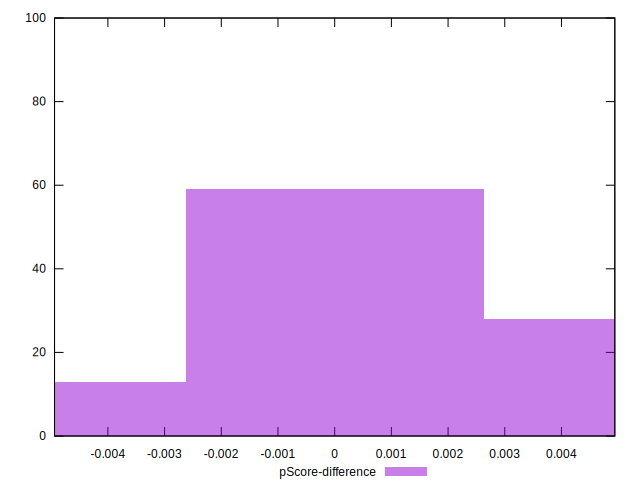