# //render-blocking-resources/samples/pages+cached+noexternal

[→ Parent](../..)


## Raw


```yaml
p90min: 1142
p90max: 1680
p90range: 538
p90mean: 1390.8021978021977
p90median: 1406
p90stdev: 130.63683574058476
p90skewness: -0.22571932027635896
p90eccentricity: 1.0000000000000002
p90discretization: 1.1518987341772151
outlandishness: 1.0887840712792767
confidence: 207.3257044158795
p90confidence: 53.68130227282927

```

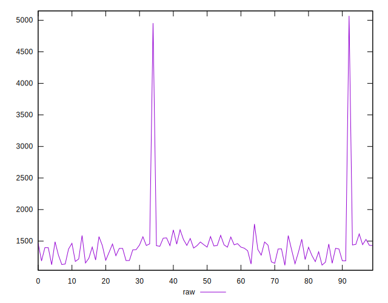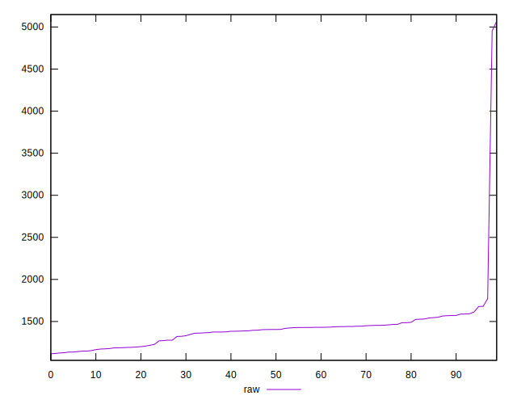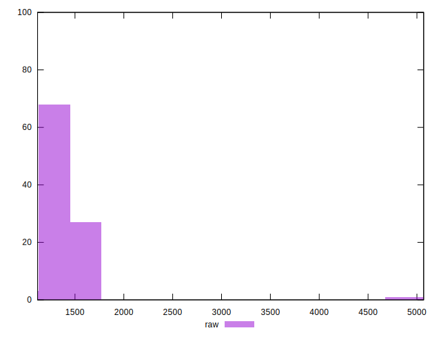
## Score


```yaml
p90min: 0.39
p90max: 0.45
p90range: 0.06
p90mean: 0.42494505494505536
p90median: 0.42
p90stdev: 0.01571543836547231
p90skewness: 0.1205538529762932
p90eccentricity: 1.0000000000000007
p90discretization: 13
outlandishness: 0.9675802699922404
confidence: 0.02411950504894156
p90confidence: 0.006457789584877749

```

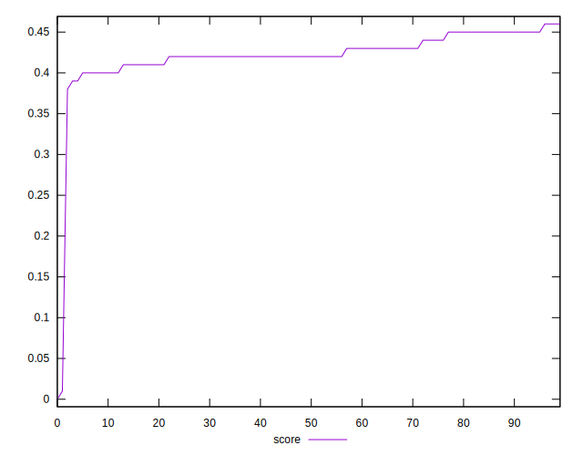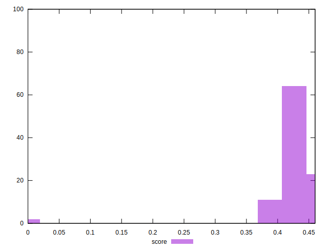
## Raw Estimate

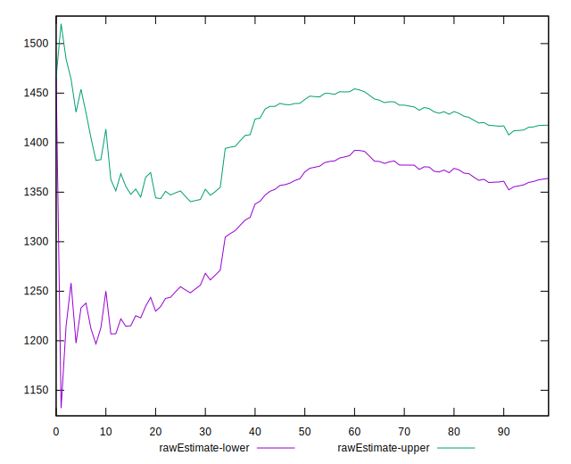
## Score Estimate

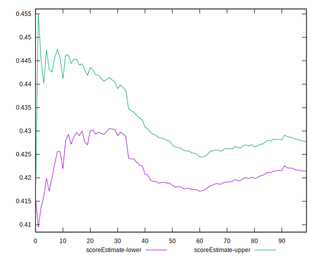
## P Score


```yaml
p90min: 0.3905882352941176
p90max: 0.45388235294117646
p90range: 0.06329411764705883
p90mean: 0.424611506140918
p90median: 0.4228235294117647
p90stdev: 0.01536903949889232
p90skewness: 0.22571932027636768
p90eccentricity: 0.9999999999999999
p90discretization: 1.1518987341772151
outlandishness: 0.9671708623553142
confidence: 0.024174695062841867
p90confidence: 0.00631544732621514

```

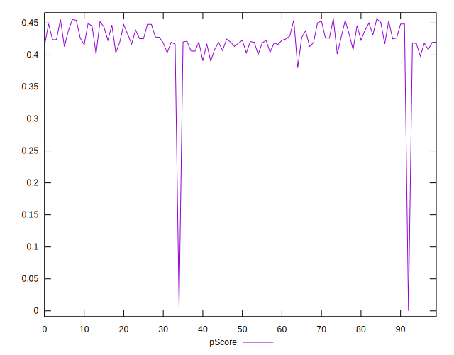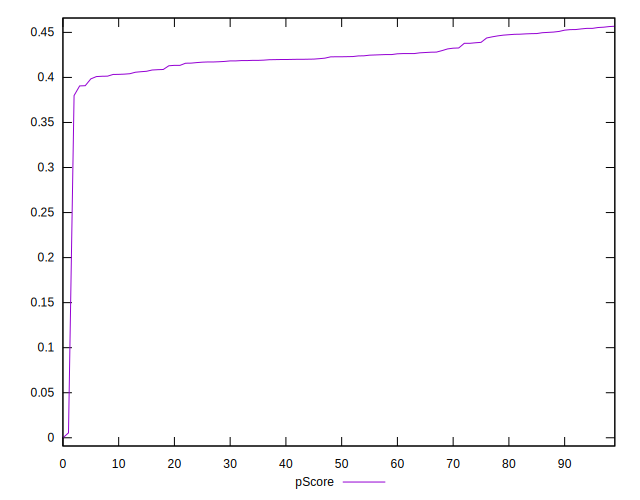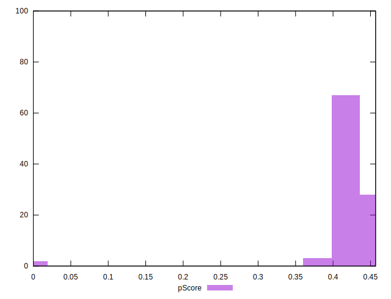
## Score Difference


```yaml
p90min: 0
p90max: 0
p90range: 0
p90mean: 0
p90median: 0
p90stdev: 0
p90skewness: .nan
p90eccentricity: .nan
p90discretization: 91
outlandishness: .inf
confidence: 6.2273069308442164e-18
p90confidence: 0

```

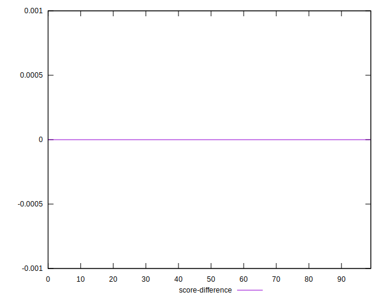
## P Score Difference


```yaml
p90min: -0.004588235294117671
p90max: 0.003882352941176448
p90range: 0.008470588235294119
p90mean: -0.0006864899806076287
p90median: -0.0010588235294117787
p90stdev: 0.0024634219787826933
p90skewness: 0.2664115789675208
p90eccentricity: 1.0000000000000002
p90discretization: 1.378787878787879
outlandishness: 0.36804444444444445
confidence: 0.0010806578303368599
p90confidence: 0.0010122696184341347

```

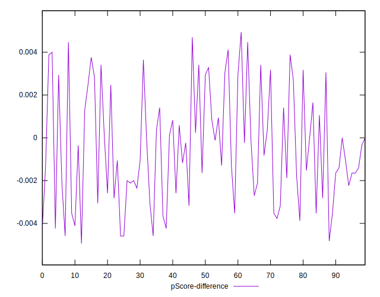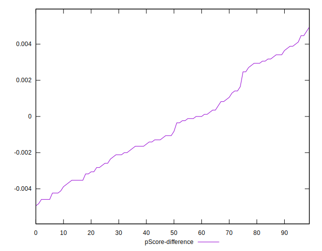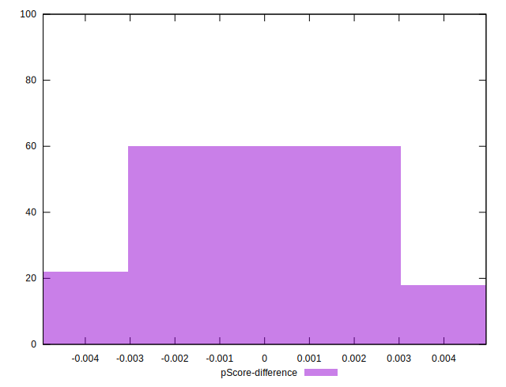