# //render-blocking-resources/samples/pages+cached

[→ Parent](../..)


## Raw


```yaml
p90min: 1140
p90max: 1782
p90range: 642
p90mean: 1435
p90median: 1436
p90stdev: 114.0880708579469
p90skewness: -0.5010304914447865
p90eccentricity: 0.9999999999999993
p90discretization: 1.1666666666666667
outlandishness: 1.1522339373307917
confidence: 244.35041032196023
p90confidence: 46.881082067932766

```

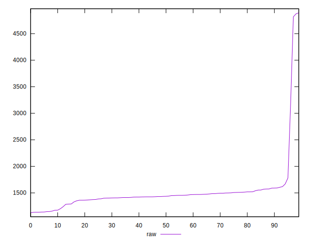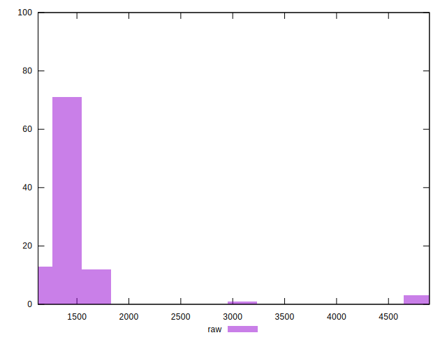
## Score


```yaml
p90min: 0.38
p90max: 0.45
p90range: 0.07
p90mean: 0.4193406593406594
p90median: 0.42
p90stdev: 0.013571317346165214
p90skewness: 0.3832679362557446
p90eccentricity: 1
p90discretization: 11.375
outlandishness: 0.9406204086141216
confidence: 0.028928191991875685
p90confidence: 0.005576727150270799

```

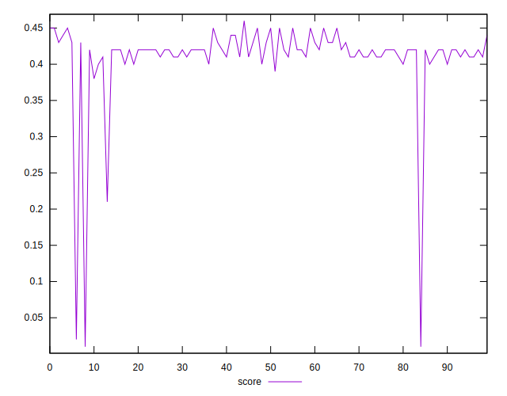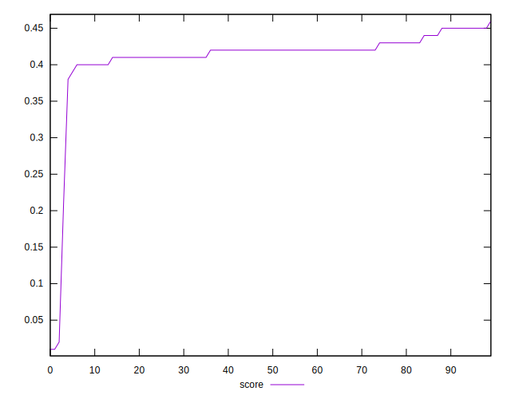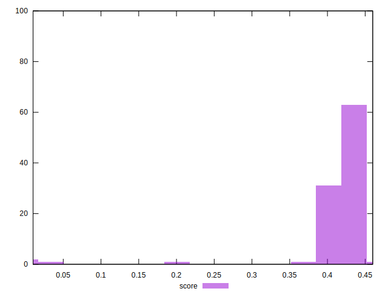
## Raw Estimate

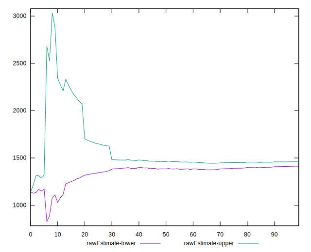
## Score Estimate

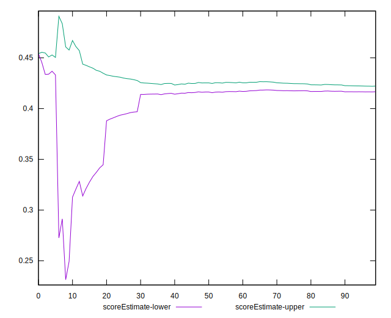
## P Score


```yaml
p90min: 0.37858823529411767
p90max: 0.4541176470588235
p90range: 0.07552941176470584
p90mean: 0.4194117647058823
p90median: 0.4192941176470588
p90stdev: 0.013422125983287873
p90skewness: 0.5010304914447699
p90eccentricity: 1.0000000000000002
p90discretization: 1.1666666666666667
outlandishness: 0.9417654443602974
confidence: 0.028747107096701252
p90confidence: 0.005515421419756805

```

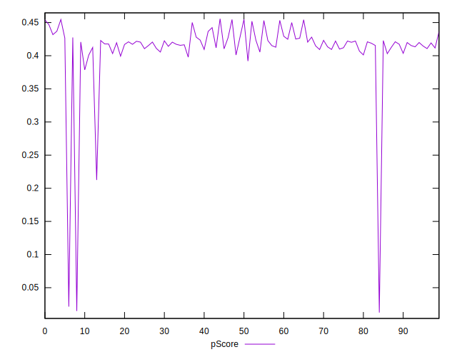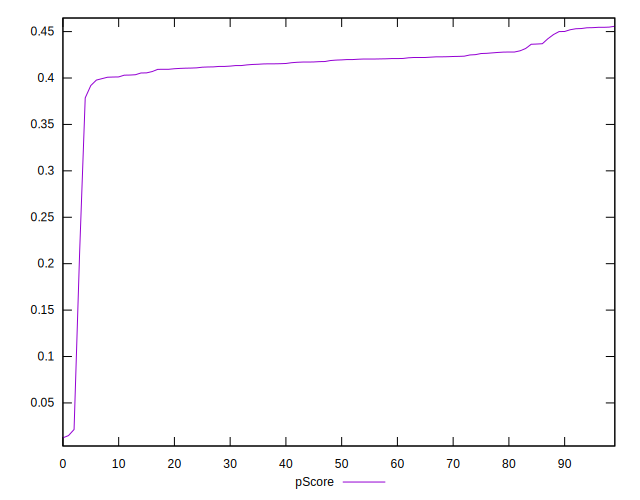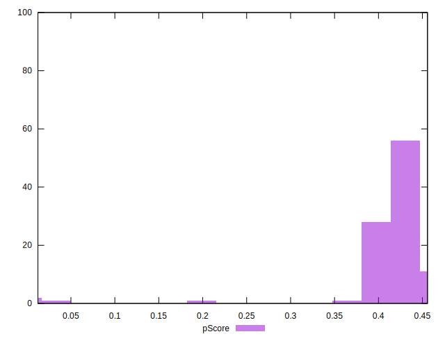
## Score Difference


```yaml
p90min: 0
p90max: 5.551115123125783e-17
p90range: 5.551115123125783e-17
p90mean: 7.93016446160826e-18
p90median: 0
p90stdev: 1.942485650729315e-17
p90skewness: 2.0412414523193054
p90eccentricity: 0.9999999999999972
p90discretization: 45.5
outlandishness: 2.3716
confidence: 9.013987730404087e-18
p90confidence: 7.98206407758531e-18

```

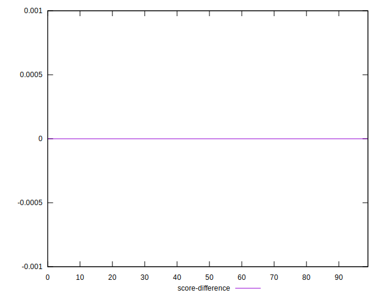
## P Score Difference


```yaml
p90min: -0.003647058823529392
p90max: 0.0048235294117647265
p90range: 0.008470588235294119
p90mean: 0.0008015513897866924
p90median: 0.0009411764705882786
p90stdev: 0.0024558561030634915
p90skewness: -0.22036555543162378
p90eccentricity: 1
p90discretization: 1.467741935483871
outlandishness: 0.1558848701873099
confidence: 0.0010997419940904172
p90confidence: 0.0010091606479884052

```

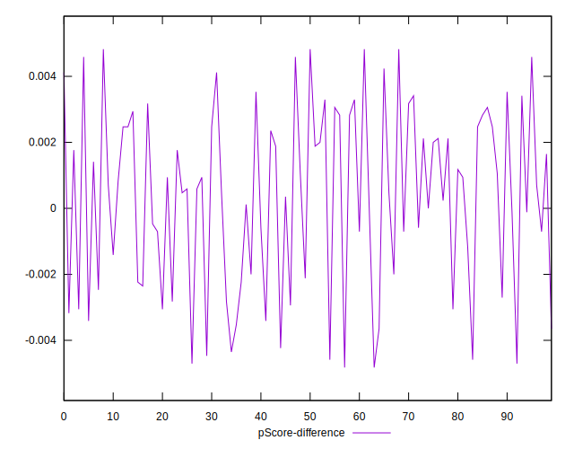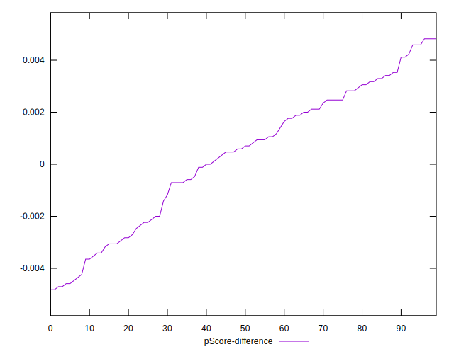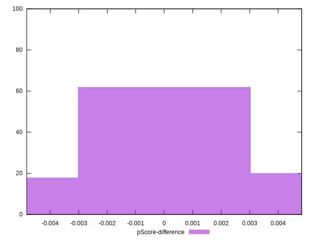