# //render-blocking-resources/samples/pages

[→ Parent](../..)


## Raw


```yaml
p90min: 1210
p90max: 2505
p90range: 1295
p90mean: 2076.6153846153848
p90median: 2215
p90stdev: 348.240562590924
p90skewness: -1.2703117748274073
p90eccentricity: 1.0000000000000002
p90discretization: 1.1375
outlandishness: 0.9930532975422718
confidence: 231.02316154016808
p90confidence: 143.09904858094933

```

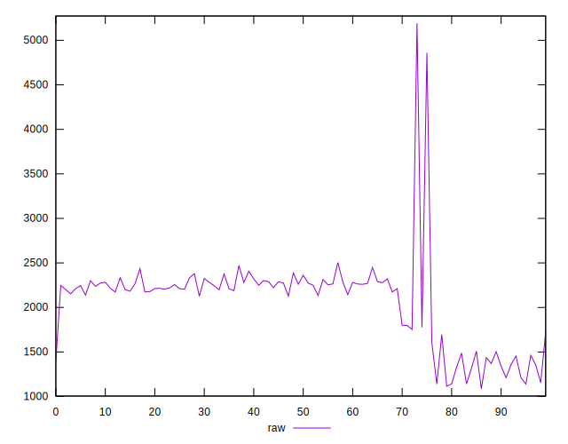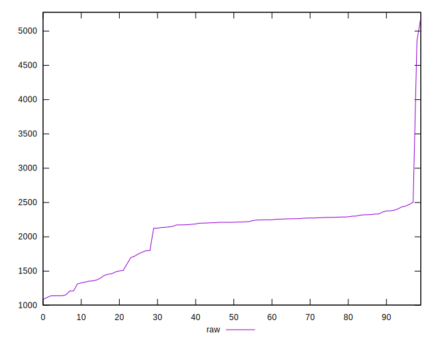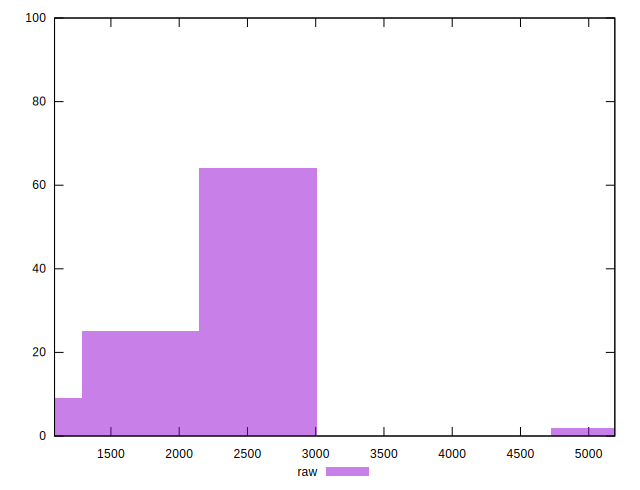
## Score


```yaml
p90min: 0.29
p90max: 0.45
p90range: 0.16000000000000003
p90mean: 0.3441758241758242
p90median: 0.33
p90stdev: 0.041299387592669295
p90skewness: 1.2618846132222825
p90eccentricity: 0.9999999999999986
p90discretization: 7
outlandishness: 1.0053775805898497
confidence: 0.026629528004014746
p90confidence: 0.01697074869026438

```

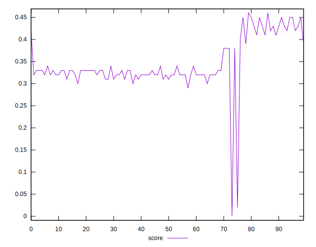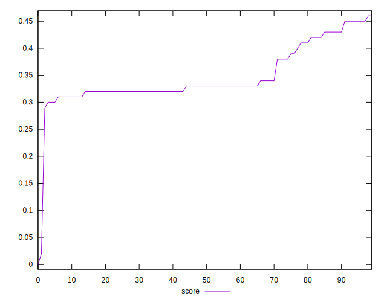
## Raw Estimate

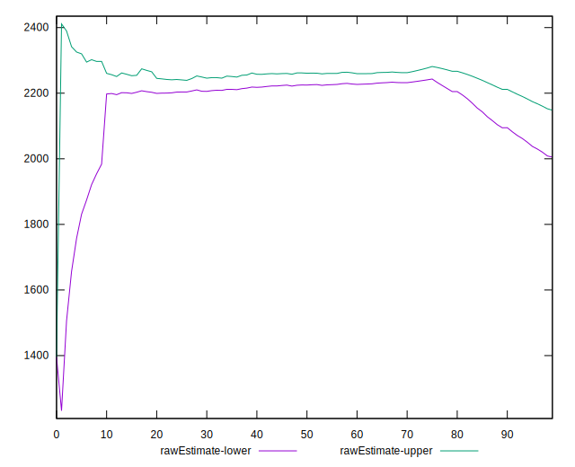
## Score Estimate

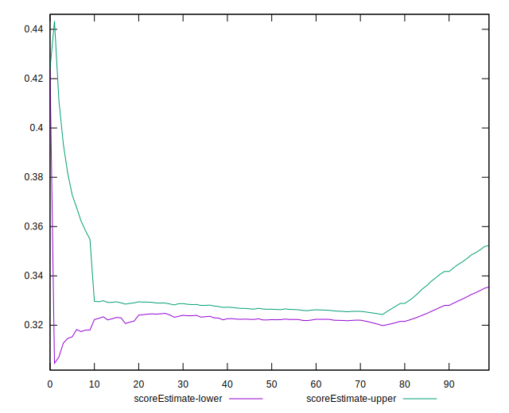
## P Score


```yaml
p90min: 0.29352941176470587
p90max: 0.44588235294117645
p90range: 0.15235294117647058
p90mean: 0.34392760180995474
p90median: 0.3276470588235294
p90stdev: 0.040969477951873425
p90skewness: 1.2703117748274009
p90eccentricity: 0.9999999999999992
p90discretization: 1.1375
outlandishness: 1.0062596336487646
confidence: 0.026722951261689887
p90confidence: 0.016835182185994002

```

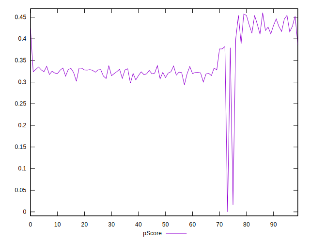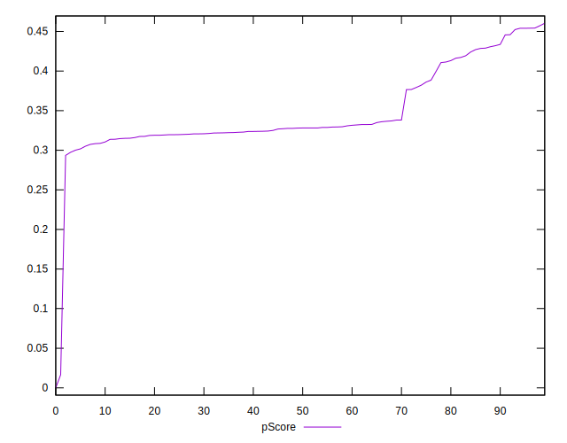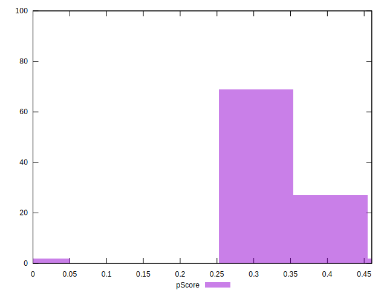
## Score Difference


```yaml
p90min: 0
p90max: 0
p90range: 0
p90mean: 0
p90median: 0
p90stdev: 0
p90skewness: .nan
p90eccentricity: .nan
p90discretization: 91
outlandishness: .inf
confidence: 3.711973057415541e-18
p90confidence: 0

```

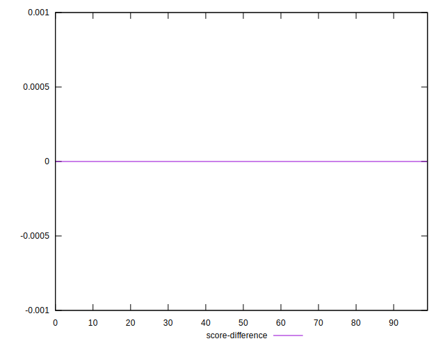
## P Score Difference


```yaml
p90min: -0.004117647058823559
p90max: 0.004117647058823504
p90range: 0.008235294117647063
p90mean: -0.00004266321913381852
p90median: -0.0003529411764706114
p90stdev: 0.002420083811151101
p90skewness: 0.16140998126747336
p90eccentricity: 1.0000000000000002
p90discretization: 1.4918032786885247
outlandishness: 5.238549954084824
confidence: 0.0010591625403281106
p90confidence: 0.0009944610940359946

```

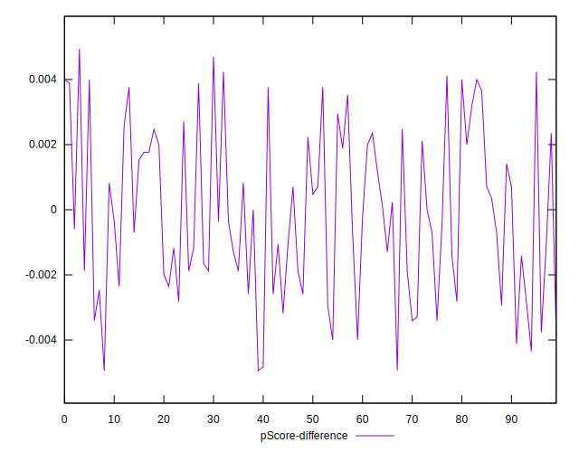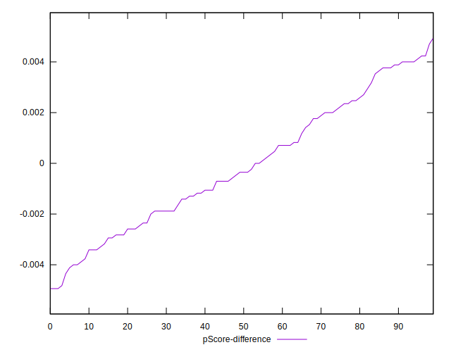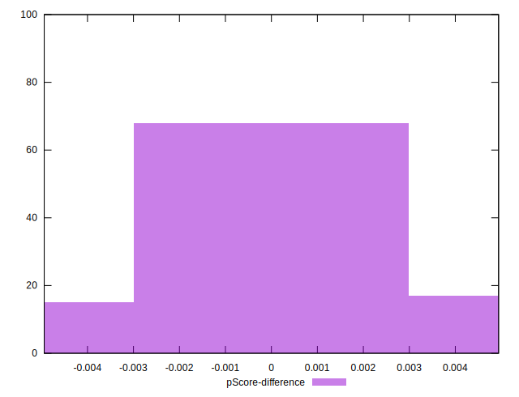