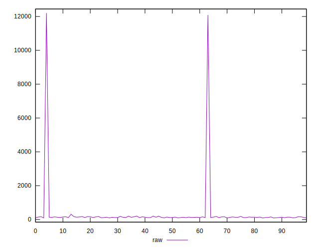
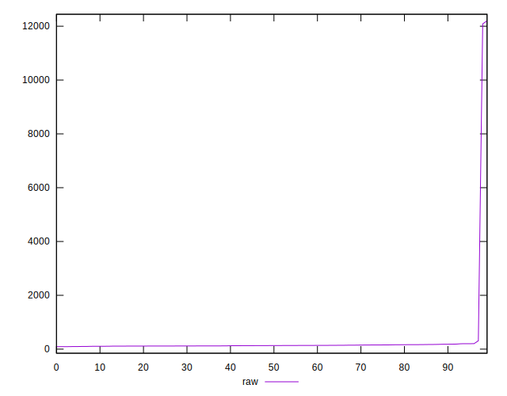
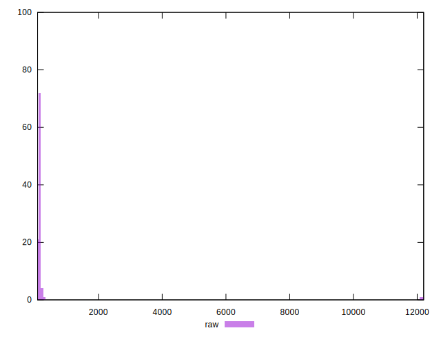
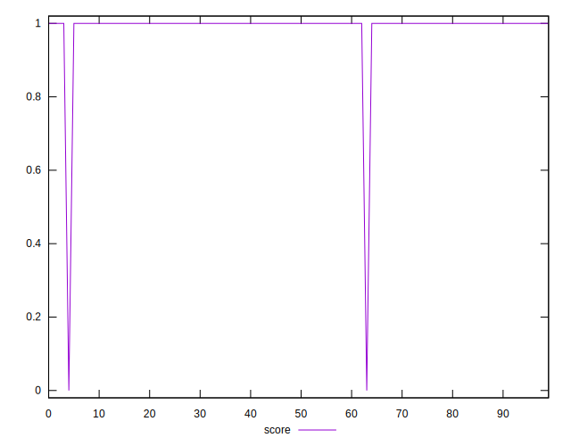
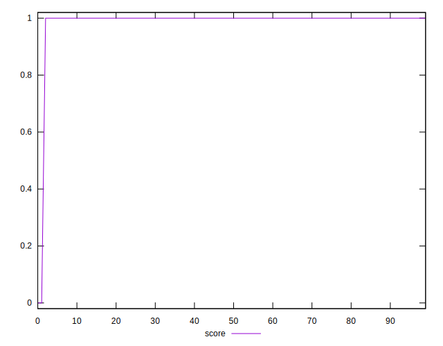
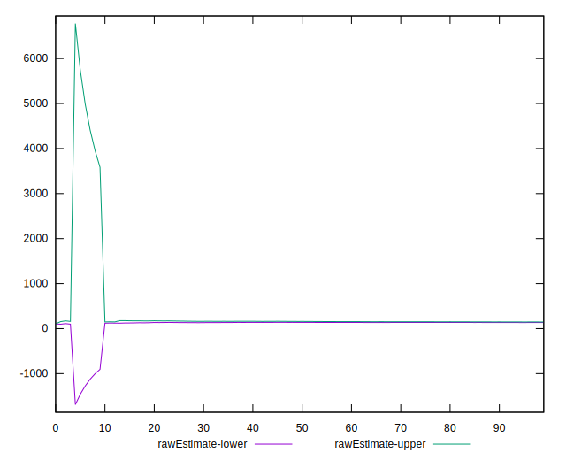
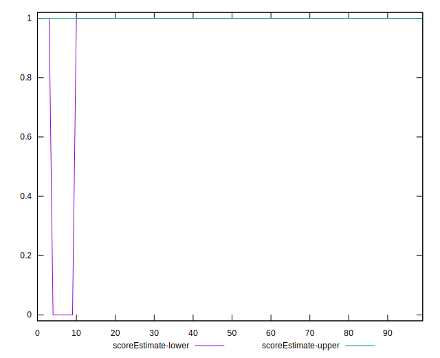
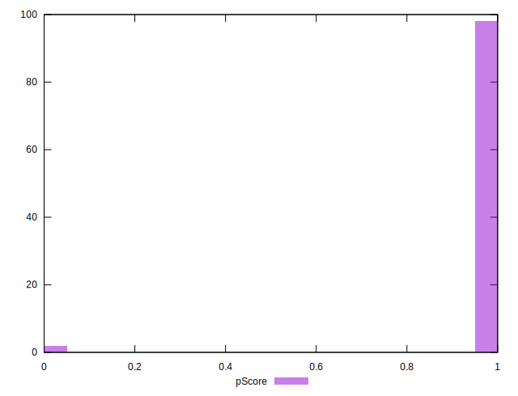

# //server-response-time/samples/pages+cached+noexternal+nomedia+nocss+nojs

[→ Parent](../..)


## Raw


```yaml
p90min: 100.712
p90max: 311.076
p90range: 210.36400000000003
p90mean: 141.10497802197804
p90median: 134.84
p90stdev: 31.07586317490555
p90skewness: 2.1135558174671507
p90eccentricity: 1.0000000000000004
p90discretization: 1
outlandishness: 7.1731658961207945
confidence: 659.0272507559822
p90confidence: 12.769696961994953

```


## Score


```yaml
p90min: 1
p90max: 1
p90range: 0
p90mean: 1
p90median: 1
p90stdev: 0
p90skewness: .nan
p90eccentricity: .nan
p90discretization: 91
outlandishness: 0.9603999999999999
confidence: 0.054878991567121505
p90confidence: 0

```


## Raw Estimate


## Score Estimate


## P Score


```yaml
p90min: 1
p90max: 1
p90range: 0
p90mean: 1
p90median: 1
p90stdev: 0
p90skewness: .nan
p90eccentricity: .nan
p90discretization: 91
outlandishness: 0.9603999999999999
confidence: 0.054878991567121505
p90confidence: 0

```


## Score Difference


```yaml
p90min: 0
p90max: 0
p90range: 0
p90mean: 0
p90median: 0
p90stdev: 0
p90skewness: .nan
p90eccentricity: .nan
p90discretization: 91
outlandishness: .nan
confidence: 0
p90confidence: 0

```


## P Score Difference


```yaml
p90min: 0
p90max: 0
p90range: 0
p90mean: 0
p90median: 0
p90stdev: 0
p90skewness: .nan
p90eccentricity: .nan
p90discretization: 91
outlandishness: .nan
confidence: 0
p90confidence: 0

```

