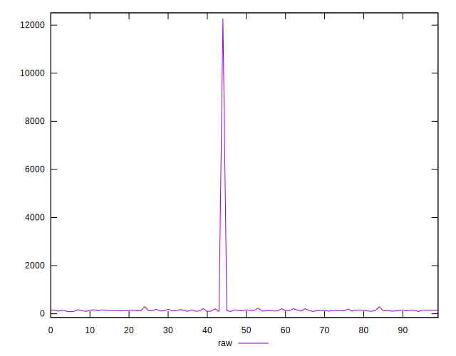
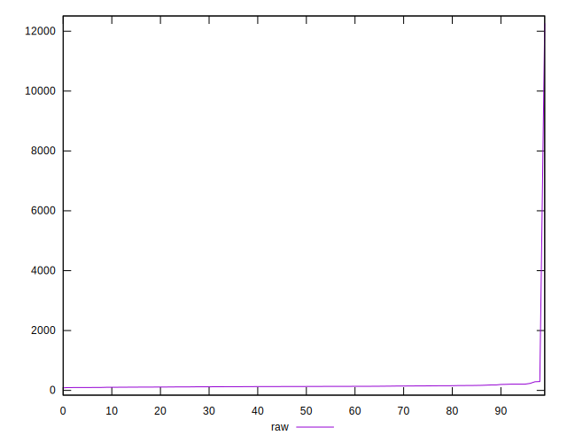
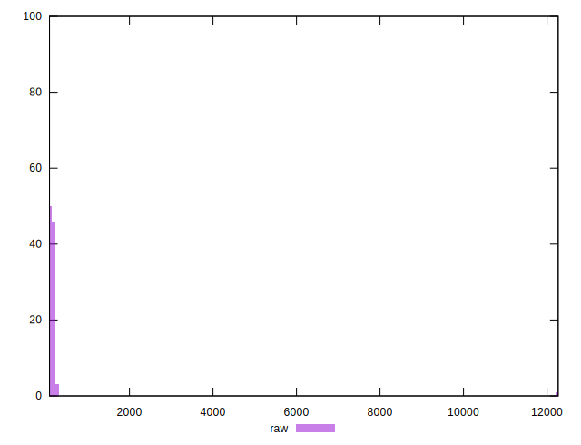
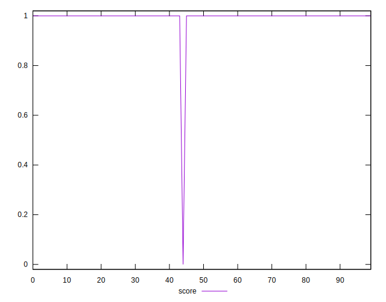
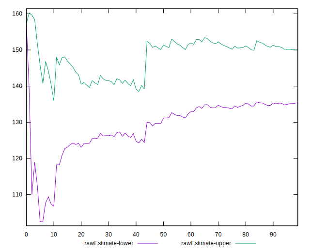
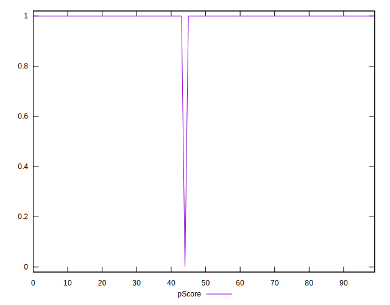
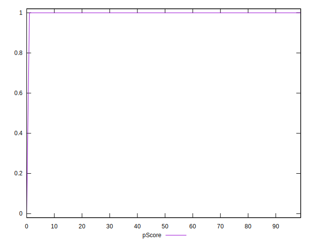
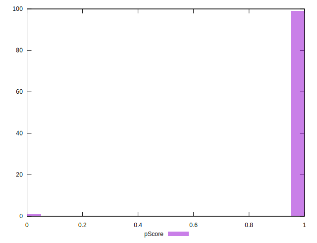

# //server-response-time/samples/pages+cached+noexternal+nomedia+nocss

[→ Parent](../..)


## Raw


```yaml
p90min: 99.979
p90max: 296.083
p90range: 196.10400000000004
p90mean: 142.66889010989007
p90median: 133.066
p90stdev: 35.478592230966846
p90skewness: 2.105991336157605
p90eccentricity: 1
p90discretization: 1
outlandishness: 3.3236919856091536
confidence: 473.2047850159174
p90confidence: 14.578866848451185

```


## Score


```yaml
p90min: 1
p90max: 1
p90range: 0
p90mean: 1
p90median: 1
p90stdev: 0
p90skewness: .nan
p90eccentricity: .nan
p90discretization: 91
outlandishness: 0.9801
confidence: 0.0390027908359758
p90confidence: 0

```


## Raw Estimate


## Score Estimate


## P Score


```yaml
p90min: 1
p90max: 1
p90range: 0
p90mean: 1
p90median: 1
p90stdev: 0
p90skewness: .nan
p90eccentricity: .nan
p90discretization: 91
outlandishness: 0.9801
confidence: 0.0390027908359758
p90confidence: 0

```


## Score Difference


```yaml
p90min: 0
p90max: 0
p90range: 0
p90mean: 0
p90median: 0
p90stdev: 0
p90skewness: .nan
p90eccentricity: .nan
p90discretization: 91
outlandishness: .nan
confidence: 0
p90confidence: 0

```


## P Score Difference


```yaml
p90min: 0
p90max: 0
p90range: 0
p90mean: 0
p90median: 0
p90stdev: 0
p90skewness: .nan
p90eccentricity: .nan
p90discretization: 91
outlandishness: .nan
confidence: 0
p90confidence: 0

```

