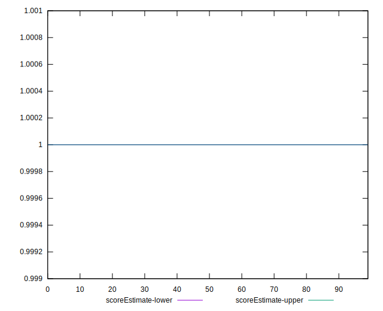

# //server-response-time/samples/pages+cached

[→ Parent](../..)


## Raw


```yaml
p90min: 99.188
p90max: 261.07399999999996
p90range: 161.88599999999997
p90mean: 135.8451868131868
p90median: 126.15200000000002
p90stdev: 34.00715055865379
p90skewness: 1.809071727099342
p90eccentricity: 1
p90discretization: 1
outlandishness: 8.183714166711408
confidence: 701.9491894708793
p90confidence: 13.974221881811559

```


## Score


```yaml
p90min: 1
p90max: 1
p90range: 0
p90mean: 1
p90median: 1
p90stdev: 0
p90skewness: .nan
p90eccentricity: .nan
p90discretization: 91
outlandishness: 0.9603999999999999
confidence: 0.054878991567121505
p90confidence: 0

```


## Raw Estimate


## Score Estimate


## P Score


```yaml
p90min: 1
p90max: 1
p90range: 0
p90mean: 1
p90median: 1
p90stdev: 0
p90skewness: .nan
p90eccentricity: .nan
p90discretization: 91
outlandishness: 0.9603999999999999
confidence: 0.054878991567121505
p90confidence: 0

```


## Score Difference


```yaml
p90min: 0
p90max: 0
p90range: 0
p90mean: 0
p90median: 0
p90stdev: 0
p90skewness: .nan
p90eccentricity: .nan
p90discretization: 91
outlandishness: .nan
confidence: 0
p90confidence: 0

```


## P Score Difference


```yaml
p90min: 0
p90max: 0
p90range: 0
p90mean: 0
p90median: 0
p90stdev: 0
p90skewness: .nan
p90eccentricity: .nan
p90discretization: 91
outlandishness: .nan
confidence: 0
p90confidence: 0

```

