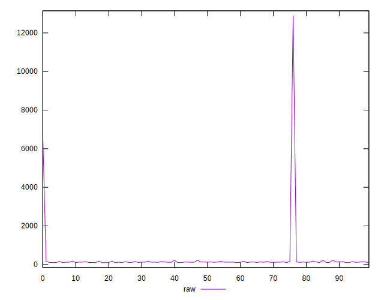
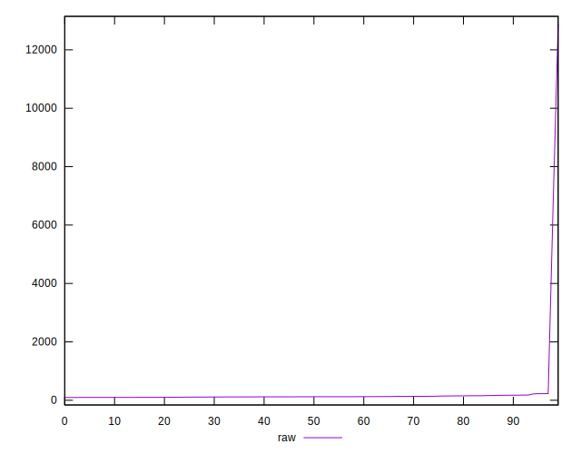
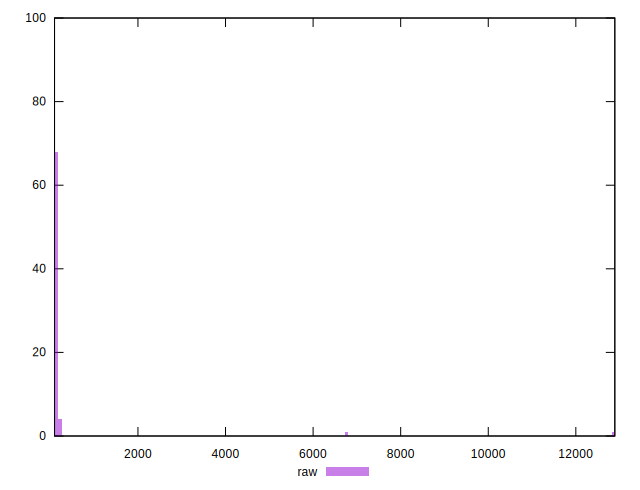
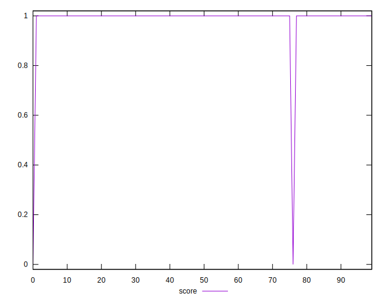
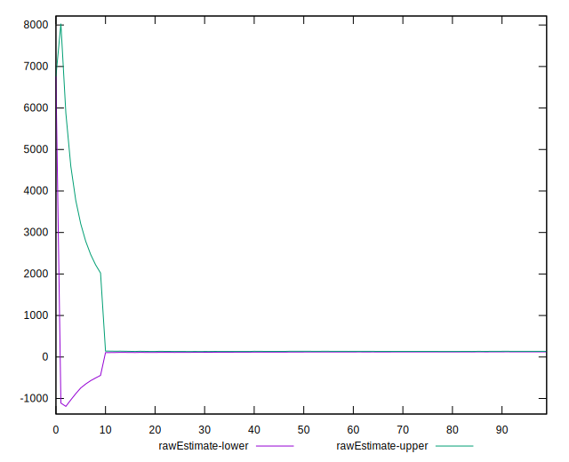
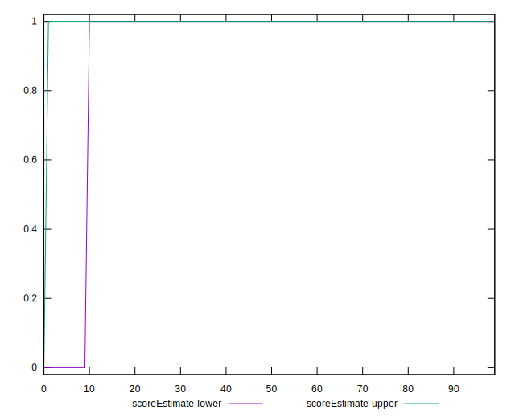
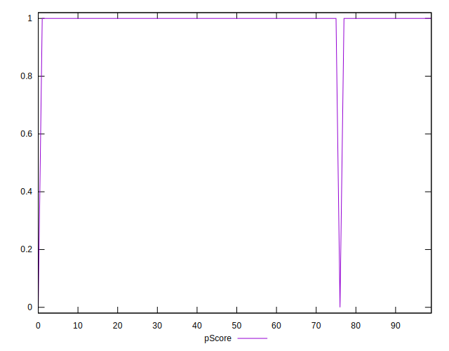
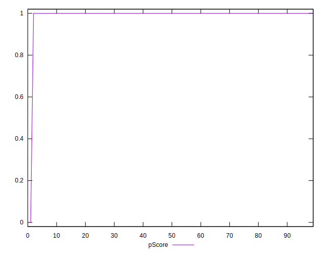
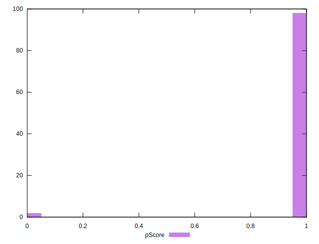

# //server-response-time/samples/pages

[→ Parent](../..)


## Raw


```yaml
p90min: 97.08099999999999
p90max: 227.9
p90range: 130.81900000000002
p90mean: 129.76338461538458
p90median: 121.77199999999999
p90stdev: 29.481605407838625
p90skewness: 1.5393722923409678
p90eccentricity: 1
p90discretization: 1
outlandishness: 6.131184301906731
confidence: 558.7810209960894
p90confidence: 12.11458439279076

```


## Score


```yaml
p90min: 1
p90max: 1
p90range: 0
p90mean: 1
p90median: 1
p90stdev: 0
p90skewness: .nan
p90eccentricity: .nan
p90discretization: 91
outlandishness: 0.9603999999999999
confidence: 0.054878991567121505
p90confidence: 0

```


## Raw Estimate


## Score Estimate


## P Score


```yaml
p90min: 1
p90max: 1
p90range: 0
p90mean: 1
p90median: 1
p90stdev: 0
p90skewness: .nan
p90eccentricity: .nan
p90discretization: 91
outlandishness: 0.9603999999999999
confidence: 0.054878991567121505
p90confidence: 0

```


## Score Difference


```yaml
p90min: 0
p90max: 0
p90range: 0
p90mean: 0
p90median: 0
p90stdev: 0
p90skewness: .nan
p90eccentricity: .nan
p90discretization: 91
outlandishness: .nan
confidence: 0
p90confidence: 0

```


## P Score Difference


```yaml
p90min: 0
p90max: 0
p90range: 0
p90mean: 0
p90median: 0
p90stdev: 0
p90skewness: .nan
p90eccentricity: .nan
p90discretization: 91
outlandishness: .nan
confidence: 0
p90confidence: 0

```

