# //speed-index/samples/pages+cached+noexternal+nomedia+nocss+nojs

[→ Parent](../..)


## Raw


```yaml
p90min: 7267.1250053493795
p90max: 11331.42573946789
p90range: 4064.3007341185103
p90mean: 8809.508772354515
p90median: 8836.365152043352
p90stdev: 925.8921739605494
p90skewness: 0.32204645960027684
p90eccentricity: 1.0000000000000009
p90discretization: 1
outlandishness: 1.1412096664723919
confidence: 1336.8516973174192
p90confidence: 380.46770943780575

```

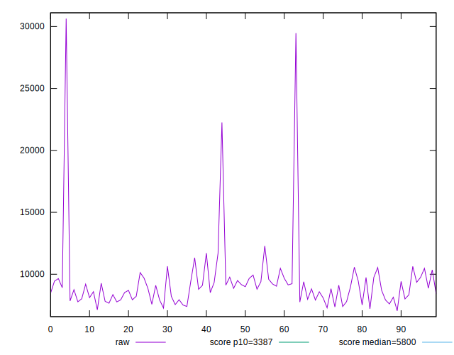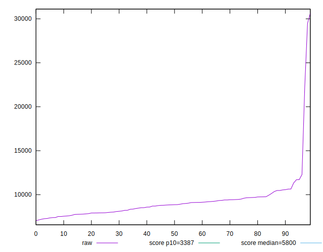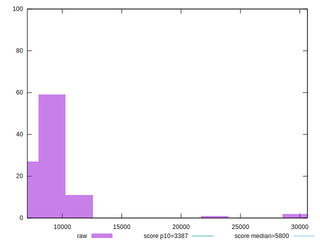
## Score


```yaml
p90min: 0.05
p90max: 0.29
p90range: 0.24
p90mean: 0.16483516483516486
p90median: 0.16
p90stdev: 0.06015296686594125
p90skewness: 0.19192741605065036
p90eccentricity: 1.0000000000000002
p90discretization: 3.64
outlandishness: 1.0093015295999994
confidence: 0.02836641459106154
p90confidence: 0.024718063466802775

```

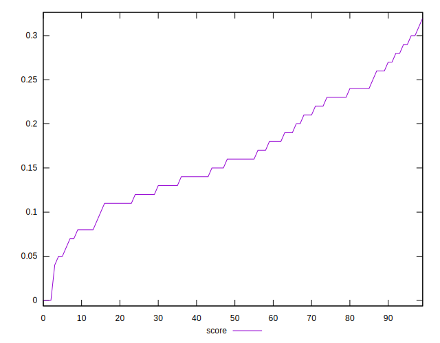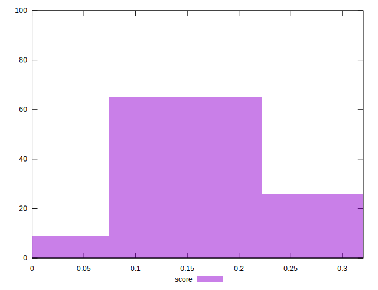
## Raw Estimate

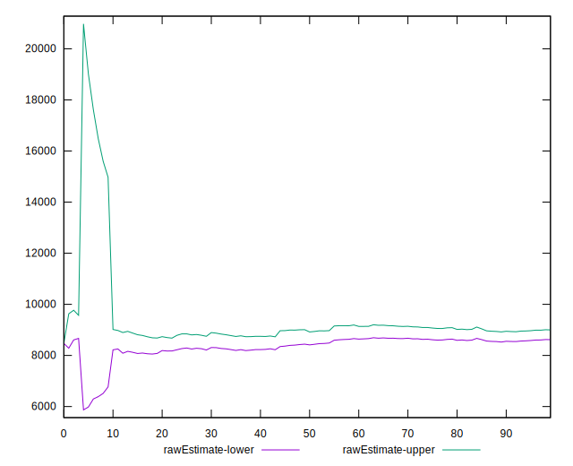
## Score Estimate

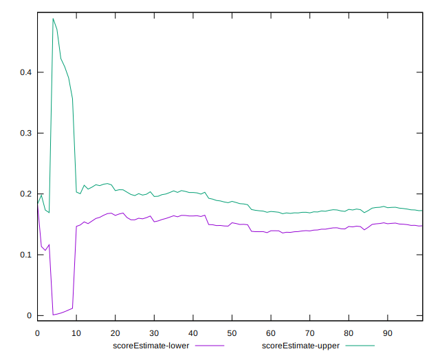
## P Score


```yaml
p90min: 0.04716055369468086
p90max: 0.2853430994901232
p90range: 0.23818254579544235
p90mean: 0.1647477310660814
p90median: 0.1563096043146875
p90stdev: 0.06056070441992282
p90skewness: 0.18902848768492972
p90eccentricity: 1.0000000000000002
p90discretization: 1
outlandishness: 1.0095824832778721
confidence: 0.028531740910225478
p90confidence: 0.02488561102533926

```

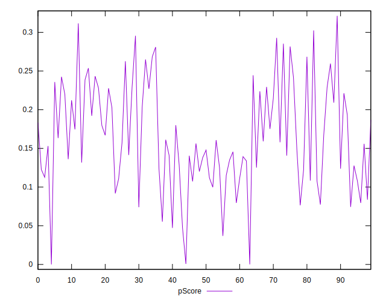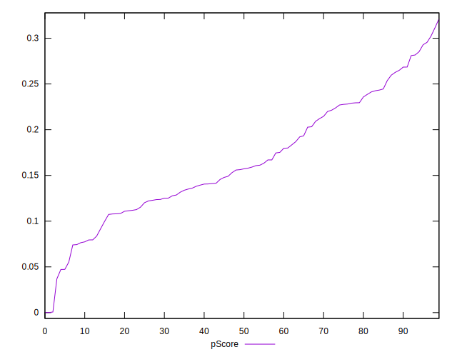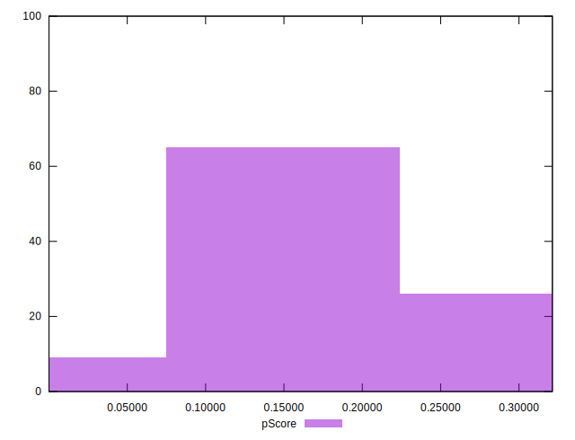
## Score Difference


```yaml
p90min: 0
p90max: 0
p90range: 0
p90mean: 0
p90median: 0
p90stdev: 0
p90skewness: .nan
p90eccentricity: .nan
p90discretization: 91
outlandishness: .nan
confidence: 0
p90confidence: 0

```


## P Score Difference


```yaml
p90min: -0.004656900509876771
p90max: 0.0045218570427513205
p90range: 0.009178757552628092
p90mean: 0.00009097657803958644
p90median: 0.00003666790709960788
p90stdev: 0.0024996127457419023
p90skewness: -0.07565759600841578
p90eccentricity: 0.9999999999999996
p90discretization: 1
outlandishness: 0.5074041168650322
confidence: 0.001090350352245579
p90confidence: 0.0010271411321967668

```

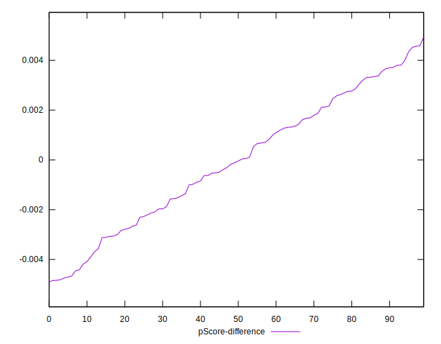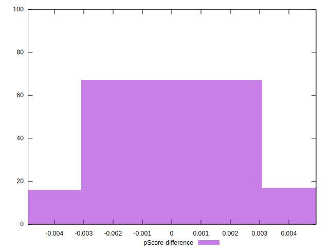