# //speed-index/samples/pages+cached+noexternal+nomedia+nocss

[→ Parent](../..)


## Raw


```yaml
p90min: 7245.53917200923
p90max: 11182.513051304326
p90range: 3936.9738792950957
p90mean: 8907.910482489808
p90median: 8853.017587758013
p90stdev: 919.7274799657993
p90skewness: 0.3560234761766694
p90eccentricity: 1.0000000000000002
p90discretization: 1
outlandishness: 1.074631329547115
confidence: 961.3292846482145
p90confidence: 377.9345127335546

```

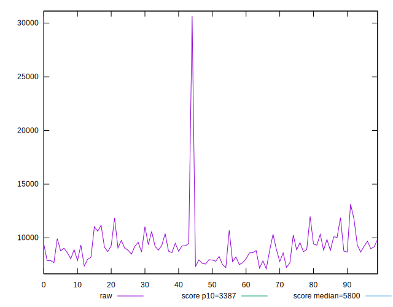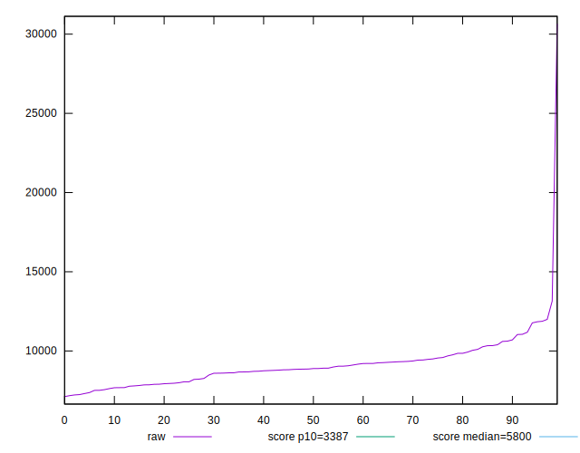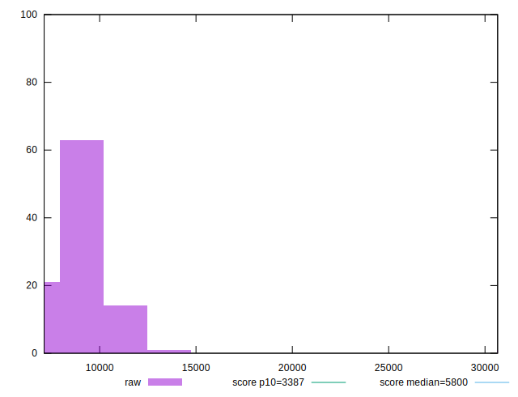
## Score


```yaml
p90min: 0.04
p90max: 0.27
p90range: 0.23
p90mean: 0.15494505494505495
p90median: 0.15
p90stdev: 0.05727077820307658
p90skewness: 0.1423944812690664
p90eccentricity: 0.9999999999999997
p90discretization: 4.136363636363637
outlandishness: 1.0609876613852423
confidence: 0.026964545986248922
p90confidence: 0.02353371419853212

```

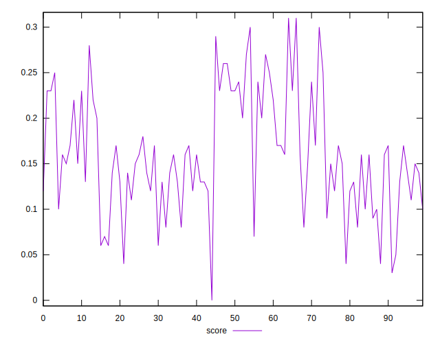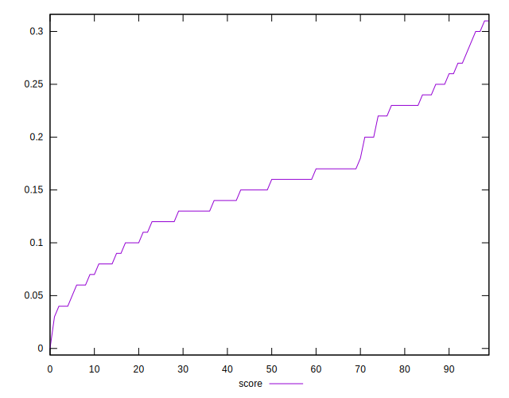
## Raw Estimate

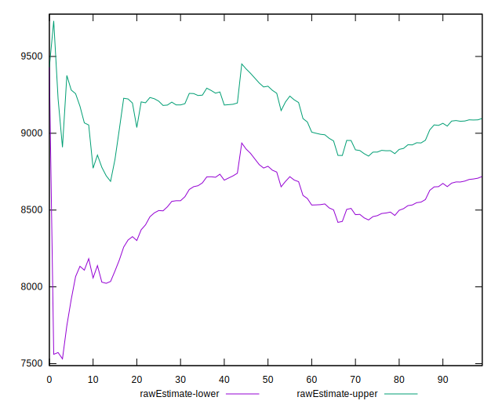
## Score Estimate

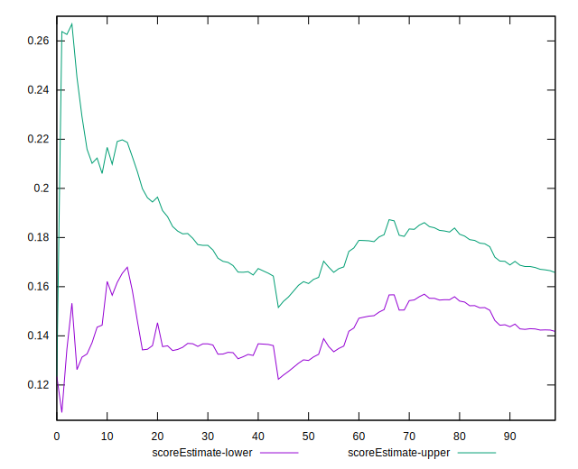
## P Score


```yaml
p90min: 0.04389285158450468
p90max: 0.2688857312431478
p90range: 0.22499287965864312
p90mean: 0.1552494305494885
p90median: 0.15431308735705834
p90stdev: 0.0570965258501938
p90skewness: 0.1660719948233513
p90eccentricity: 1.0000000000000002
p90discretization: 1
outlandishness: 1.0602874929346455
confidence: 0.026931571955338907
p90confidence: 0.023462110403371095

```

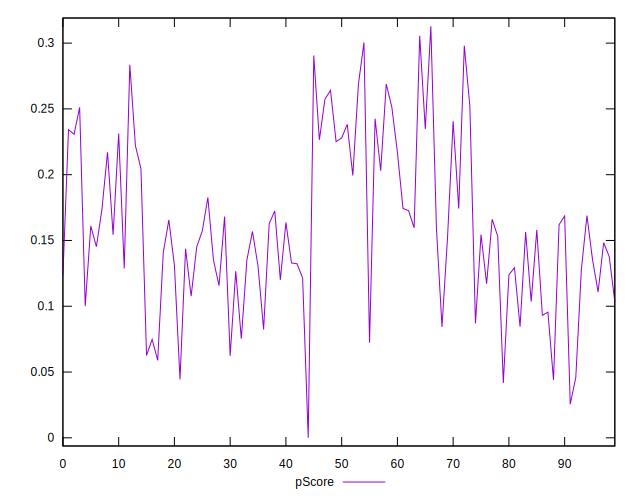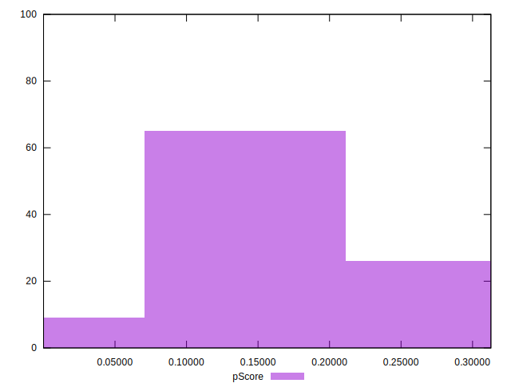
## Score Difference


```yaml
p90min: 0
p90max: 0
p90range: 0
p90mean: 0
p90median: 0
p90stdev: 0
p90skewness: .nan
p90eccentricity: .nan
p90discretization: 91
outlandishness: .nan
confidence: 0
p90confidence: 0

```


## P Score Difference


```yaml
p90min: -0.004431431514949374
p90max: 0.004792774798319799
p90range: 0.009224206313269173
p90mean: 0.0007517001276049579
p90median: 0.0011527333322708389
p90stdev: 0.0027276833421683365
p90skewness: -0.2771467831658215
p90eccentricity: 1.0000000000000002
p90discretization: 1
outlandishness: 0.12032222764879208
confidence: 0.0011896273123485667
p90confidence: 0.001120859925651194

```

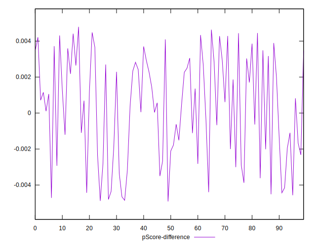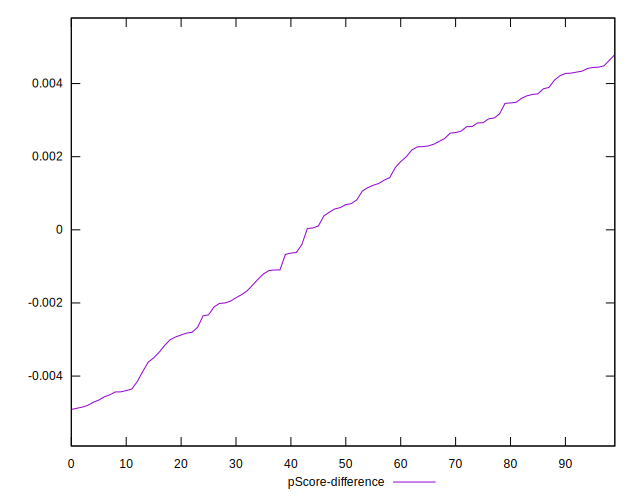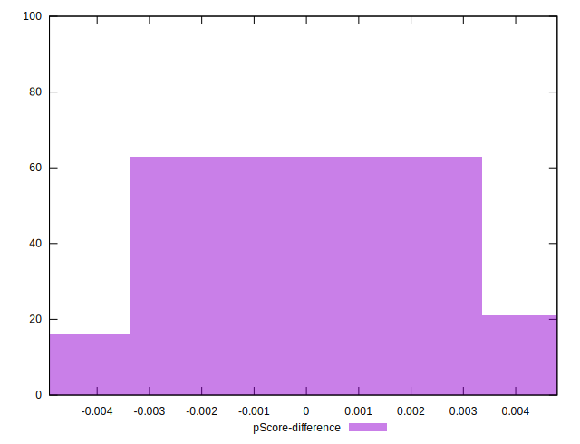