# //speed-index/samples/pages+cached+noexternal+nomedia

[→ Parent](../..)


## Raw


```yaml
p90min: 7301.719916386438
p90max: 11299.090540440728
p90range: 3997.3706240542897
p90mean: 9052.916200708882
p90median: 8874.10949919721
p90stdev: 1013.8447504170415
p90skewness: 0.6499710975572488
p90eccentricity: 0.9999999999999997
p90discretization: 1
outlandishness: 1.0780058896691371
confidence: 1155.5320451652478
p90confidence: 416.60919139937687

```

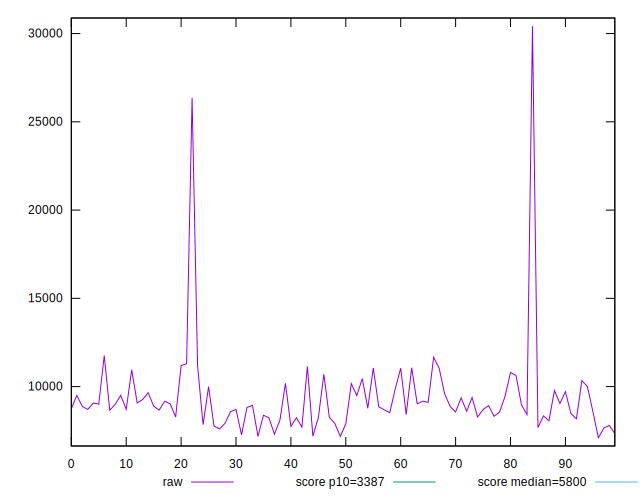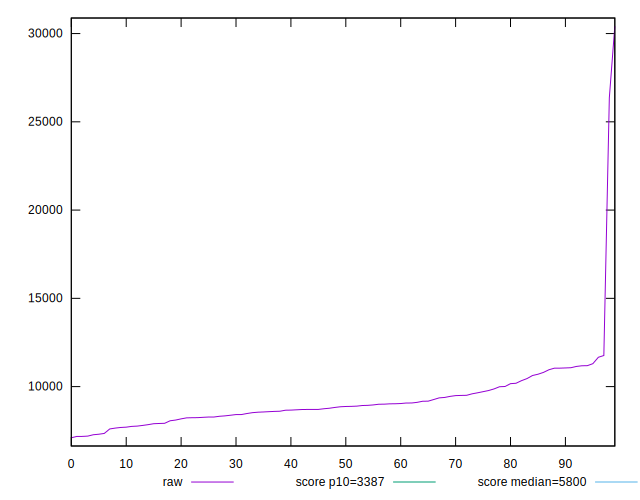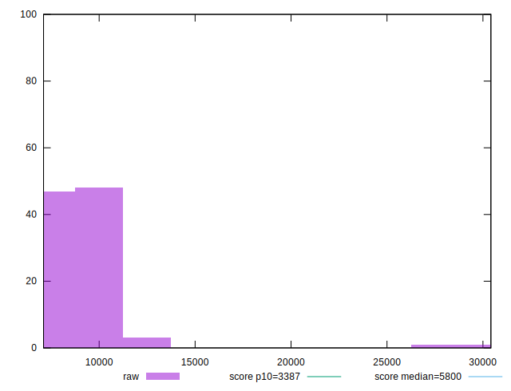
## Score


```yaml
p90min: 0.05
p90max: 0.26
p90range: 0.21000000000000002
p90mean: 0.15076923076923082
p90median: 0.15
p90stdev: 0.056241839832636455
p90skewness: -0.08878263120285192
p90eccentricity: 1.0000000000000007
p90discretization: 4.136363636363637
outlandishness: 1.101000510204081
confidence: 0.027278755923615505
p90confidence: 0.02311090273520644

```

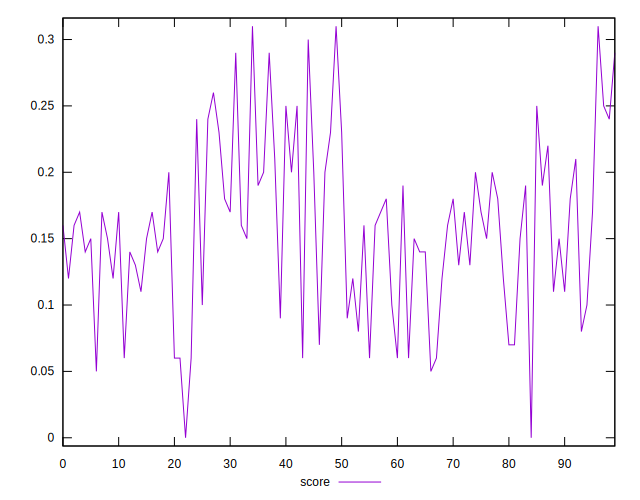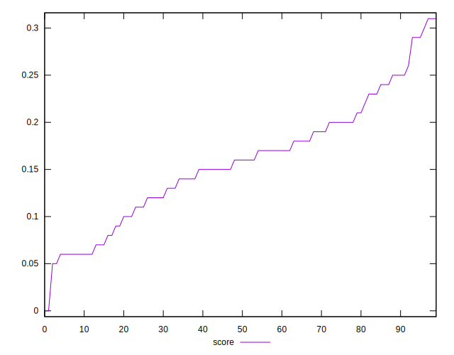
## Raw Estimate

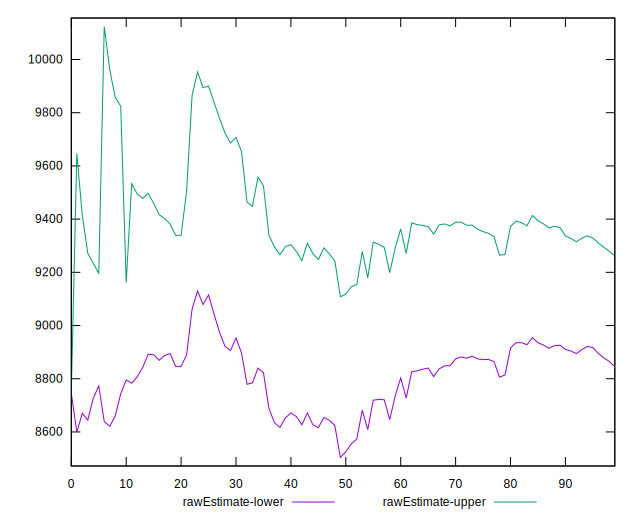
## Score Estimate

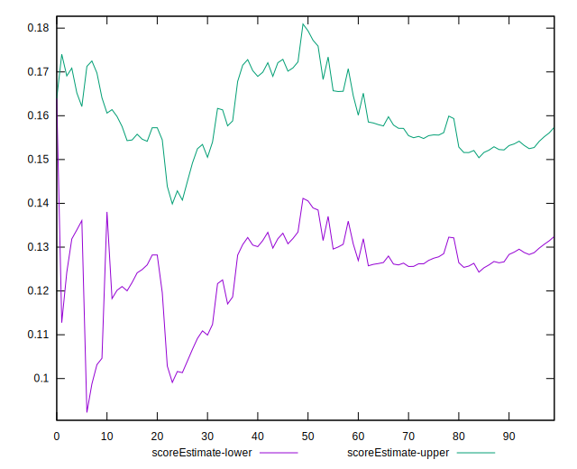
## P Score


```yaml
p90min: 0.04605818007717344
p90max: 0.25971378982504534
p90range: 0.2136556097478719
p90mean: 0.150338732837865
p90median: 0.1542159719703834
p90stdev: 0.05601687135640309
p90skewness: -0.06402217547560533
p90eccentricity: 0.9999999999999997
p90discretization: 1
outlandishness: 1.102341586238768
confidence: 0.027255308698268532
p90confidence: 0.023018458665307773

```

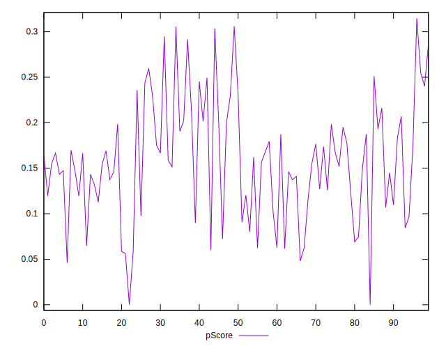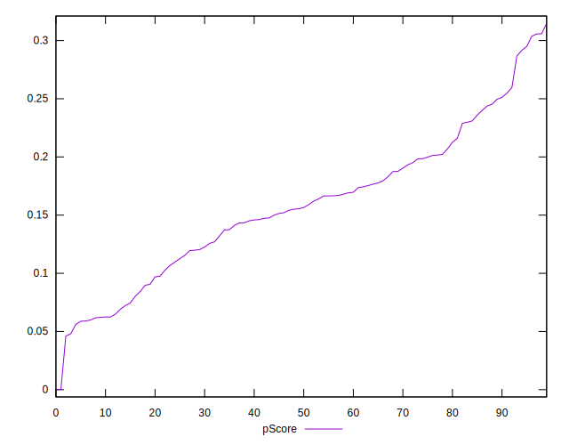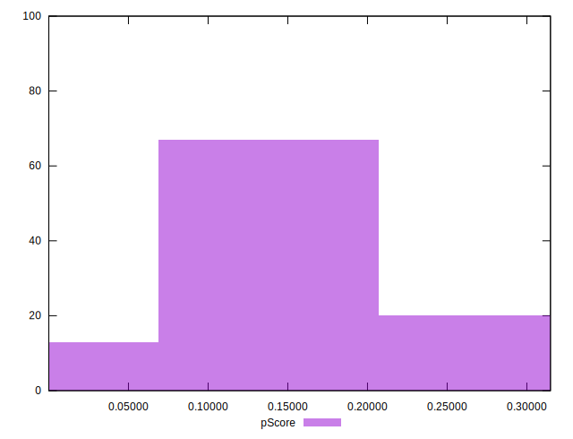
## Score Difference


```yaml
p90min: 0
p90max: 0
p90range: 0
p90mean: 0
p90median: 0
p90stdev: 0
p90skewness: .nan
p90eccentricity: .nan
p90discretization: 91
outlandishness: .nan
confidence: 0
p90confidence: 0

```


## P Score Difference


```yaml
p90min: -0.00492726574113575
p90max: 0.003940917179548947
p90range: 0.008868182920684697
p90mean: -0.0007422223596274434
p90median: -0.0004413876584841159
p90stdev: 0.00256929732086574
p90skewness: 0.0969937701629036
p90eccentricity: 1.0000000000000002
p90discretization: 1
outlandishness: 0.2296310826559372
confidence: 0.0011316976113221354
p90confidence: 0.001055775925130704

```

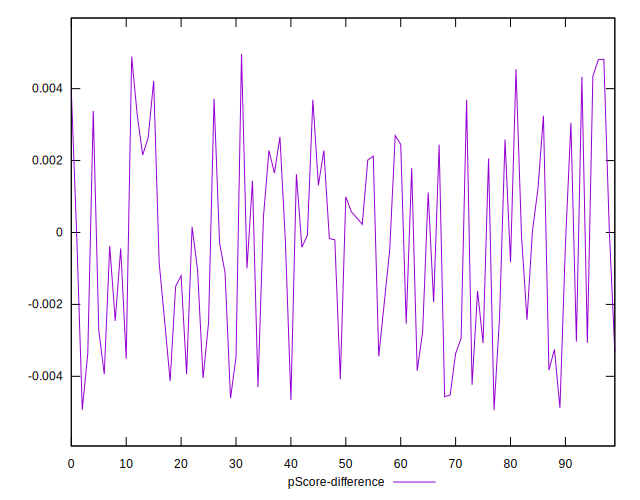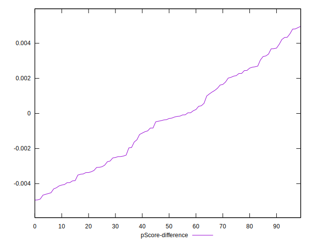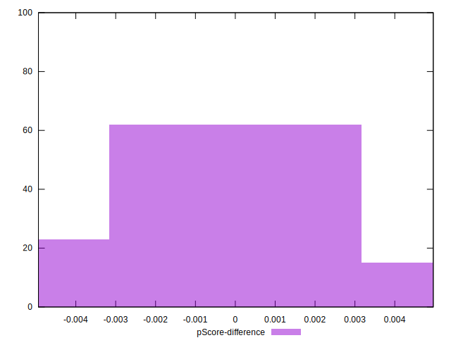