# //speed-index/samples/pages+cached+noexternal

[→ Parent](../..)


## Raw


```yaml
p90min: 7199.246234353175
p90max: 10294.266189746439
p90range: 3095.0199553932634
p90mean: 8381.356196938405
p90median: 8410.517179917095
p90stdev: 744.6014001285364
p90skewness: 0.4454200407188249
p90eccentricity: 0.9999999999999992
p90discretization: 1
outlandishness: 1.077232179950318
confidence: 701.902965266403
p90confidence: 305.9716856005725

```

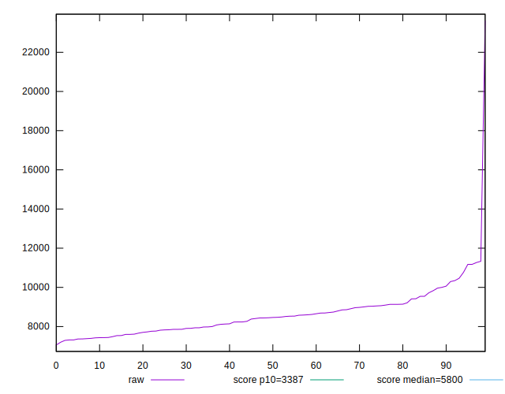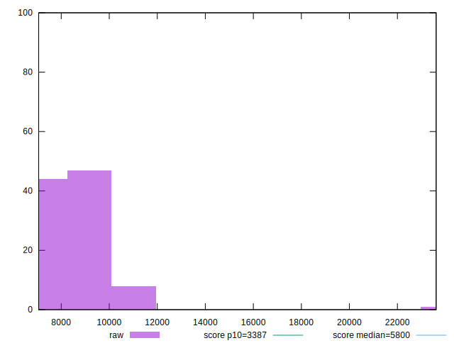
## Score


```yaml
p90min: 0.08
p90max: 0.29
p90range: 0.20999999999999996
p90mean: 0.19527472527472528
p90median: 0.19
p90stdev: 0.05591085249861898
p90skewness: -0.014890335846855547
p90eccentricity: 1.0000000000000002
p90discretization: 4.333333333333333
outlandishness: 0.9249092117784656
confidence: 0.026170209473556028
p90confidence: 0.022974893385124262

```

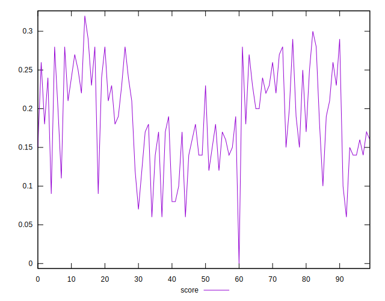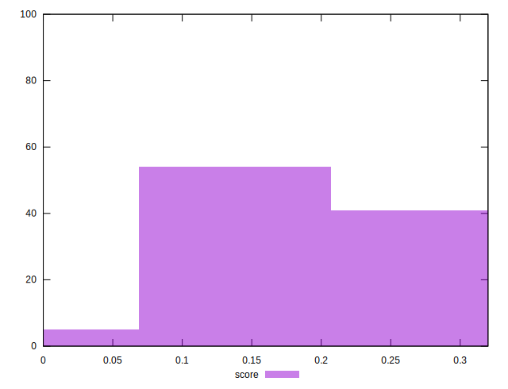
## Raw Estimate

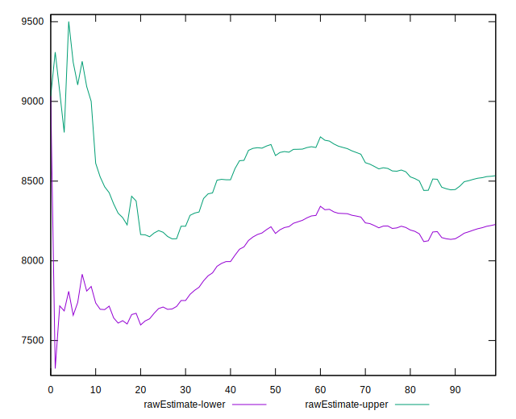
## Score Estimate

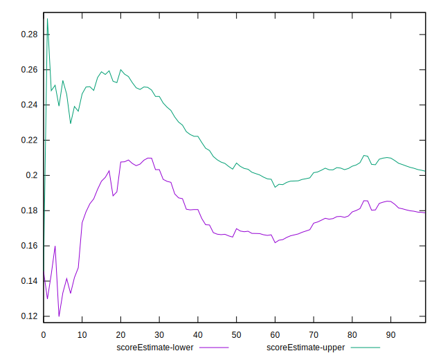
## P Score


```yaml
p90min: 0.08401649672967615
p90max: 0.29249323762462304
p90range: 0.2084767408949469
p90mean: 0.19544976361729297
p90median: 0.18586609446862473
p90stdev: 0.05598367210130652
p90skewness: -0.011158902779527947
p90eccentricity: 1
p90discretization: 1
outlandishness: 0.9242232940576786
confidence: 0.026286558690021555
p90confidence: 0.023004816423914165

```

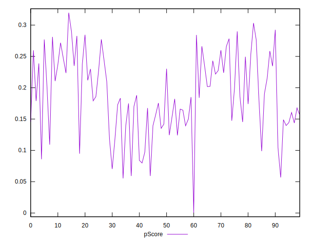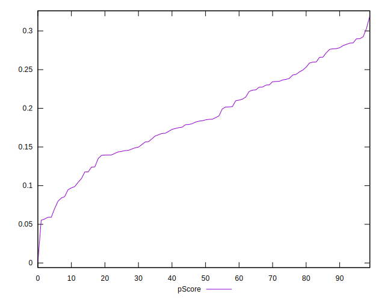
## Score Difference


```yaml
p90min: 0
p90max: 0
p90range: 0
p90mean: 0
p90median: 0
p90stdev: 0
p90skewness: .nan
p90eccentricity: .nan
p90discretization: 91
outlandishness: .nan
confidence: 0
p90confidence: 0

```


## P Score Difference


```yaml
p90min: -0.004423527355162327
p90max: 0.0045031978875364476
p90range: 0.008926725242698774
p90mean: 0.000057304954898219645
p90median: -0.0001850671820994021
p90stdev: 0.002677940796410306
p90skewness: 0.10937147356438176
p90eccentricity: 1
p90discretization: 1
outlandishness: 2.9620991685821743
confidence: 0.0011484754687560012
p90confidence: 0.0011004197135202193

```

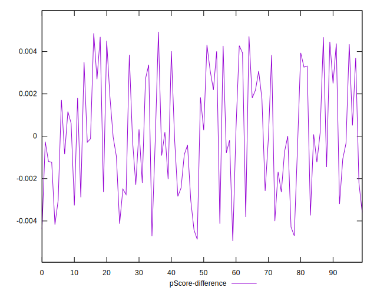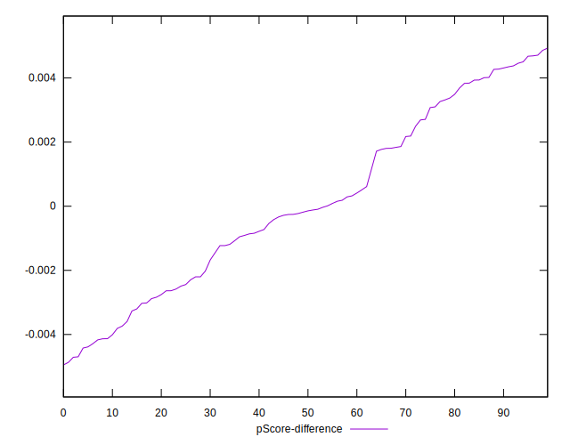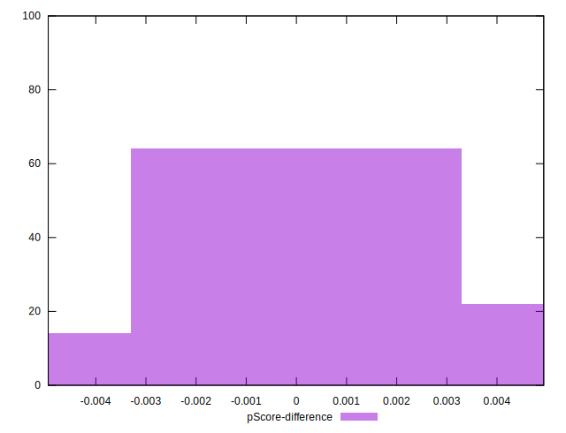