# //speed-index/samples/pages+cached

[→ Parent](../..)


## Raw


```yaml
p90min: 7347.186537596898
p90max: 11248.758020769379
p90range: 3901.571483172481
p90mean: 8870.6555108811
p90median: 8807.497363410745
p90stdev: 872.9123549907207
p90skewness: 0.6689954798678571
p90eccentricity: 0.9999999999999996
p90discretization: 1
outlandishness: 1.1155050775353124
confidence: 1243.2779135112287
p90confidence: 358.69723665839047

```

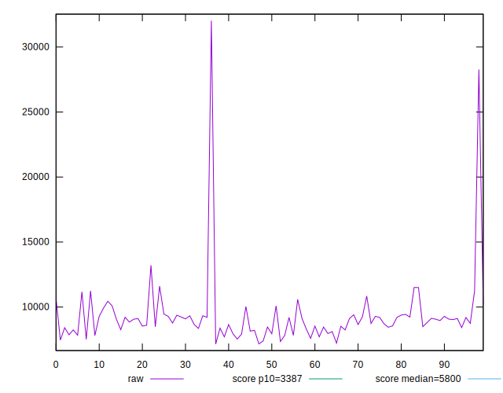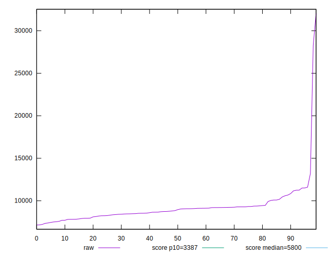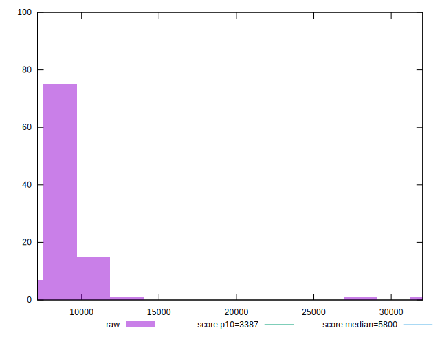
## Score


```yaml
p90min: 0.05
p90max: 0.27
p90range: 0.22000000000000003
p90mean: 0.15945054945054954
p90median: 0.15
p90stdev: 0.053521334708029056
p90skewness: 0.08419822837387464
p90eccentricity: 0.999999999999998
p90discretization: 4.333333333333333
outlandishness: 1.0157333528862202
confidence: 0.02598563387884051
p90confidence: 0.021992992483469864

```

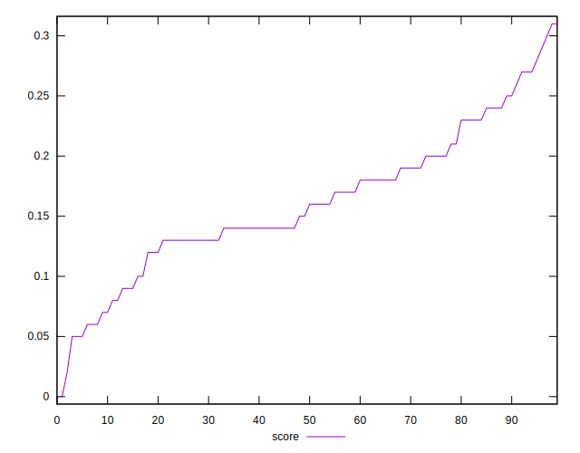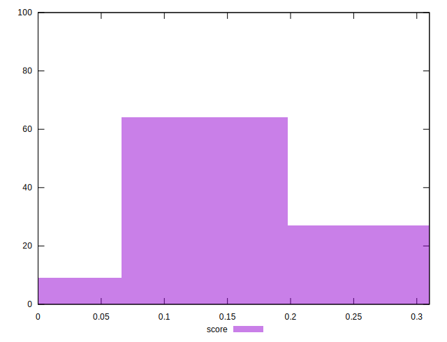
## Raw Estimate

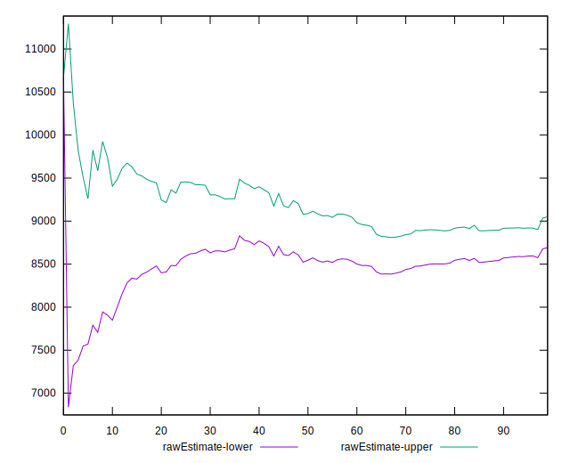
## Score Estimate

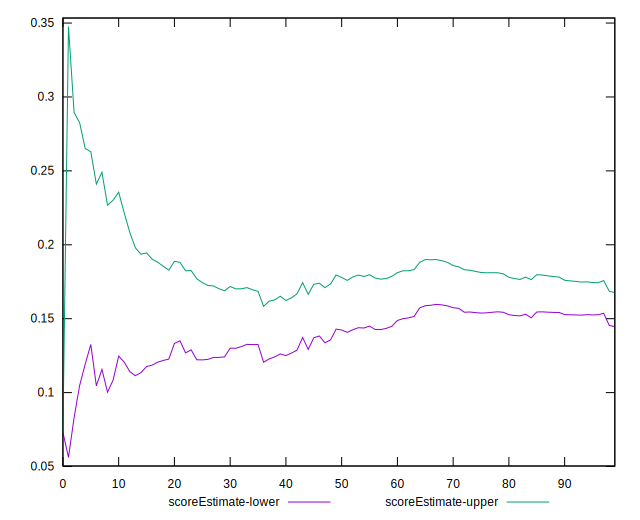
## P Score


```yaml
p90min: 0.0491663766694484
p90max: 0.2688968672737634
p90range: 0.219730490604315
p90mean: 0.15701925868705174
p90median: 0.1455729305606484
p90stdev: 0.05309521617799603
p90skewness: -0.009300574926588763
p90eccentricity: 1
p90discretization: 1
outlandishness: 1.0478952017217271
confidence: 0.02583421743465497
p90confidence: 0.02181789181232241

```

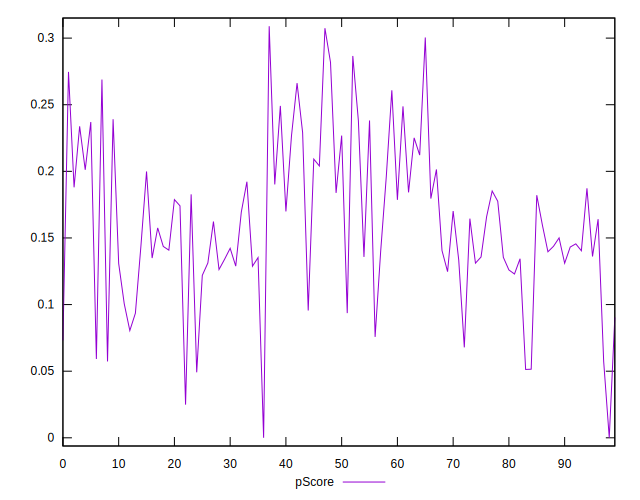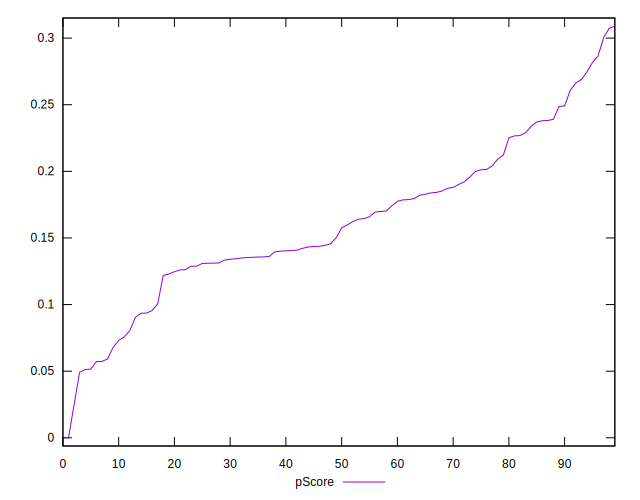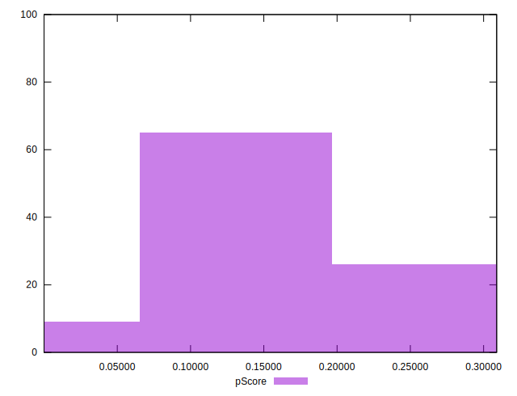
## Score Difference


```yaml
p90min: 0
p90max: 0
p90range: 0
p90mean: 0
p90median: 0
p90stdev: 0
p90skewness: .nan
p90eccentricity: .nan
p90discretization: 91
outlandishness: .nan
confidence: 0
p90confidence: 0

```


## P Score Difference


```yaml
p90min: -0.004427069439351589
p90max: 0.004514599313596462
p90range: 0.008941668752948051
p90mean: 0.00008494285174306902
p90median: 0.000055593917948959515
p90stdev: 0.0025661746789371965
p90skewness: 0.003165994969548639
p90eccentricity: 1
p90discretization: 1
outlandishness: 0.17482050447783656
confidence: 0.0011089426405491841
p90confidence: 0.001054492768781228

```

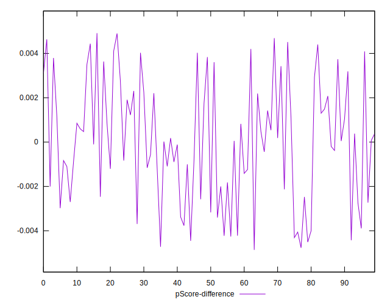