# //speed-index/samples/pages

[→ Parent](../..)


## Raw


```yaml
p90min: 6637.8208936090905
p90max: 9629.169748848059
p90range: 2991.348855238968
p90mean: 7765.688181314498
p90median: 7754.342967186332
p90stdev: 665.1125470895291
p90skewness: 0.6652262511347561
p90eccentricity: 0.9999999999999997
p90discretization: 1
outlandishness: 1.1251178781290117
confidence: 1114.4026165163941
p90confidence: 273.3081177552758

```

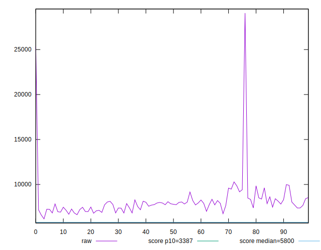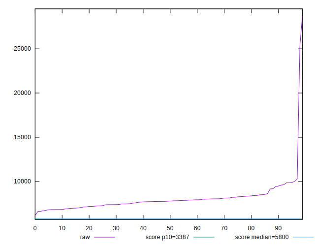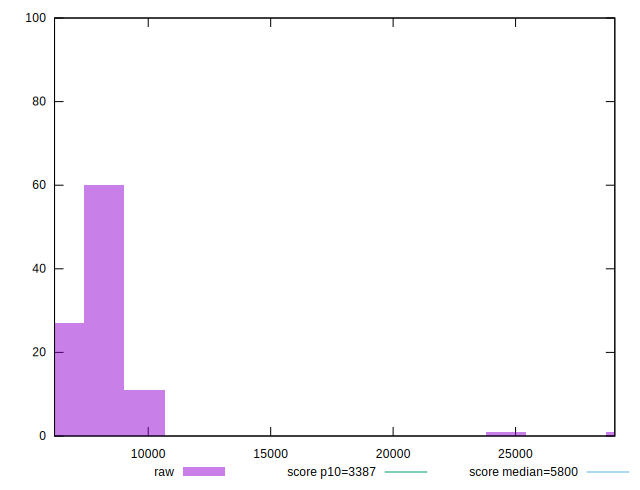
## Score


```yaml
p90min: 0.11
p90max: 0.37
p90range: 0.26
p90mean: 0.25032967032967046
p90median: 0.24
p90stdev: 0.061204943947589574
p90skewness: 0.00037637147970579756
p90eccentricity: 0.9999999999999993
p90discretization: 3.9565217391304346
outlandishness: 0.9260809383529598
confidence: 0.03101995809949626
p90confidence: 0.025150341999759518

```

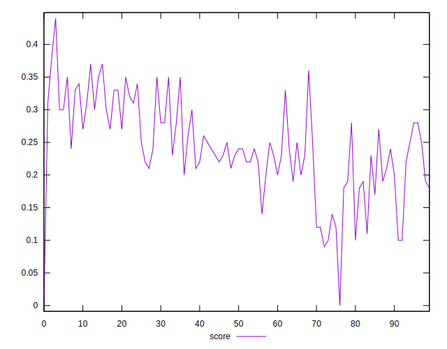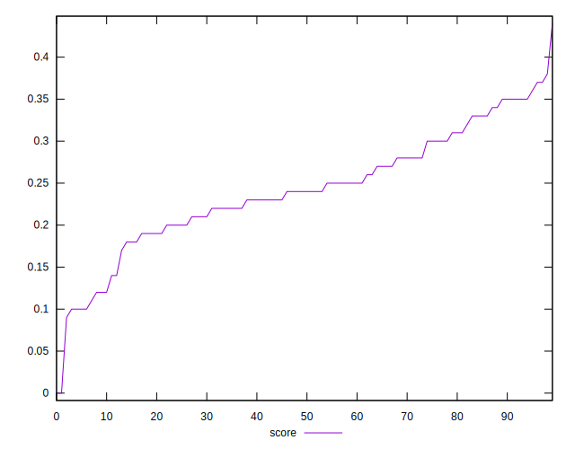
## Raw Estimate

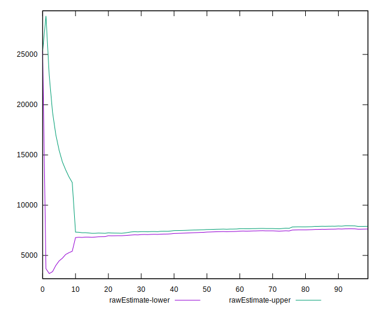
## Score Estimate

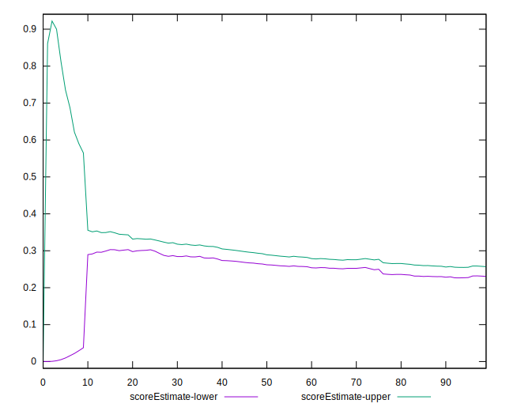
## P Score


```yaml
p90min: 0.11357044665995886
p90max: 0.37393325811603423
p90range: 0.26036281145607537
p90mean: 0.25041353185494847
p90median: 0.24451510592750614
p90stdev: 0.061036164387207215
p90skewness: -0.022010692451683866
p90eccentricity: 1.0000000000000004
p90discretization: 1
outlandishness: 0.9262112369398956
confidence: 0.030967003970084506
p90confidence: 0.025080987085068007

```

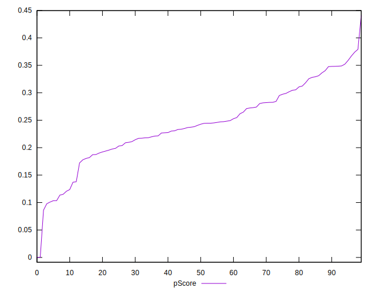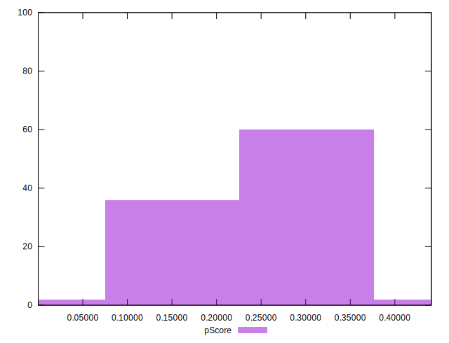
## Score Difference


```yaml
p90min: 0
p90max: 0
p90range: 0
p90mean: 0
p90median: 0
p90stdev: 0
p90skewness: .nan
p90eccentricity: .nan
p90discretization: 91
outlandishness: .inf
confidence: 5.167706891451849e-18
p90confidence: 0

```

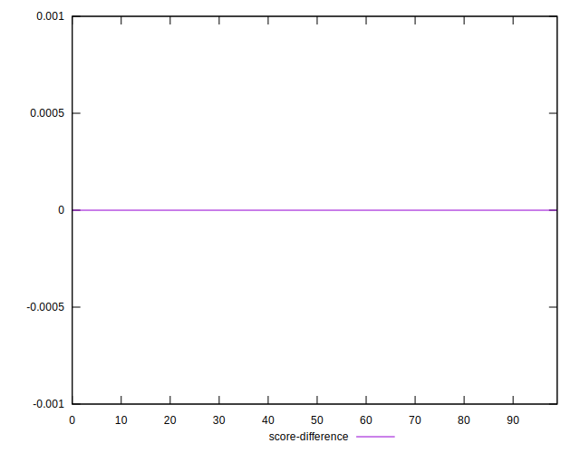
## P Score Difference


```yaml
p90min: -0.003991146474070728
p90max: 0.004601517482403339
p90range: 0.008592663956474067
p90mean: 0.0002600827894559989
p90median: 0.00027407521797045975
p90stdev: 0.0024975184709937702
p90skewness: 0.11031883408516513
p90eccentricity: 0.9999999999999997
p90discretization: 1
outlandishness: 0.14098212629833662
confidence: 0.0010914719036185271
p90confidence: 0.00102628055259715

```

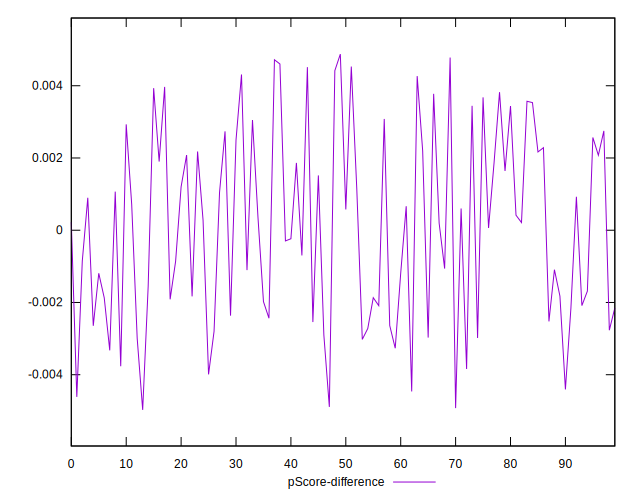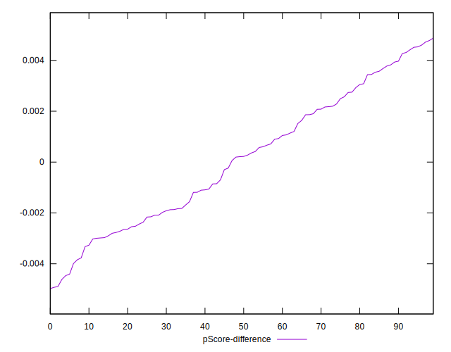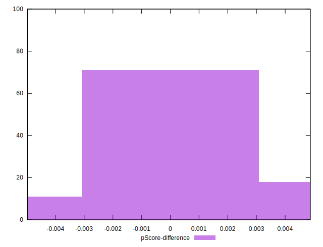