# //total-blocking-time/samples/pages+cached+noexternal+nomedia+nocss+nojs

[→ Parent](../..)


## Raw


```yaml
p90min: 269
p90max: 607.5
p90range: 338.5
p90mean: 364.69201648351657
p90median: 341.9999999999991
p90stdev: 82.13137123741228
p90skewness: 1.2387010921505217
p90eccentricity: 1.0000000000000002
p90discretization: 1.0833333333333333
outlandishness: 1.2554196016324326
confidence: 70.40723510981513
p90confidence: 33.74943170112135

```

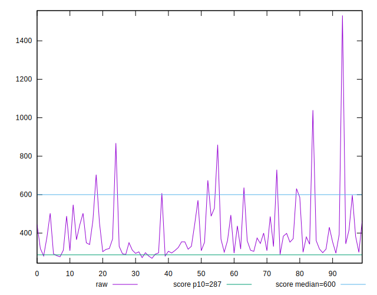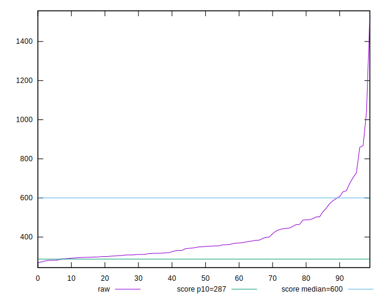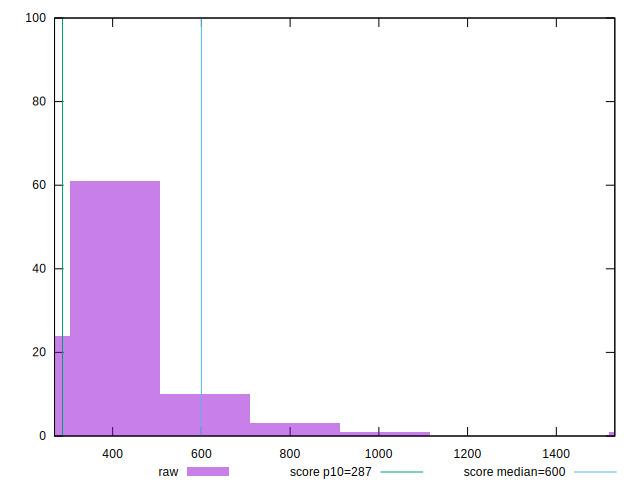
## Score


```yaml
p90min: 0.49
p90max: 0.92
p90range: 0.43000000000000005
p90mean: 0.8034065934065934
p90median: 0.84
p90stdev: 0.10670097665000754
p90skewness: -1.2869355587168767
p90eccentricity: 1
p90discretization: 2.84375
outlandishness: 0.8939209775972907
confidence: 0.06939915579959899
p90confidence: 0.043845576539601305

```

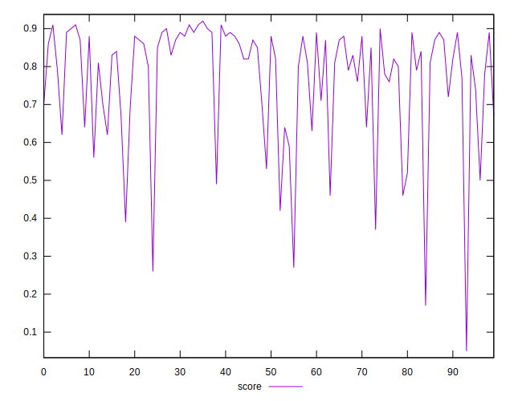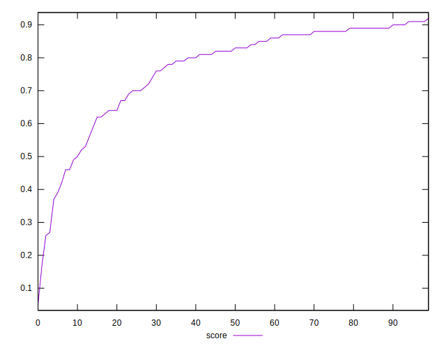
## Raw Estimate

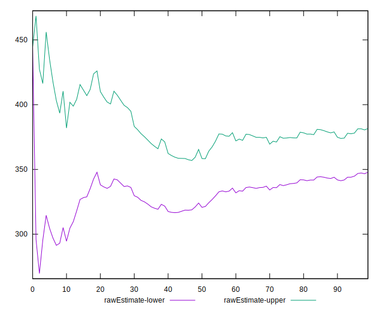
## Score Estimate

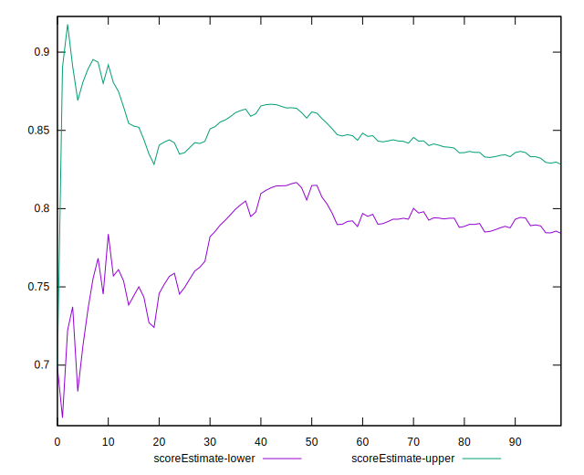
## P Score


```yaml
p90min: 0.4913882144269356
p90max: 0.9183580026018724
p90range: 0.4269697881749368
p90mean: 0.8031035427299529
p90median: 0.8356812604906926
p90stdev: 0.1062714883212077
p90skewness: -1.2820181202943683
p90eccentricity: 0.9999999999999996
p90discretization: 1.0833333333333333
outlandishness: 0.8939135389880488
confidence: 0.06929599513313955
p90confidence: 0.043669091150390305

```

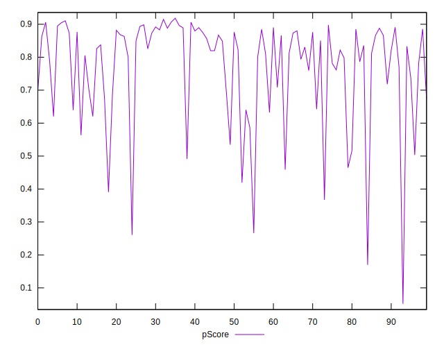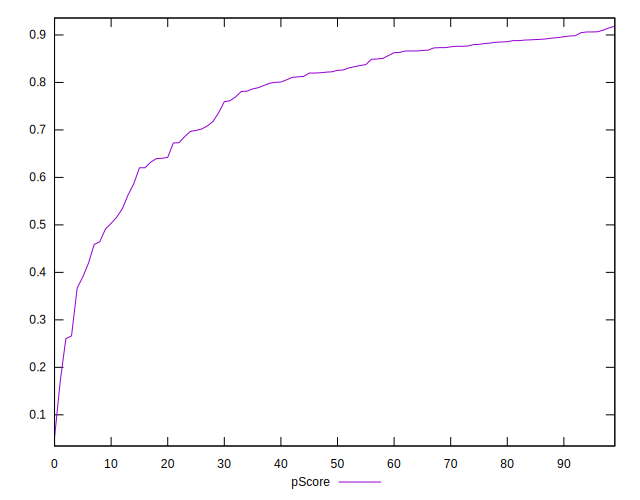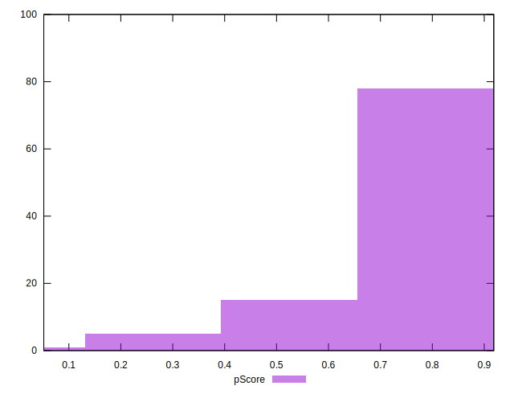
## Score Difference


```yaml
p90min: 0
p90max: 1.1102230246251565e-16
p90range: 1.1102230246251565e-16
p90mean: 4.8801012071435456e-18
p90median: 0
p90stdev: 2.2759276888232054e-17
p90skewness: 4.44926701957686
p90eccentricity: 1.0000000000000018
p90discretization: 45.5
outlandishness: 8.74680625
confidence: 1.4635906249893467e-17
p90confidence: 9.352244450977916e-18

```

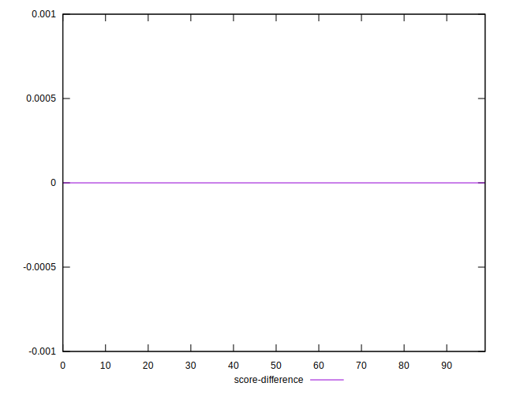
## P Score Difference


```yaml
p90min: -0.004461738289897599
p90max: 0.0036355929325060377
p90range: 0.008097331222403636
p90mean: -0.00047147039651024763
p90median: -0.0002953217875051317
p90stdev: 0.0024157290414398794
p90skewness: -0.022299124039790216
p90eccentricity: 0.9999999999999999
p90discretization: 1.0833333333333333
outlandishness: 0.37752479098180336
confidence: 0.0010686644452302951
p90confidence: 0.0009926716316085605

```

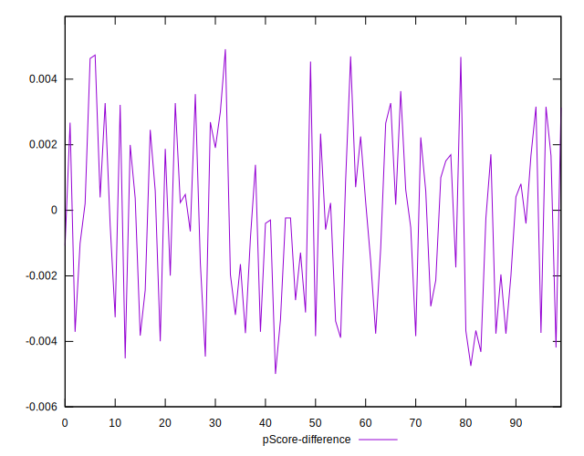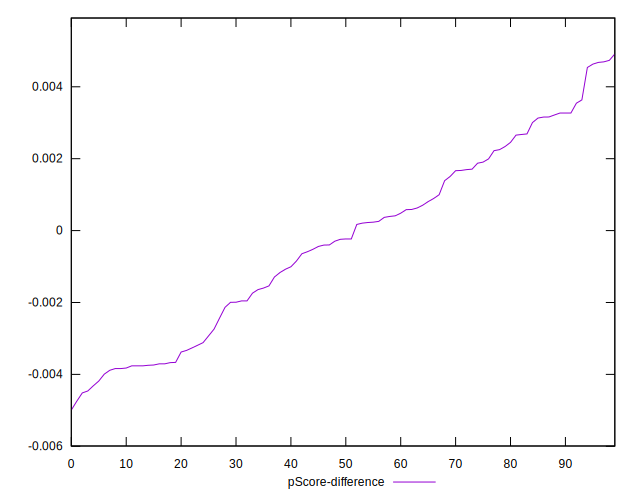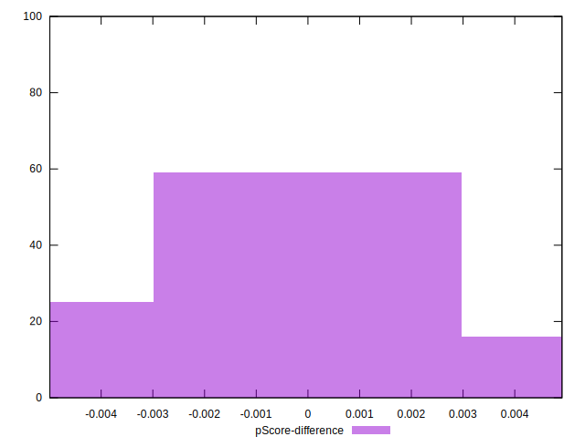