# //total-blocking-time/samples/pages+cached+noexternal+nomedia+nocss

[→ Parent](../..)


## Raw


```yaml
p90min: 271
p90max: 548
p90range: 277
p90mean: 355.5108626373626
p90median: 338.5
p90stdev: 68.09663798215654
p90skewness: 1.1202558913093095
p90eccentricity: 1.0000000000000002
p90discretization: 1.058139534883721
outlandishness: 1.1862314789910058
confidence: 54.635627108619474
p90confidence: 27.982277636780736

```

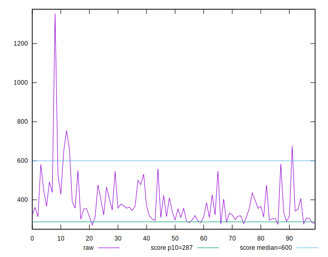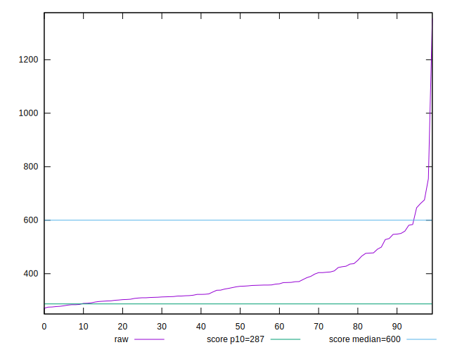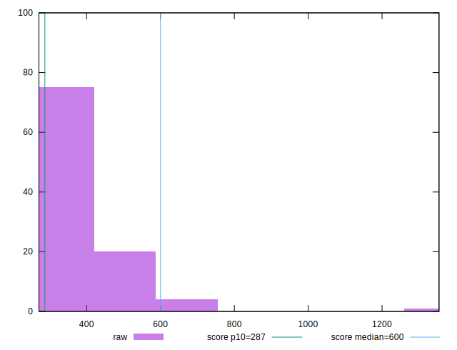
## Score


```yaml
p90min: 0.56
p90max: 0.92
p90range: 0.36
p90mean: 0.8149450549450546
p90median: 0.84
p90stdev: 0.08865755363309868
p90skewness: -1.223840187986276
p90eccentricity: 1.0000000000000002
p90discretization: 3.033333333333333
outlandishness: 0.9167830098560179
confidence: 0.056906378874370445
p90confidence: 0.03643117125707729

```

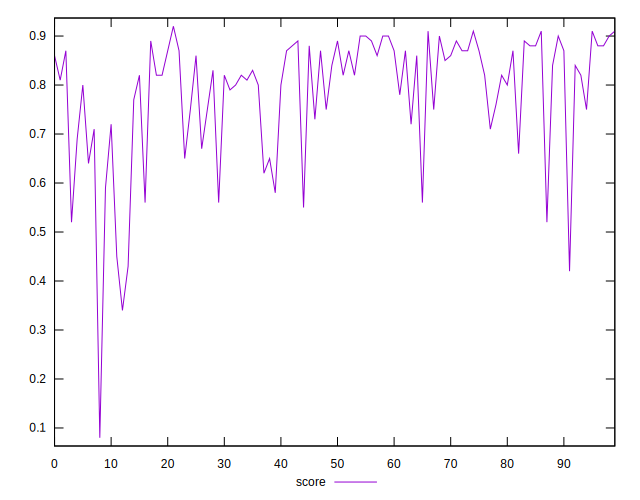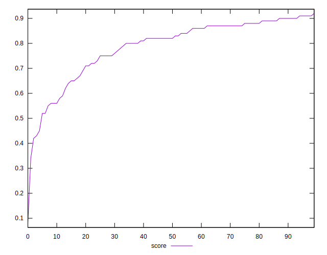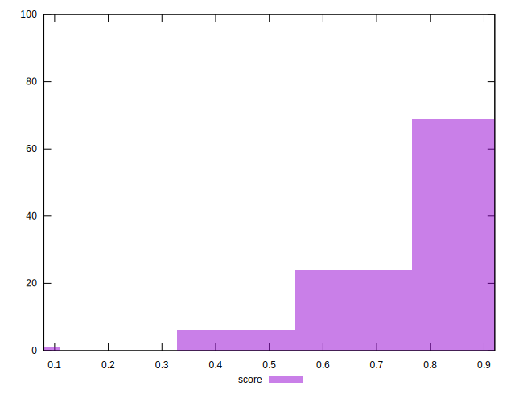
## Raw Estimate

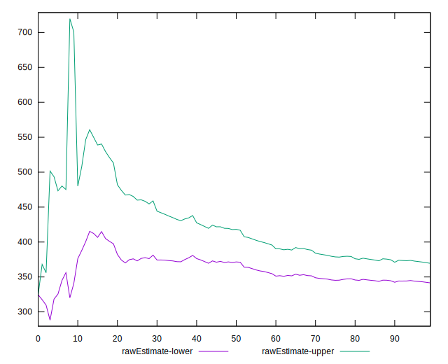
## Score Estimate

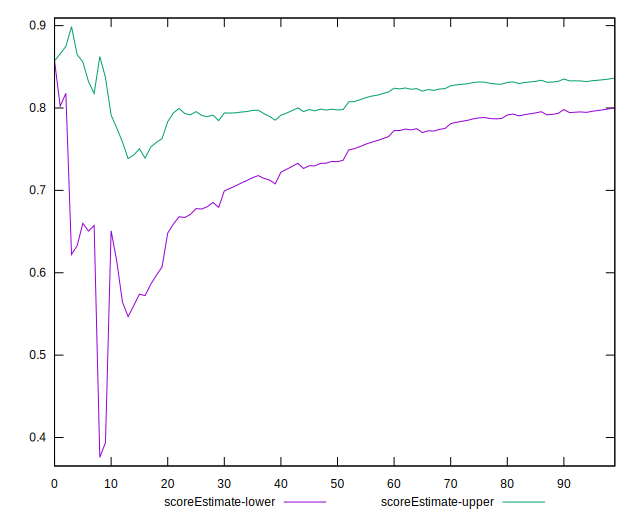
## P Score


```yaml
p90min: 0.5625907832253756
p90max: 0.9163971786250911
p90range: 0.3538063953997155
p90mean: 0.8151037344188701
p90median: 0.8400682221931516
p90stdev: 0.0881015476782669
p90skewness: -1.214673378444049
p90eccentricity: 0.9999999999999997
p90discretization: 1.058139534883721
outlandishness: 0.9167840147052913
confidence: 0.05679067743546051
p90confidence: 0.036202697231680014

```

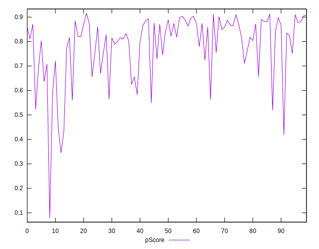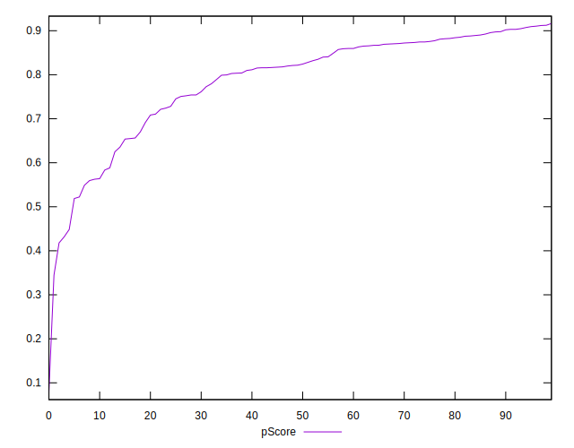
## Score Difference


```yaml
p90min: 0
p90max: 1.1102230246251565e-16
p90range: 1.1102230246251565e-16
p90mean: 4.8801012071435456e-18
p90median: 0
p90stdev: 2.2759276888232057e-17
p90skewness: 4.449267019576857
p90eccentricity: 1.0000000000000022
p90discretization: 45.5
outlandishness: 8.74680625
confidence: 1.4635906249893467e-17
p90confidence: 9.352244450977916e-18

```

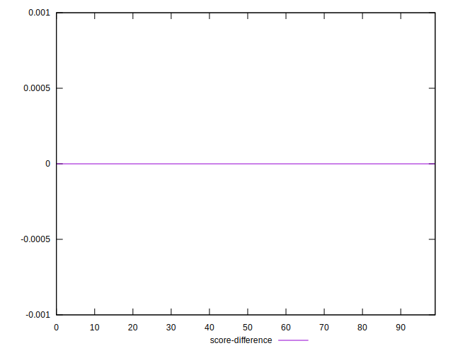
## P Score Difference


```yaml
p90min: -0.0044146714803489084
p90max: 0.004735383410851224
p90range: 0.009150054891200132
p90mean: 0.0003195433643814003
p90median: 0.00025626150766167033
p90stdev: 0.002524301233909955
p90skewness: -0.06075503930508817
p90eccentricity: 1.0000000000000004
p90discretization: 1.058139534883721
outlandishness: 0.22734750714905225
confidence: 0.0011056412770499748
p90confidence: 0.0010372861283496143

```

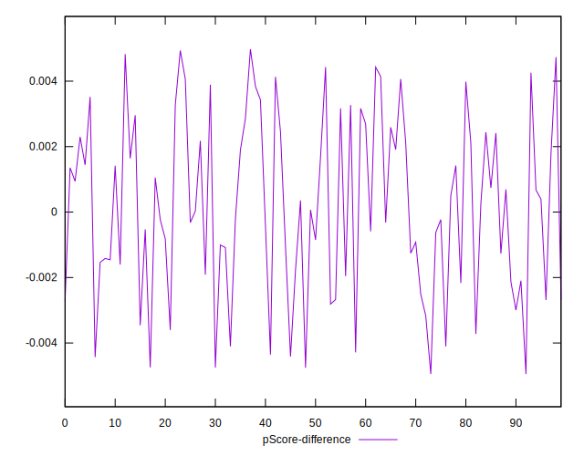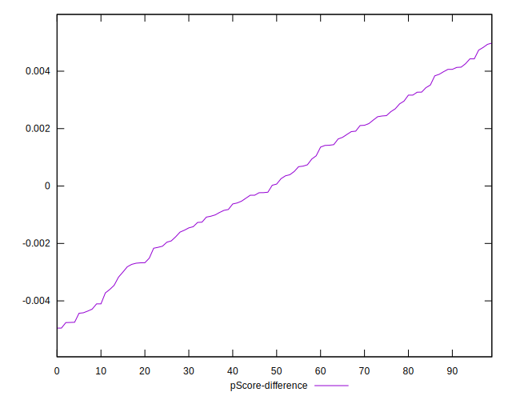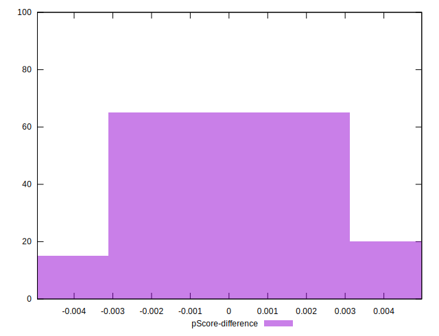