# //total-blocking-time/samples/pages+cached+noexternal+nomedia

[→ Parent](../..)


## Raw


```yaml
p90min: 264
p90max: 367
p90range: 103
p90mean: 300.0838956043956
p90median: 296.5
p90stdev: 23.01661422140809
p90skewness: 0.6946173974331917
p90eccentricity: 0.9999999999999997
p90discretization: 1.1666666666666667
outlandishness: 1.1079745224296176
confidence: 24.62583165778983
p90confidence: 9.457989534973535

```

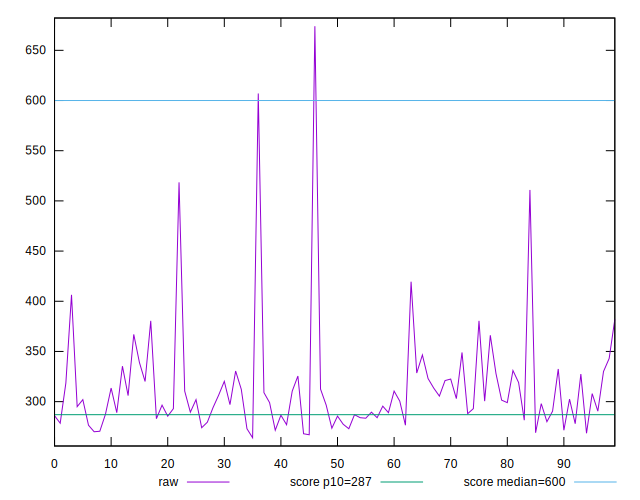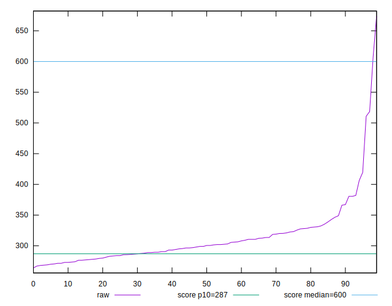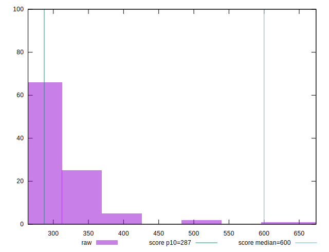
## Score


```yaml
p90min: 0.8
p90max: 0.92
p90range: 0.12
p90mean: 0.8842857142857137
p90median: 0.89
p90stdev: 0.0269775184035721
p90skewness: -0.8785407957958972
p90eccentricity: 0.9999999999999997
p90discretization: 8.272727272727273
outlandishness: 0.9553088652028782
confidence: 0.03096125273143091
p90confidence: 0.011085604697810725

```

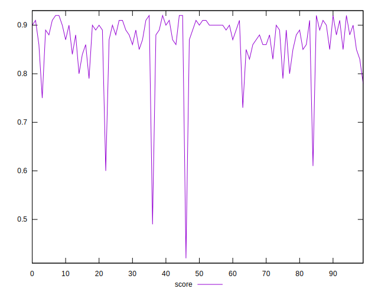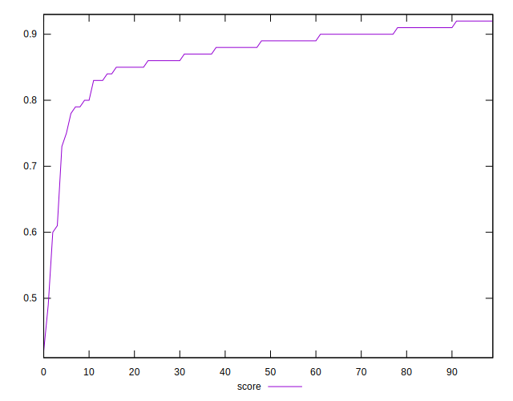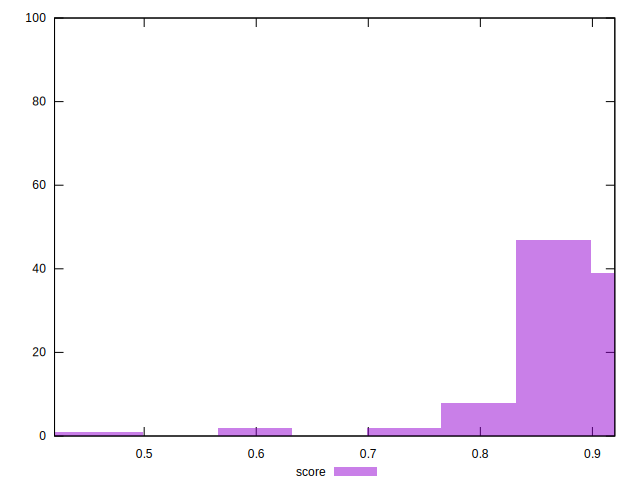
## Raw Estimate

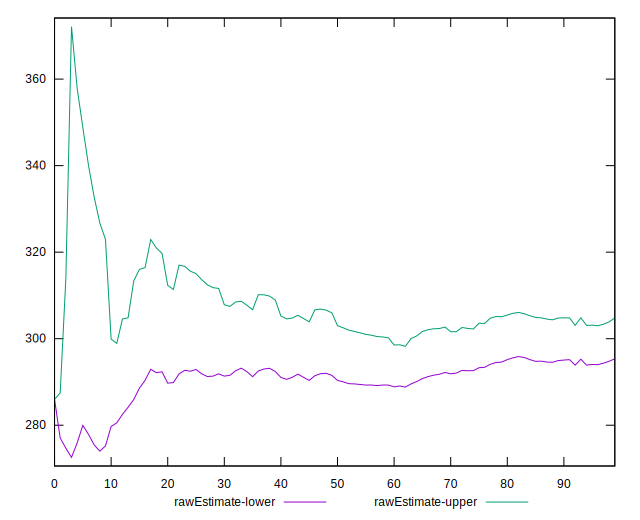
## Score Estimate

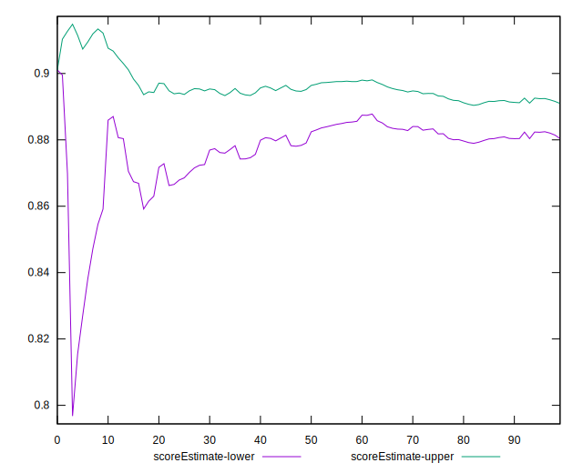
## P Score


```yaml
p90min: 0.8035186874875309
p90max: 0.9231692315882869
p90range: 0.11965054410075604
p90mean: 0.8846929312017473
p90median: 0.8897046782124949
p90stdev: 0.026310664186164245
p90skewness: -0.8661229839672548
p90eccentricity: 1
p90discretization: 1.1666666666666667
outlandishness: 0.9552666452875946
confidence: 0.030874935044312712
p90confidence: 0.010811580892705175

```

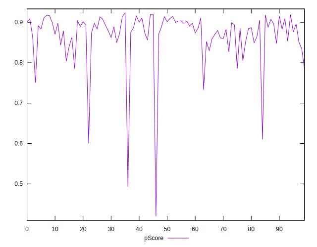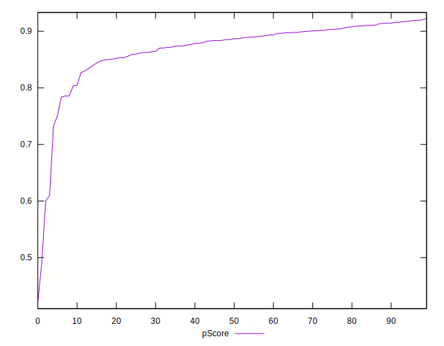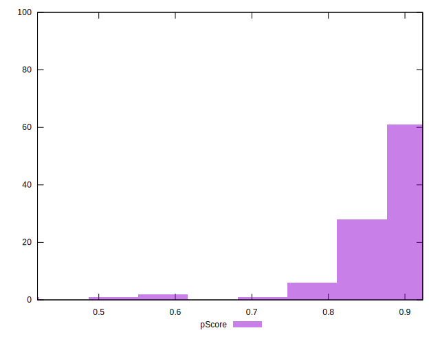
## Score Difference


```yaml
p90min: 0
p90max: 0
p90range: 0
p90mean: 0
p90median: 0
p90stdev: 0
p90skewness: .nan
p90eccentricity: .nan
p90discretization: 91
outlandishness: .inf
confidence: 7.423946114831079e-18
p90confidence: 0

```

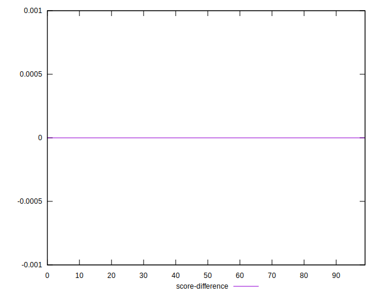
## P Score Difference


```yaml
p90min: -0.003746969954420254
p90max: 0.004668900856868996
p90range: 0.00841587081128925
p90mean: 0.0008441276655420382
p90median: 0.000582172989926022
p90stdev: 0.0024135296319383903
p90skewness: -0.12164201129591354
p90eccentricity: 1.0000000000000007
p90discretization: 1.1375
outlandishness: 0.20148634034422522
confidence: 0.0010731938142602634
p90confidence: 0.0009917678500250444

```

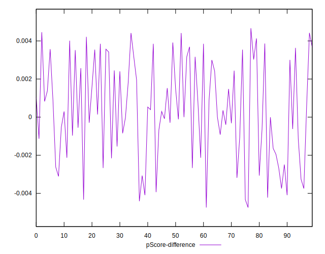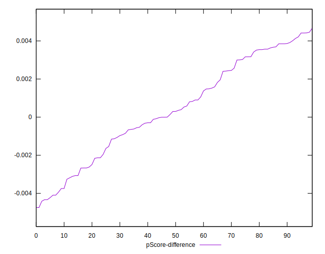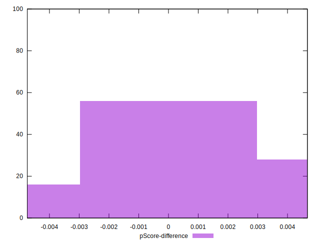